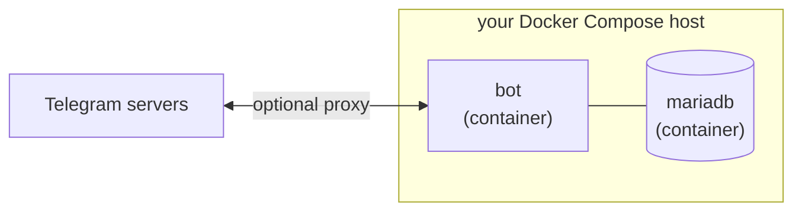
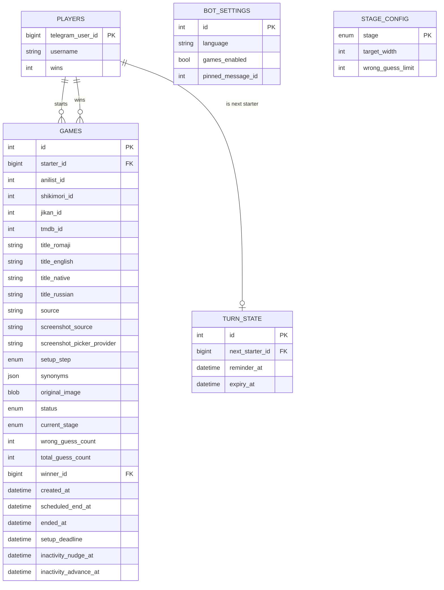

# Architecture

## Overview

A Python Telegram bot running a single guessing game in one topic of one
group chat. A player DMs the bot a screenshot — or sends `/newgame` and
picks one from a provider's gallery instead — and identifies its anime
(see `MECHANICS.md` for exactly how); the bot pixelates it hard and posts
it into the group's game topic, then progressively reveals clearer
versions as wrong `/guess` attempts accumulate, until someone's right,
the stages run out, or a 2-day timeout fires. See `CLAUDE.md` for repo
layout and coding conventions, `MECHANICS.md` for the game rules
themselves; this doc covers the system design.



No web-facing component exists (no admin panel, no reverse proxy or SSO
involvement) — this bot is Telegram-only.

## Infrastructure

- **Docker Compose stack:**
  - `bot` — built from the repo `Dockerfile` (uv-based Python image).
  - `mariadb` — official `mariadb:11` image, data in a named volume. Not
    installed on the host — deliberately containerized like everything
    else this bot needs.
- **Telegram connectivity:** most hosts can reach `api.telegram.org`
  directly and don't need anything extra. If yours can't (geo-blocked,
  firewalled, etc.), the bot can route *all* Telegram API traffic — both
  `getUpdates` long-polling and outgoing `send*` calls — through an HTTP
  proxy instead, configured via the optional `TELEGRAM_PROXY_URL` env var
  (`http://<user>:<pass>@<proxy-host>:<proxy-port>`), applied to
  `ApplicationBuilder`'s `proxy` and `get_updates_proxy`. See
  README.md's Self-hosting section for setup.
- **AniList/Shikimori/Jikan connectivity:** all three are reached
  directly, no proxy needed — `services/search/shikimori.py`'s
  `SHIKIMORI_GRAPHQL_URL` points at `shikimori.io`. (Shikimori's older
  `shikimori.one` domain now permanently redirects to `shikimori.io` —
  worth remembering if that redirect target ever changes again.)
- **TMDB connectivity — may need the same optional proxy:** TMDB
  requires its own API key regardless (see below), but on some hosts
  `api.themoviedb.org` and its image CDN (`image.tmdb.org`) may also be
  blocked or misresolve outright (e.g. resolving to loopback instead of
  timing out, which can be confirmed with `getent hosts`/`resolvectl
  status`). If that happens, routing the same request through
  `TELEGRAM_PROXY_URL` (if you've set one) should resolve and connect
  fine. `services/search/tmdb.py` therefore always constructs its
  `httpx` client with that same proxy configured, unlike every other
  search service in this package, which are all proxy-free — this is a
  no-op if you haven't set `TELEGRAM_PROXY_URL`. A TMDB API key (a v4
  "Read Access Token") needs to be issued from themoviedb.org and placed
  in `.env` — TMDB search/screenshots are optional; without a key,
  everything else still works.
  `commands/dm_start/screenshot_gallery.py`'s screenshot download
  therefore routes through `_client_for_source(context, provider)` (the
  same client `tmdb.py` itself uses), not a bare client — a TMDB
  screenshot pick would otherwise fail if a proxy is actually needed on
  your host.
- **Group admin permission:** the bot needs the group's "Pin messages"
  admin permission for the pinned-current-image behavior (see
  `MECHANICS.md`'s "Pixelation stages" section) to actually take effect.
  Without it, `pin_chat_message`/`unpin_chat_message` calls fail
  silently (logged at `WARNING`) rather than blocking anything — the
  game still works, it just never gets a pinned image.

## Component boundaries

```
commands/        →  services/  →  models/
commands/helpers/   (game rules)  (persistence)
jobs/            (Telegram)
(Telegram, JobQueue)
```

- **`commands/`** — one module per Telegram command. Parses the `Update`,
  calls into `services/`, formats the reply. No game rules live here.
- **`commands/helpers/`** — Telegram-aware plumbing shared by more than one
  command file (topic/DM scoping checks, inline-keyboard builders, bot
  command-menu registration, shared formatting). One exception to the
  "no handlers here" rule: `player_tracking.py` (see "Handler groups").

### Handler groups

Every handler `app.py` registers goes into PTB's default group (`0`)
except one: `player_tracking.remember_user`, a `TypeHandler(Update, …)`
in group `-1` (`app._PLAYER_TRACKING_GROUP`). PTB walks groups in order
and, unless a callback raises `ApplicationHandlerStop`, carries on to the
next — so this runs first on *every* update and then hands off to the
normal command handlers.

Its job is to create-or-refresh the update sender's `players` row, which
is what `/correct @username` and `/skip @username` resolve their typed
handle against. It's a pre-handler rather than a `get_or_create_player`
call inside each command because those two lookups have to work for
someone the bot has only ever *seen* — a person who answered a round in
plain prose in the game topic is exactly who `/correct` is for, and is
exactly who no command handler would ever have recorded.
- **`jobs/`** — JobQueue-driven background timers. Telegram-aware like
  `commands/`, but its entry points are scheduled callbacks invoked by
  PTB's `JobQueue`, not `CommandHandler`/`CallbackQueryHandler`s registered
  against a user action — a genuinely different shape, so it's a sibling
  package rather than living under `commands/` despite depending on the
  same `services/`/`models/` layers.
- **`services/`** — the game logic, framework-agnostic (no
  `python-telegram-bot` imports). This is what unit tests target.
- **`models/`** — SQLAlchemy ORM models, one module per table. Columns and
  relationships only — if a model needs a method beyond what SQLAlchemy
  itself generates, that logic belongs in `services/` instead.

This separation exists so guess-matching and pixelation math can be tested
as plain Python without a Telegram update or a live DB. See "Where things
are" below for what's actually in each of these.

### Where things are

The full directory/module layout — moved here from `CLAUDE.md` since it's
architecture, not day-to-day workflow. Each `commands/`/`services/`
subpackage's own `__init__.py` docstring (`dm_start/`, `game_flow/`,
`services/game/`, `services/search/`, `services/settings/`) is the more
detailed, load-bearing version of what's summarized here — if the two ever
disagree, trust the docstring and fix this tree, not the other way around.

```
src/nani_pix_bot/
  config.py       # env/.env loading — the only place that reads os.environ
  db.py           # SQLAlchemy engine/session factory, session_scope()
  logging_config.py  # loguru setup, redirects PTB's stdlib logging into it
  heartbeat.py    # wraps bot.get_updates so a liveness file is only
                   # touched after a real successful poll — lets
                   # docker-compose.yml's HEALTHCHECK (+ fleet autoheal)
                   # detect the getUpdates connection-pool wedge that a
                   # process can retry-loop through forever otherwise
  app.py          # ApplicationBuilder wiring, handler registration, an
                   # error handler (so network hiccups log at WARNING
                   # instead of vanishing at DEBUG), and re-arming any
                   # pending JobQueue jobs from the DB on startup (see
                   # MECHANICS.md's "Game lifecycle")
  commands/       # one module per Telegram command (thin: parse update,
                   # call a service, format a reply — no game rules here)
    dm_start/     # both game-setup entry points (DM photo, /newgame) and
                   # the shared identification/screenshot-picking/preview
                   # flow that follows either one, split by flow stage
                   # (package's own __init__ re-exports only the PTB
                   # handler entrypoints):
                   #   intake.py      photo_handler — the traditional,
                   #                  photo-first entry point
                   #   newgame.py     newgame_command — the screenshot-
                   #                  less /newgame entry point (picks a
                   #                  screenshot later instead of
                   #                  uploading one first)
                   #   search.py      method selection + AniList/
                   #                  Shikimori/Jikan/TMDB search-and-pick
                   #   manual.py      manual title/synonym entry
                   #   screenshots.py screenshot-source selection for
                   #                  the /newgame path — the source-
                   #                  selection keyboard and same-/
                   #                  cross-provider resolution up to
                   #                  the point a gallery is first shown
                   #   screenshot_gallery.py  browsing an already-shown
                   #                  gallery (numbered picks, "More
                   #                  screenshots", the "Wrong anime?
                   #                  Search again" cross-provider
                   #                  correction) — split out of
                   #                  screenshots.py once that file's
                   #                  own complexity grew past qlty's
                   #                  threshold
                   #   preview.py     the confirmation preview (show/
                   #                  confirm/change-image/research/
                   #                  add-synonym) + the final post to
                   #                  the group
                   #   keyboards.py   inline-keyboard builders +
                   #                  callback-data constants for all of
                   #                  the above
                   #   _shared.py     helpers used by more than one of
                   #                  them — _start_new_game() (the
                   #                  eligibility-check + game-creation
                   #                  logic both intake.py and newgame.py
                   #                  call), _show_preview() (needed by
                   #                  every path that ends in "an image
                   #                  now exists for this game")
    game_flow/    # commands that run during (or between) an in-progress
                   # game — grouped for symmetry with dm_start/, though
                   # none of these four is individually large:
                   #   guess.py    /guess — the only handler most
                   #               wrong-guess traffic hits
                   #   correct.py  /correct @user — author override
                   #   skip.py     /skip [@user] — turn handoff when no
                   #               game is running
                   #   stop.py     /stop — DM-only; starter or a group
                   #               admin aborts the current game after a
                   #               Yes/No confirmation (outcome is still
                   #               announced in the group topic)
    leaderboard.py  # /leaderboard
    language.py   # /language — DM-only, admin-gated bot language switch
    stageconfig.py  # /stageconfig, /setstageconfig, /setstage — DM-only,
                   # admin-gated view/edit of per-stage pixelation config
                   # (blocked while a game is running; posts a visual
                   # preview on a successful edit)
    gamesenabled.py  # /setgamesenabled — DM-only, admin-gated toggle for
                   # whether a *new* game may be started at all
    onboarding.py # /start, /help
    helpers/      # shared Telegram-aware plumbing — topic/DM scoping
                   # checks (scoping.py), group-membership + admin checks
                   # (membership.py), the one inline keyboard genuinely
                   # shared across packages: stop_confirm_keyboard()
                   # (keyboards.py, used by game_flow/stop.py and
                   # stageconfig.py), bot command-menu registration
                   # (bot_menu.py), and the one update callback here that
                   # app.py does register — player_tracking.py's
                   # remember_user (see "Handler groups" below). Test:
                   # does more than one commands/*.py file need it, or
                   # does it not correspond to an actual /command at all?
                   # Either one means helpers/, not a plain commands/*.py
                   # file (dm_start's own keyboard builders live in
                   # commands/dm_start/keyboards.py instead, since
                   # nothing outside that package needs them).
  jobs/           # JobQueue-driven background timers — Telegram-aware
                   # like commands/, but scheduled callbacks rather than
                   # CommandHandler/CallbackQueryHandlers, so a sibling
                   # package rather than living under commands/
    timers/       # split from a single module (2026-09) once it grew
                   # past qlty's file-total-complexity threshold; every
                   # public name is re-exported from __init__.py, so
                   # existing callers (`from nani_pix_bot.jobs import
                   # timers as timeout_module`) needed no changes:
                   #   __init__.py        rearm_pending_timeouts (touches
                   #                      every submodule below, so lives
                   #                      here rather than in any one of
                   #                      them) + the re-exports
                   #   _shared.py         seconds_until/seconds_until_timeout
                   #                      — pure scheduling math every
                   #                      submodule needs
                   #   current_image.py   post_current_image (the shared
                   #                      "post + best-effort pin" send,
                   #                      decoupled from any caller's own
                   #                      DB transaction — see MECHANICS.md's
                   #                      "Cleanup" note) + clear_image_if_sent
                   #   game_timeout.py    the 2-day absolute timeout
                   #   setup_abandon.py   the 1h setup-abandon timer
                   #   turn_timers.py     the win-turn 15min-reminder/
                   #                      12h-expiry timers
                   #   inactivity.py      the 3h-nudge/6h-auto-advance
                   #                      inactivity timers
  services/       # the actual game logic — framework-agnostic, no
                   # python-telegram-bot imports in this package
    search/       # anime identification + screenshot fetching, called
                   # at setup time only, never per guess:
                   #   anilist.py    AniList GraphQL search (httpx) — no
                   #                 screenshot capability
                   #   shikimori.py  Shikimori GraphQL search + screenshots
                   #                 (httpx) — the RU-friendly
                   #                 alternative to anilist.py. Migrated
                   #                 off REST (issue #104) to sidestep a
                   #                 REST-only malformed-data shape (issue
                   #                 #103)
                   #   jikan.py      Jikan (third-party MyAnimeList API)
                   #                 search + screenshots (httpx)
                   #   tmdb.py       TMDB search + screenshots (httpx) —
                   #                 needs a proxied client + a Bearer
                   #                 token, unlike the three above (see
                   #                 "Infrastructure" above)
                   #   rest.py       the JSON-GET + by-id-or-404 plumbing
                   #                 shared by the two REST providers
                   #                 above (jikan.py, tmdb.py — not
                   #                 anilist.py or shikimori.py, both
                   #                 GraphQL with neither a by-id URL nor
                   #                 404 semantics). Generic over the
                   #                 parsed type, so each module's
                   #                 get_by_id keeps its own concrete
                   #                 return type (issue #68)
                   #   graphql.py    the shared GraphQL-over-HTTP plumbing
                   #                 for the two GraphQL providers above
                   #                 (anilist.py, then shikimori.py once
                   #                 it migrated onto GraphQL, issue
                   #                 #104) — the POST/decode/error-array
                   #                 handling rest.py provides for its
                   #                 own two REST providers
                   #   parsing.py    the entry-level guards all four
                   #                 share: skip a result whose shape
                   #                 the provider's own _parse_* can't
                   #                 index, and validate the fields it
                   #                 hands back. Here rather than in
                   #                 rest.py because anilist.py and
                   #                 shikimori.py need them too and
                   #                 deliberately share none of the REST
                   #                 plumbing (issue #83)
                   #   http_retry.py the 429/Retry-After retry loop
                   #                 shared by all four
                   #   cache.py      short-TTL, in-process, keyed-by-
                   #                 client-identity cache wrapping all
                   #                 four providers' search()/
                   #                 get_by_id()/screenshots() calls —
                   #                 read-only performance caching,
                   #                 unrelated to this project's
                   #                 DB-derived-flow-state principle
                   #                 (issue #11 — see CLAUDE.md)
    matching.py   # normalize + rapidfuzz-match a guess against a game's
                   # cached title/synonyms — pure function, fully
                   # deterministic, no network calls
    pixelate/     # Pillow downscale/upscale pipeline — given raw bytes,
                   # a target width and a PixelAlgorithm, no DB or
                   # PixelStage dependency; callers resolve the width via
                   # settings/stage_config.py and the algorithm off the
                   # game row first:
                   #   render.py      the shared Pillow primitives (the
                   #                  plain mosaic, and the rank mosaic
                   #                  median/mode need)
                   #   algorithms.py  PixelAlgorithm -> implementation
                   #                  registry, and pixelate() itself
    game/         # the state machine — the only package that mutates a
                   # Game row:
                   #   state.py   create/advance/win/unsolved/timeout
                   #              transitions, plus display_title()
                   #   turns.py   TurnState bookkeeping (who starts
                   #              next, their reminder/expiry timers) —
                   #              a related but distinct concern
    players.py    # Player lookup/creation, win-count bookkeeping,
                   # leaderboard query — everything that touches only
                   # the Player table (win increments themselves happen
                   # in services/game/state.py, alongside the Game row)
    i18n.py       # simple dict/JSON t(key, lang, **kwargs) — see
                   # CLAUDE.md's "Language / i18n"
    settings/     # bot-wide configuration, two persistence shapes:
                   #   bot_settings.py  singleton row — language,
                   #                    games-enabled flag (BotSettings)
                   #   stage_config.py  one row per PixelStage — target
                   #                    width + wrong-guess limit
                   #                    (StageConfig), admin-adjustable
                   #                    via commands/stageconfig.py
  models/         # SQLAlchemy ORM models, one module per table
    base.py       # declarative base
    player.py     # Player
    game.py       # Game
    turn_state.py # TurnState (singleton row)
    bot_settings.py  # BotSettings (singleton row — language, games_enabled)
    stage_config.py  # StageConfig (one row per PixelStage)
    enums.py      # GameStatus, PixelStage, SetupStep, and Provider — the
                   # latter also exposes pick_prefix/id_attr_name/
                   # screenshot_module/search_module as properties, the
                   # single source of truth for what used to be four
                   # hand-maintained Provider-keyed dicts (issue #114)
migrations/       # Alembic migrations
tests/            # mirrors src/ layout
scripts/          # one-off / operational scripts, if any turn out to be needed
Dockerfile, docker-compose.yml   # bot + mariadb, see "Infrastructure" above
```

`Provider.screenshot_module`/`search_module` resolve to real
`services.search.*` module objects, but the import backing each one lives
*inside* the property getter, re-run on every access, instead of at
`enums.py`'s module level — `services/search/*.py` already imports
`Provider` from `models.enums` at its own top level, so a module-level
import back here would be a real two-hop cycle
(`models.enums` <-> `services.search.*`). Don't "simplify" this into a
top-level import; it was tried and the cycle is real.

### Before adding something new

When a change introduces a genuinely new file, module, enum, or shared
concept — not just a function added to an existing, already-scoped file —
decide its placement explicitly before writing code, and update this
section with the decision, rather than dropping it into whichever file
happens to need it first.

## Data model



| Table | Status | Purpose |
|---|---|---|
| `players` | v1 | Telegram user id, opportunistically-captured `username`, `wins` counter (feeds `/leaderboard`). |
| `games` | v1 | One row per round. `status` is `SETUP` (starter is picking/confirming the anime in DM) → `ACTIVE` (posted to the group, guessing open) → `WON`/`UNSOLVED` (terminal). `source` (`"anilist"`/`"shikimori"`/`"jikan"`/`"tmdb"`/`"manual"`) records which identification method was used; `anilist_id`/`shikimori_id`/`jikan_id`/`tmdb_id` are one nullable column per provider — at most one is ever set from identification, but a screenshot cross-search (see below) can also populate one of these even when that provider wasn't the identification source. `setup_step` (`PICKING_METHOD`/`PICKING_SCREENSHOT`/`AWAITING_PHOTO_CHANGE`/`AWAITING_SYNONYM`/`CONFIRMING`) tracks exactly where in the multi-step DM setup flow the starter is — only meaningful while `status` is `SETUP`, and (like everything else in that flow) derived from the DB rather than in-memory state, so a restart mid-edit resolves correctly. `pixel_algorithm` (`NEAREST`/`BOX`/`MEDIAN`/`MODE`/`LANCZOS`, defaulting to `MEDIAN`) is how each pixelation block's colour is chosen — picked by the starter from the confirmation preview, and stored per game rather than read from a shared setting because stages 2-5 are rendered much later and from elsewhere, so a mid-round change to a shared setting would make a round's later stages look unlike the ones already posted. `setup_deadline` (`created_at + 1h`) is when the setup-abandon timer fires if the row is still `SETUP` — see `MECHANICS.md`'s "Starting a game". `current_stage` tracks which pixelation level is currently shown (`STAGE_1`→`STAGE_2`→`STAGE_3`→`STAGE_4`→`STAGE_5`); `wrong_guess_count` resets to 0 each time the stage advances, while `total_guess_count` never resets (gates `/correct` on at least one real attempt). `inactivity_nudge_at`/`inactivity_advance_at` are the absolute deadlines for the 3h-nudge/6h-auto-advance inactivity clock, reset on every `/guess` — see `MECHANICS.md`'s "Inactivity" section. `original_image` holds the current game's screenshot as raw bytes directly, rather than a Telegram file_id — deferred-loaded (SQLAlchemy `deferred()`) so routine queries (status checks, the `/guess` hot path) don't pull a multi-hundred-KB blob every time; cleared once the reveal message (win or unsolved) is confirmed sent — see `MECHANICS.md`'s "Cleanup" note; nothing after a game ends needs to re-fetch the screenshot. `screenshot_source` and `screenshot_picker_provider` (both nullable, both `"shikimori"`/`"jikan"`/`"tmdb"`) are two separate meanings that used to share one column, which is what let a genuine upload delete an identification provider id and let text typed at a same-provider gallery be read as a search query: `screenshot_source` is **image provenance** — which provider's `*_id` column is currently backing `original_image`, `null` for a genuine upload or no image yet, written only where the bytes themselves are (`commands/dm_start/screenshot_gallery.py`'s pick) — while `screenshot_picker_provider` is **picker state** — which provider the screenshot picker is currently *resolving* an anime for, i.e. which provider a typed DM message would be searched against, written by whichever screen the starter lands on, since only that screen knows whether anything is left to resolve: the screen a source-button *tap* lands on (the tap handler itself deliberately writes nothing — it does not yet know whether it will end on a gallery or a failure), any failure screen, and any gallery page that carries "Wrong anime? Search again" (every page past the first, and every cross-provider one) all set it, while a same-provider gallery and a finished pick clear it. A screen that draws that button without setting it is a bug — the button itself re-arms the column when *tapped*, but a typed correction has only the column to route on. Re-entering the picker from a later step (the "Search again" prompt reached from a stale gallery message after the preview went up) has to re-assert `setup_step` alongside it, or `search_text_handler` never reaches the branch that reads the column at all. `search_text_handler` routes on the picker column; the preview's "Change image" reads the provenance one. Only one row may be `SETUP`/`ACTIVE` at a time, enforced in `services/game/state.py`, not a DB constraint. |
| `turn_state` | v1 | Single row (`id=1`). `next_starter_id` is who's designated to start the next game; `null` means anyone can. Set to the winner on a `WON` game, changed by `/skip`, otherwise left alone (an `UNSOLVED` game doesn't force a turn on anyone). `reminder_at`/`expiry_at` are the win-turn 15min-reminder/12h-expiry absolute deadlines — set alongside `next_starter_id` whenever it becomes a real user, nulled when it's opened back up (see `MECHANICS.md`'s "Turn handoff"). |
| `bot_settings` | v2 | Single row (`id=1`). `language` (`"EN"`/`"RU"`) is the bot's current reply language, changed only via `/language` by a group admin/owner — see CLAUDE.md's "Language / i18n". `games_enabled` gates whether a new game may be *started*, changed via `/setgamesenabled` — see `MECHANICS.md`'s "Pixelation stages" section. `pinned_message_id` is the Telegram `message_id` of whatever "current image" is currently pinned in the game topic — a singleton pointer rather than a per-`games` column since the pin is meant to persist across games (the next game's first post naturally supersedes it); see `MECHANICS.md`'s "Pixelation stages" section. |
| `stage_config` | v5 | One row per `PixelStage` (5 total, `stage` is the primary key). `target_width`/`wrong_guess_limit` are the admin-configurable pixelation width and wrong-guess allowance for that stage, seeded with defaults by migration and changed live via `/setstageconfig`/`/setstage` — see `services/settings/stage_config.py` and `MECHANICS.md`'s "Pixelation stages" section. |

## Game flow, topics, and commands

Full rules live in `MECHANICS.md`; this section is the interaction-model
summary.

- **Game setup** happens entirely in **1-to-1 DM** with the bot, via either
  of two entry points: send a photo directly, or send `/newgame` and pick
  a screenshot afterward instead (see `MECHANICS.md`'s "Starting a game"
  for the full walkthrough, including cross-provider screenshot
  resolution). Either way: pick AniList, Shikimori, Jikan, TMDB, or manual
  entry, then either search and tap one of that service's results shown
  as an inline keyboard, or (for manual) type a title and at least one
  synonym directly — landing on a private preview once both a title and a
  screenshot exist — one album with the screenshot pixelated at all 5
  configured stages, captioned with the staged title/synonyms, followed
  by a separate message (`sendMediaGroup` can't carry a keyboard) with
  buttons to change the image, re-search, add a synonym, switch the
  pixelation algorithm (a submenu; picking one re-renders the album),
  or confirm and
  post to the group. Deliberately stateless across restarts: which game a
  DM is setting up comes from a DB lookup (`get_setup_game_for_starter`),
  which method was picked is stored on that row (`Game.source`) and
  which step of the flow the starter is on (`Game.setup_step`) rather
  than in memory, and a tapped result's title/synonyms are re-fetched
  fresh by the id embedded in the button's `callback_data`
  (`anilist.get_by_id`/`shikimori.get_by_id`/etc.) — none of it is cached
  in PTB's in-memory `user_data`, which a redeploy mid-setup would
  otherwise wipe.
- **Everything else** (`/guess`, `/correct`, `/skip`, `/leaderboard`) is
  scoped to **one topic** (`GAME_TOPIC_ID`) in **one group**
  (`GROUP_CHAT_ID`) — checked via `message.message_thread_id` in
  `commands/helpers/scoping.py`. Commands sent elsewhere in the group are
  ignored.
- **`/stop`** is the odd one out: like game setup, it's DM-only (checked
  via `is_private_chat`, not the topic check above) so a stop/confirm
  exchange doesn't clutter the group topic — but unlike setup, its
  *outcome* is still announced back to `GAME_TOPIC_ID` once confirmed.
  See `MECHANICS.md`'s "Stopping a game" section.
- Guessing is via an explicit `/guess <text>` command rather than scanning
  every message, which also means the bot never needs Telegram's group
  privacy mode disabled — it only ever needs to see commands.

## Roadmap (explicitly out of scope for v1)

- **Multi-group / multi-topic support.** `GROUP_CHAT_ID`/`GAME_TOPIC_ID`
  are single env-var values; supporting more than one group is a real
  design change (per-chat config, per-chat active game), not a v1 concern.
- **Per-anime guess history / stats beyond win counts.** `players.wins` is
  the only aggregate tracked; anything richer (guess accuracy, fastest
  solve, per-anime stats) is a future addition, not blocked by anything in
  this schema.
- **Configurable stage thresholds/timeout per game.** Per-stage wrong-
  guess limits are admin-configurable globally (`services/settings/
  stage_config.py`, `/setstageconfig`/`/setstage`), but not *per game* —
  the 2-day-absolute-timeout and inactivity nudge/auto-advance delay
  constants are still fixed in `services/game/state.py`, and none of
  them are chosen by the starter.

## Testing strategy

- **Unit tests** (`tests/`, mirrors `src/` layout): `services/matching.py`
  gets fuzzy-match edge-case coverage (exact title, known synonym, typo
  within threshold, unrelated text); `services/pixelate/` gets
  output-dimension/block-size assertions per stage, run against every
  algorithm in the registry; `services/game/state.py`
  gets full state-machine coverage (win, stage-exhaustion → unsolved, timeout →
  unsolved, author override, skip/handoff, and the `original_image`
  cleanup after both terminal states) against `sqlite:///:memory:`.
  `commands/` tests are thin-layer — topic/DM scoping, error-to-reply
  mapping — not a second copy of the game-logic tests.
- **Manual end-to-end**: a throwaway test bot + empty test group (topics
  enabled, matching the real game topic) before anything touches the real
  group. See `README.md` for the deploy commands used there.
