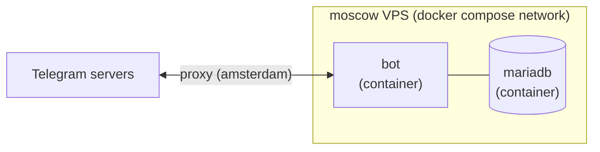
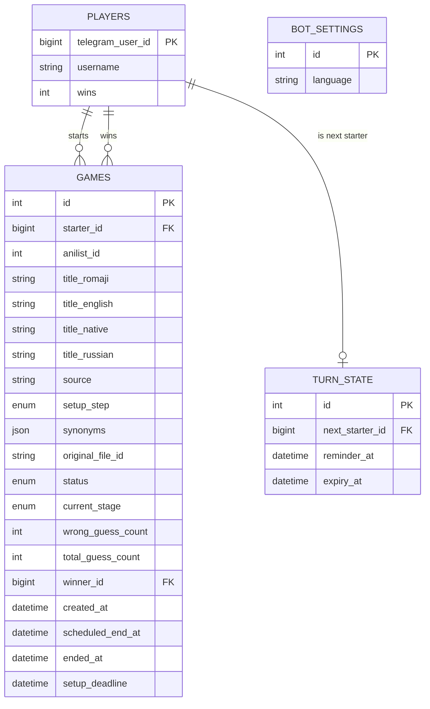

# Architecture

## Overview

A Python Telegram bot running a single guessing game in one topic of one
group chat. A player DMs the bot a screenshot and identifies its anime
(see `MECHANICS.md` for exactly how); the bot pixelates it hard and posts
it into the group's game topic, then progressively reveals clearer
versions as wrong `/guess` attempts accumulate, until someone's right,
the stages run out, or a 2-day timeout fires. See `CLAUDE.md` for repo
layout and coding conventions, `MECHANICS.md` for the game rules
themselves; this doc covers the system design.



No web-facing component exists (no admin panel, no Traefik/Keycloak
involvement) — this bot is Telegram-only, unlike `ley-shards-bot`.

## Infrastructure

- **Host:** internal alias `moscow` (see the ops vault for the actual
  hostname/credentials).
- **Docker Compose stack:**
  - `bot` — built from the repo `Dockerfile` (uv-based Python image).
  - `mariadb` — official `mariadb:11` image, data in a named volume. Not
    installed on the host — deliberately containerized like everything else
    deployed to these VPSes.
- **Telegram connectivity:** `moscow` has no direct route to
  `api.telegram.org`. The bot routes *all* Telegram API traffic — both
  `getUpdates` long-polling and outgoing `send*` calls — through another
  internal host's (`amsterdam`) tinyproxy
  (`http://<user>:<pass>@<proxy-host>:<proxy-port>`), configured on
  `ApplicationBuilder`'s `proxy` and `get_updates_proxy`. Real
  hostname/port/credentials are documented in the ops vault, not here.
  (`amsterdam` is used rather than `helsinki` — as of this bot's setup,
  `helsinki`'s proxy is unreachable from both `moscow` and the outside; see
  the ops vault for current status if this ever needs revisiting.)

## Component boundaries

```
commands/        →  services/  →  models/
commands/helpers/   (game rules)  (persistence)
jobs/            (Telegram)
(Telegram, JobQueue)
```

- **`commands/`** — one module per Telegram command. Parses the `Update`,
  calls into `services/`, formats the reply. No game rules live here.
- **`commands/helpers/`** — Telegram-aware plumbing shared by more than one
  command file (topic/DM scoping checks, inline-keyboard builders, bot
  command-menu registration, shared formatting). Nothing here registers a
  handler in `app.py`.
- **`jobs/`** — JobQueue-driven background timers (`timers.py`: the 2-day
  game timeout, 1h setup-abandon, 15min/12h win-turn reminder/expiry).
  Telegram-aware like `commands/`, but its entry points are scheduled
  callbacks invoked by PTB's `JobQueue`, not `CommandHandler`/
  `CallbackQueryHandler`s registered against a user action — a genuinely
  different shape, so it's a sibling package rather than living under
  `commands/` despite depending on the same `services/`/`models/` layers.
- **`services/`** — the game logic, framework-agnostic (no
  `python-telegram-bot` imports). This is what unit tests target. One
  module per concern: `anilist.py`/`shikimori.py` (search), `matching.py`
  (guess normalization/fuzzy-match), `pixelate.py` (Pillow pipeline),
  `game.py` (the state machine — the only place that mutates a `Game`
  row), `players.py` (win counts, leaderboard), `i18n.py`/`settings.py`
  (bot language).
- **`models/`** — SQLAlchemy ORM models, one module per table. Columns and
  relationships only — if a model needs a method beyond what SQLAlchemy
  itself generates, that logic belongs in `services/` instead.

This separation exists so guess-matching and pixelation math can be tested
as plain Python without a Telegram update or a live DB.

### Before adding something new

When a change introduces a genuinely new file, module, enum, or shared
concept — not just a function added to an existing, already-scoped file —
decide its placement explicitly before writing code, and update this
section with the decision, rather than dropping it into whichever file
happens to need it first.

## Data model



| Table | Status | Purpose |
|---|---|---|
| `players` | v1 | Telegram user id, opportunistically-captured `username`, `wins` counter (feeds `/leaderboard`). |
| `games` | v1 | One row per round. `status` is `SETUP` (starter is picking/confirming the anime in DM) → `ACTIVE` (posted to the group, guessing open) → `WON`/`UNSOLVED` (terminal). `source` (`"anilist"`/`"shikimori"`/`"manual"`) records which identification method was used. `setup_step` (`PICKING_METHOD`/`AWAITING_PHOTO_CHANGE`/`AWAITING_SYNONYM`/`CONFIRMING`) tracks exactly where in the multi-step DM setup flow the starter is — only meaningful while `status` is `SETUP`, and (like everything else in that flow) derived from the DB rather than in-memory state, so a restart mid-edit resolves correctly. `setup_deadline` (`created_at + 1h`) is when the setup-abandon timer fires if the row is still `SETUP` — see `MECHANICS.md`'s "Starting a game". `current_stage` tracks which pixelation level is currently shown (`X10`→`X8`→`X5`→`X2`); `wrong_guess_count` resets to 0 each time the stage advances, while `total_guess_count` never resets (gates `/correct` on at least one real attempt). `original_file_id` is cleared once the reveal message (win or unsolved) is confirmed sent — see `MECHANICS.md`'s "Cleanup" note; nothing after a game ends needs to re-fetch the screenshot. Only one row may be `SETUP`/`ACTIVE` at a time, enforced in `services/game.py`, not a DB constraint. |
| `turn_state` | v1 | Single row (`id=1`). `next_starter_id` is who's designated to start the next game; `null` means anyone can. Set to the winner on a `WON` game, changed by `/skip`, otherwise left alone (an `UNSOLVED` game doesn't force a turn on anyone). `reminder_at`/`expiry_at` are the win-turn 15min-reminder/12h-expiry absolute deadlines — set alongside `next_starter_id` whenever it becomes a real user, nulled when it's opened back up (see `MECHANICS.md`'s "Turn handoff"). |
| `bot_settings` | v2 | Single row (`id=1`). `language` (`"EN"`/`"RU"`) is the bot's current reply language, changed only via `/language` by a group admin/owner — see CLAUDE.md's "Language / i18n". |

## Game flow, topics, and commands

Full rules live in `MECHANICS.md`; this section is the interaction-model
summary.

- **Game setup** happens entirely in **1-to-1 DM** with the bot: send a
  photo, pick AniList, Shikimori, or manual entry, then either search and
  tap one of that service's results shown as an inline keyboard, or (for
  manual) type a title and at least one synonym directly — landing on a
  private preview (staged title/synonyms + the x10 screenshot) with
  buttons to change the image, re-search, add a synonym, or confirm and
  post to the group. Deliberately stateless across restarts: which game a
  DM is setting up comes from a DB lookup (`get_setup_game_for_starter`),
  which method was picked is stored on that row (`Game.source`) and
  which step of the flow the starter is on (`Game.setup_step`) rather
  than in memory, and a tapped result's title/synonyms are re-fetched
  fresh by the id embedded in the button's `callback_data`
  (`anilist.get_by_id`/`shikimori.get_by_id`) — none of it is cached in
  PTB's in-memory `user_data`, which a redeploy mid-setup would otherwise
  wipe.
- **Everything else** (`/guess`, `/correct`, `/skip`, `/leaderboard`) is
  scoped to **one topic** (`GAME_TOPIC_ID`) in **one group**
  (`GROUP_CHAT_ID`) — checked via `message.message_thread_id` in
  `commands/helpers/scoping.py`. Commands sent elsewhere in the group are
  ignored.
- **`/stop`** is the odd one out: like game setup, it's DM-only (checked
  via `is_private_chat`, not the topic check above) so a stop/confirm
  exchange doesn't clutter the group topic — but unlike setup, its
  *outcome* is still announced back to `GAME_TOPIC_ID` once confirmed.
  See `MECHANICS.md`'s "Stopping a game" section.
- Guessing is via an explicit `/guess <text>` command rather than scanning
  every message, which also means the bot never needs Telegram's group
  privacy mode disabled — it only ever needs to see commands.

## Roadmap (explicitly out of scope for v1)

- **Multi-group / multi-topic support.** `GROUP_CHAT_ID`/`GAME_TOPIC_ID`
  are single env-var values; supporting more than one group is a real
  design change (per-chat config, per-chat active game), not a v1 concern.
- **Per-anime guess history / stats beyond win counts.** `players.wins` is
  the only aggregate tracked; anything richer (guess accuracy, fastest
  solve, per-anime stats) is a future addition, not blocked by anything in
  this schema.
- **Configurable stage thresholds/timeout per game.** The 5-wrong-guesses-
  per-stage and 2-day-absolute-timeout constants are fixed in
  `services/game.py`, not chosen per game by the starter.

## Testing strategy

- **Unit tests** (`tests/`, mirrors `src/` layout): `services/matching.py`
  gets fuzzy-match edge-case coverage (exact title, known synonym, typo
  within threshold, unrelated text); `services/pixelate.py` gets
  output-dimension/block-size assertions per stage; `services/game.py` gets
  full state-machine coverage (win, stage-exhaustion → unsolved, timeout →
  unsolved, author override, skip/handoff, and the `original_file_id`
  cleanup after both terminal states) against `sqlite:///:memory:`.
  `commands/` tests are thin-layer — topic/DM scoping, error-to-reply
  mapping — not a second copy of the game-logic tests.
- **Manual end-to-end**: a throwaway test bot + empty test group (topics
  enabled, matching the real game topic) before anything touches the real
  group. See `README.md` for the deploy commands used there.
