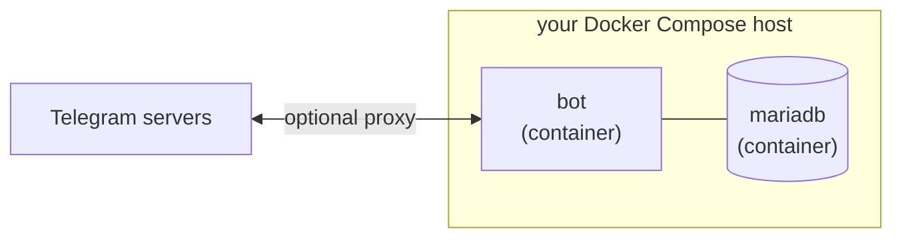
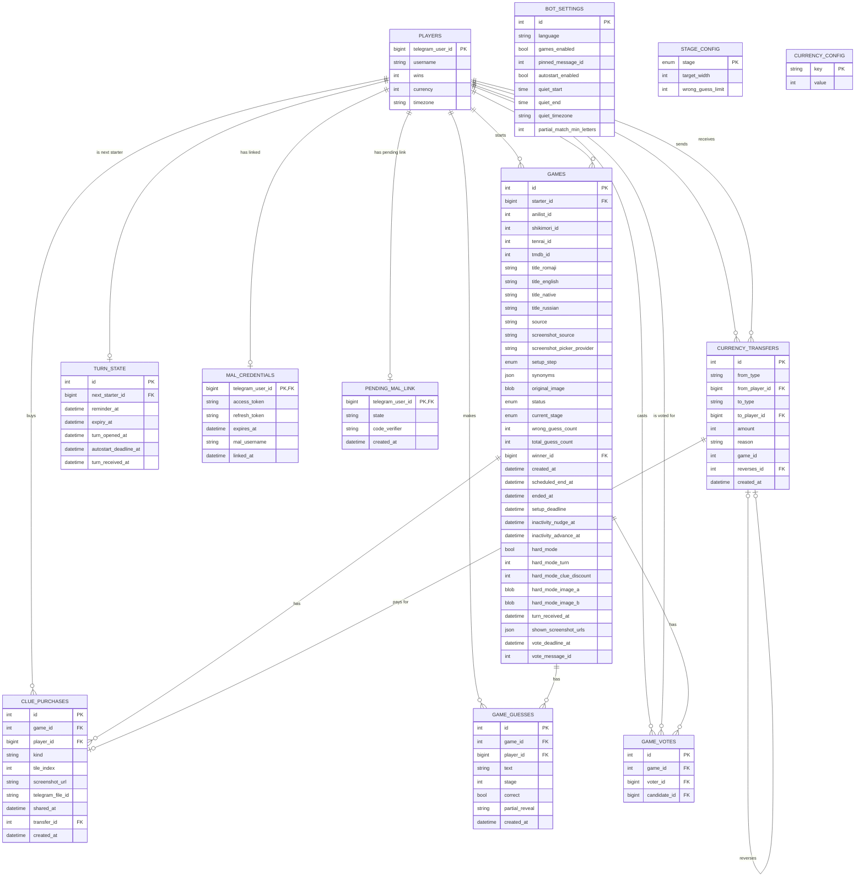
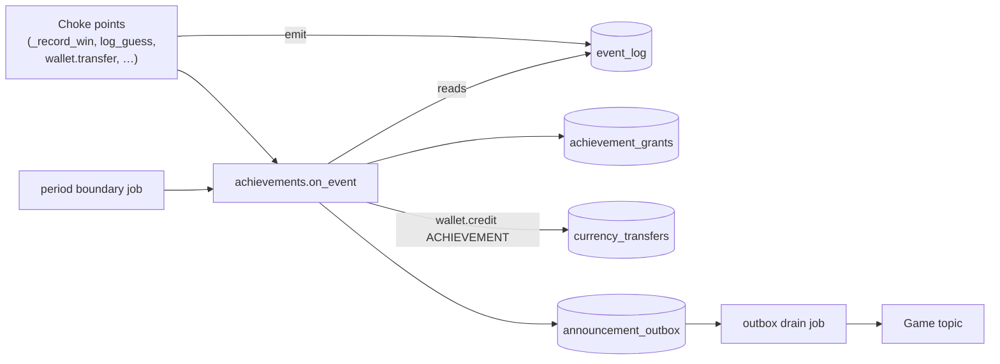

# Architecture

## Overview

A Python Telegram bot running a single guessing game in one topic of one
group chat. A player DMs the bot a screenshot — or sends `/newgame` and
picks one from a provider's gallery instead — and identifies its anime
(see `MECHANICS.md` for exactly how); the bot pixelates it hard and posts
it into the group's game topic, then progressively reveals clearer
versions as wrong `/guess` attempts accumulate, until someone's right,
the stages run out, or a 2-day timeout fires. See `CLAUDE.md` for repo
layout and coding conventions, `MECHANICS.md` for the game rules
themselves; this doc covers the system design.


```mermaid
flowchart LR
    Telegram["Telegram servers"]
    subgraph Host["your Docker Compose host"]
        direction LR
        Bot["bot<br/>(container)"] --- MariaDB[("mariadb<br/>(container)")]
    end
    Telegram <-->|"optional proxy"| Bot
```

No web-facing component exists (no admin panel, no reverse proxy or SSO
involvement) — this bot is Telegram-only.

## Infrastructure

- **Docker Compose stack:**
  - `bot` — built from the repo `Dockerfile` (uv-based Python image).
  - `mariadb` — official `mariadb:11` image, data in a named volume. Not
    installed on the host — deliberately containerized like everything
    else this bot needs.
- **Telegram connectivity:** most hosts can reach `api.telegram.org`
  directly and don't need anything extra. If yours can't (geo-blocked,
  firewalled, etc.), the bot can route *all* Telegram API traffic — both
  `getUpdates` long-polling and outgoing `send*` calls — through an HTTP
  proxy instead, configured via the optional `TELEGRAM_PROXY_URL` env var
  (`http://<user>:<pass>@<proxy-host>:<proxy-port>`), applied to
  `ApplicationBuilder`'s `proxy` and `get_updates_proxy`. See
  README.md's Self-hosting section for setup.
- **AniList/Shikimori connectivity:** both are reached
  directly, no proxy needed — `services/search/shikimori.py`'s
  `SHIKIMORI_GRAPHQL_URL` points at `shikimori.io`. (Shikimori's older
  `shikimori.one` domain now permanently redirects to `shikimori.io` —
  worth remembering if that redirect target ever changes again.)
- **Tenrai connectivity — may need the same optional proxy:** Tenrai
  needs no API key — its public tier (120 RPM / 4 RPS / 40,000 RPD) is
  far more than this bot's call volume needs, see
  `services/search/tenrai.py`'s module docstring — but `api.tenrai.org`
  may still be blocked or unreachable on some hosts, the same risk
  TMDB's paragraph below describes for `api.themoviedb.org`.
  Tenrai is therefore always talked to through a client `app.py` builds
  with `TELEGRAM_PROXY_URL` configured too, unlike AniList's and
  Shikimori's proxy-free clients above — this is a no-op if you haven't
  set `TELEGRAM_PROXY_URL`.
  `commands/dm_start/screenshot_gallery.py`'s screenshot download
  therefore routes through `_client_for_source(context, provider)` (the
  same client `tenrai.py` itself uses) for a Tenrai pick, exactly as it
  does for TMDB below — a Tenrai screenshot pick would otherwise fail if
  a proxy is actually needed on your host.
- **TMDB connectivity — may need the same optional proxy:** TMDB
  requires its own API key regardless (see below), but on some hosts
  `api.themoviedb.org` and its image CDN (`image.tmdb.org`) may also be
  blocked or misresolve outright (e.g. resolving to loopback instead of
  timing out, which can be confirmed with `getent hosts`/`resolvectl
  status`). If that happens, routing the same request through
  `TELEGRAM_PROXY_URL` (if you've set one) should resolve and connect
  fine. TMDB is therefore always talked to through a client `app.py`
  builds with that same proxy configured, unlike anilist.py's/
  shikimori.py's proxy-free clients above (Tenrai's client also needs
  the proxy — see its own paragraph above) — this is a no-op if you
  haven't set `TELEGRAM_PROXY_URL`. A TMDB API key (a v4
  "Read Access Token") needs to be issued from themoviedb.org and placed
  in `.env` — TMDB search/screenshots are optional; without a key,
  everything else still works.
  `commands/dm_start/screenshot_gallery.py`'s screenshot download
  therefore routes through `_client_for_source(context, provider)` (the
  same client `tmdb.py` itself uses), not a bare client — a TMDB
  screenshot pick would otherwise fail if a proxy is actually needed on
  your host.
- **MAL (MyAnimeList) connectivity — may need the same optional proxy,
  and the whole feature is optional:** MyAnimeList's own OAuth +
  REST API (`myanimelist.net`/`api.myanimelist.net`) powers the
  optional "My MAL List" identification method (see `MECHANICS.md`'s
  "Linking a personal MyAnimeList account"). Unlike TMDB above, there's
  no bot-wide API key/header to preset — every player has their own
  per-request Bearer access token, added per call by
  `services/search/mal_user.py`, not on the client itself. `app.py`
  still builds `mal_client` with `TELEGRAM_PROXY_URL` configured,
  mirroring `tenrai_client`/`tmdb_client` above, for hosts where
  `myanimelist.net`/`api.myanimelist.net` need the same proxy path —
  again a no-op if you haven't set `TELEGRAM_PROXY_URL`. The whole
  feature is gated behind four env vars set together (`MAL_CLIENT_ID`,
  `MAL_CLIENT_SECRET`, `MAL_REDIRECT_URI`, `MAL_TOKEN_ENCRYPTION_KEY` —
  see `.env.example`): with any of them unset (or with
  `MAL_TOKEN_ENCRYPTION_KEY` set to something that isn't a valid Fernet
  key, which `app.py` constructs once at startup to check), the
  method-picker's sixth button never renders and `/linkmal` replies that
  linking isn't configured — the same "optional, cleanly absent without
  it" shape TMDB's own paragraph above describes. That gate is one
  predicate, `commands/helpers/mal_config.py`'s `mal_configured`, which
  every caller asks rather than spelling out its own subset of the four
  keys; `app.py` logs a `WARNING` at startup when it sees some-but-not-all
  of them, so a half-configured deploy says so at boot instead of
  stranding the first player who tries to link.
- **OAuth redirect page (`docs/mal-callback.html`):** MyAnimeList's
  OAuth flow needs somewhere to send the player's browser back to once
  they approve access, and this bot has no web-facing component of its
  own to serve one (see "Overview" above). `docs/mal-callback.html` is
  a static, dependency-free page — reads the `code` MyAnimeList
  appended to its own URL's query string, displays it, offers a copy
  button — meant to be served via **this repo's own GitHub Pages**
  rather than by the bot. `MAL_REDIRECT_URI` (`.env`) must point at
  wherever that page ends up served and must exactly match the
  redirect URI registered with the MAL app. **Enabling GitHub Pages
  (Settings → Pages, source: branch `master`, folder `/docs`) is a
  manual, one-time repo-settings step the maintainer must still do
  themselves** — nothing in this codebase or its CI automates it. See
  README.md's Self-hosting section.
- **Group admin permission:** the bot needs the group's "Pin messages"
  admin permission for the pinned-current-image behavior (see
  `MECHANICS.md`'s "Pixelation stages" section) to actually take effect.
  Without it, `pin_chat_message`/`unpin_chat_message` calls fail
  silently (logged at `WARNING`) rather than blocking anything — the
  game still works, it just never gets a pinned image.

## Component boundaries

```
commands/        →  services/  →  models/
commands/helpers/   (game rules)  (persistence)
jobs/            (Telegram)
(Telegram, JobQueue)
```

- **`commands/`** — one module per Telegram command. Parses the `Update`,
  calls into `services/`, formats the reply. No game rules live here.
- **`commands/helpers/`** — Telegram-aware plumbing shared by more than one
  command file (topic/DM scoping checks, inline-keyboard builders, bot
  command-menu registration, shared formatting). Two exceptions to the
  "no handlers here" rule: `player_tracking.py` and `log_scope.py` (see
  "Handler groups").

### Handler groups

Every handler `app.py` registers goes into PTB's default group (`0`)
except two `TypeHandler(Update, …)` pre-handlers. PTB walks groups in
order and, unless a callback raises `ApplicationHandlerStop`, carries on
to the next, so both run on *every* update before the normal command
handlers:
- `log_scope.bind_update` in group `-2` (`app._LOG_SCOPE_GROUP`) resets
  the structured log context (`log_context.py`, #230) to this update's
  user, chat and thread. It resets rather than adds because PTB handles
  updates one after another in the same task, so the previous update's
  game and user would otherwise carry over.
- `player_tracking.remember_user` in group `-1`
  (`app._PLAYER_TRACKING_GROUP`), described below.

Its job is to create-or-refresh the update sender's `players` row, which
is what `/correct @username` and `/skip @username` resolve their typed
handle against. It's a pre-handler rather than a `get_or_create_player`
call inside each command because those two lookups have to work for
someone the bot has only ever *seen* — a person who answered a round in
plain prose in the game topic is exactly who `/correct` is for, and is
exactly who no command handler would ever have recorded.
- **`jobs/`** — JobQueue-driven background timers. Telegram-aware like
  `commands/`, but its entry points are scheduled callbacks invoked by
  PTB's `JobQueue`, not `CommandHandler`/`CallbackQueryHandler`s registered
  against a user action — a genuinely different shape, so it's a sibling
  package rather than living under `commands/` despite depending on the
  same `services/`/`models/` layers.
- **`services/`** — the game logic, framework-agnostic (no
  `python-telegram-bot` imports). This is what unit tests target.
- **`models/`** — SQLAlchemy ORM models, one module per table. Columns and
  relationships only — if a model needs a method beyond what SQLAlchemy
  itself generates, that logic belongs in `services/` instead.

This separation exists so guess-matching and pixelation math can be tested
as plain Python without a Telegram update or a live DB. See "Where things
are" below for what's actually in each of these.

### Where things are

The full directory/module layout — moved here from `CLAUDE.md` since it's
architecture, not day-to-day workflow. Each `commands/`/`services/`
subpackage's own `__init__.py` docstring (`dm_start/`, `game_flow/`,
`services/game/`, `services/search/`, `services/settings/`) is the more
detailed, load-bearing version of what's summarized here — if the two ever
disagree, trust the docstring and fix this tree, not the other way around.

```
src/nani_pix_bot/
  config.py       # env/.env loading — the only place that reads os.environ
  db.py           # SQLAlchemy engine/session factory, session_scope();
                   # the engine pre-pings/recycles pooled connections so
                   # one MariaDB dropped after 8h idle isn't reused (#194)
  logging_config.py  # loguru setup, redirects PTB's stdlib logging into it;
                   # its filter masks every .env secret (Config.secret_values())
                   # in messages, extra fields and exception chains, plus
                   # anything token-shaped (#184). LOG_FORMAT picks the
                   # text sink ([game 88 | 2 @bob] prefix) or the JSON
                   # sink (one flat object per line, #230)
  log_context.py  # the structured log context (#230): a ContextVar reset
                   # per update (commands/helpers/log_scope.py) and per
                   # timer job (jobs/timers/_shared.py's job_log_scope),
                   # with game_id bound by services/game/state.py's
                   # lookups; its loguru patcher copies it into every
                   # record's extra
  heartbeat.py    # wraps bot.get_updates so a liveness file is only
                   # touched after a real successful poll — lets
                   # docker-compose.yml's HEALTHCHECK (+ fleet autoheal)
                   # detect the getUpdates connection-pool wedge that a
                   # process can retry-loop through forever otherwise
  app.py          # ApplicationBuilder wiring, handler registration, an
                   # error handler (so network hiccups log at WARNING
                   # instead of vanishing at DEBUG), and re-arming any
                   # pending JobQueue jobs from the DB on startup (see
                   # MECHANICS.md's "Game lifecycle")
  commands/       # one module per Telegram command (thin: parse update,
                   # call a service, format a reply — no game rules here)
    dm_start/     # both game-setup entry points (DM photo, /newgame) and
                   # the shared identification/screenshot-picking/preview
                   # flow that follows either one, split by flow stage
                   # (package's own __init__ re-exports only the PTB
                   # handler entrypoints):
                   #   intake.py      photo_handler — the traditional,
                   #                  photo-first entry point
                   #   newgame.py     newgame_command — the screenshot-
                   #                  less /newgame entry point (picks a
                   #                  screenshot later instead of
                   #                  uploading one first)
                   #   search.py      method selection + AniList/
                   #                  Shikimori/Tenrai/TMDB search-and-pick
                   #   manual.py      manual title/synonym entry
                   #   screenshots.py screenshot-source selection for
                   #                  the /newgame path — the source-
                   #                  selection keyboard and same-/
                   #                  cross-provider resolution up to
                   #                  the point a gallery is first shown
                   #   screenshot_gallery.py  browsing an already-shown
                   #                  gallery (numbered picks, "More
                   #                  screenshots", the "Wrong anime?
                   #                  Search again" cross-provider
                   #                  correction) — split out of
                   #                  screenshots.py once that file's
                   #                  own complexity grew past qlty's
                   #                  threshold
                   #   source_pick.py the screenshot-source button tap:
                   #                  read it, answer it and search/
                   #                  fetch with no session open,
                   #                  commit what that resolved, then
                   #                  send (#292) — split out of
                   #                  screenshots.py for the same reason
                   #   preview.py     the confirmation preview (show/
                   #                  confirm/change-image/research/
                   #                  add-synonym) + the final post to
                   #                  the group
                   #   keyboards.py   inline-keyboard builders +
                   #                  callback-data constants for all of
                   #                  the above
                   #   _shared.py     helpers used by more than one of
                   #                  them — _start_new_game() (the
                   #                  eligibility-check + game-creation
                   #                  logic both intake.py and newgame.py
                   #                  call), _stage_preview()/
                   #                  _post_preview_album() (needed by
                   #                  every path that ends in "an image
                   #                  now exists for this game": stage
                   #                  in the session, then render the
                   #                  five stages in a worker thread and
                   #                  send after the commit, #161)
                   #   mal_browse.py  everything behind the "My MAL
                   #                  List" 6th method-picker button —
                   #                  unlinked/linked dispatch, the
                   #                  pasted-back OAuth code, and the
                   #                  paginated list browser's own
                   #                  callback handlers (page/pick),
                   #                  including refresh-on-demand for an
                   #                  expired access token. A pick
                   #                  resolves through tenrai.get_by_id
                   #                  and hands off to
                   #                  game_service.stage_result exactly
                   #                  like search.py's own picks — see
                   #                  MECHANICS.md's "Linking a personal
                   #                  MyAnimeList account"
    game_flow/    # commands that run during (or between) an in-progress
                   # game — grouped for symmetry with dm_start/, though
                   # none of these four is individually large:
                   #   guess.py    /guess — the only handler most
                   #               wrong-guess traffic hits
                   #   correct.py  /correct @user — author override
                   #   skip.py     /skip [@user] — turn handoff when no
                   #               game is running
                   #   stop.py     /stop — DM-only; starter or a group
                   #               admin aborts the current game after a
                   #               Yes/No confirmation (outcome is still
                   #               announced in the group topic)
                   #   bounty.py   /bounty <amount> — topic only, ACTIVE
                   #               game; adds to the pot
                   #   vote.py     the vote buttons on a hard-mode
                   #               ballot (#252): records or changes
                   #               one vote, re-renders the ballot
                   #   sharpen.py  /sharpen — confirm button (requester
                   #               only), then charge and advance
                   #   stage_post.py  the stage-advance announcement,
                   #               shared by /guess and /sharpen (the timers
                   #               can't import commands/)
    tip.py        # /tip @user <amount> — topic or DM
    leaderboard.py  # /leaderboard — all-time rich table (👑 wins, 💠, 🏆
                   # points, the chosen title in «» after the name) from
                   # players.leaderboard, paged with lb:<page>; topic or DM
    achievements/  # /achievements — group summary + top (__init__.py),
                   # the DM browser with tabs/pages (browser.py), compare
                   # (compare.py), the status -> rich-message markdown
                   # (render.py, every non-syntax string through
                   # md_escape) and the shared helpers/deep link/callback
                   # parsing (common.py). Callback data is
                   # ach:<view>:<owner>:<filter>:<page>[:<other>], parsed
                   # defensively; ids in callbacks and deep links are
                   # capped at 2**63-1
    standings.py  # /standings — live week/month/year champion tables in
                   # one rich message (periods.standings), with two DM
                   # deep-link buttons (/start rules, /start recent)
    status.py     # /status — topic-only manual resync: re-posts the
                   # current stage image (pixelated off the event loop)
                   # with a live caption, or says what's happening when
                   # no game runs; no state change, no re-pin
    history/      # /history — DM-only finished-games list with an
                   # All/Mine toggle and per-game records with the guess
                   # log (__init__.py), callback data hist:l:/hist:g:
                   # parsed defensively (data.py), markdown (render.py);
                   # queries in services/game/history.py
    standings_dm.py  # the DM views behind them: how 🌟 points work
                   # (rendered from periods' constants) and this week's
                   # gains (periods.recent_gains), paged with std:r:<page>
    title.py      # /title — DM-only picker over the titles you earned
    balance.py    # /balance — the caller's 💠 balance, DM or game topic
    currency_config.py  # /pixelconfig — DM-only, admin-gated view/edit of
                   # the currency amounts (services/economy/config.py);
                   # unlike stageconfig.py, allowed mid-game
    partialmatch.py  # /partialmatch — DM-only, admin-gated view/edit of
                   # bot_settings.partial_match_min_letters, how many
                   # matched letters a wrong guess needs before part of
                   # the title is revealed (#250)
    refund.py     # /refund @user — DM-only, admin-gated: a paginated
                   # picker of the player's clue purchases, a confirm
                   # step, then services/clues/shop.py's refund() and a
                   # DM to the player (#249)
    setwinner.py  # /setwinner <game id> @user — DM-only, admin-gated:
                   # re-finishes an UNSOLVED game through
                   # services/game/refinish.py, or closes a VOTING game's
                   # vote with that winner through jobs/timers/vote.py's
                   # finalize_vote (#253)
    shop/         # the private clue shop (#209) — see MECHANICS.md's "Clue
                   # shop". /shop and `/start shop` open it in DM; the 🛒
                   # on stage posts deep-links there
                   #   menu.py       /shop and `/start shop` (open_shop,
                   #                 shared by both): members only, ACTIVE
                   #                 round only, setter refused; renders the
                   #                 offers
                   #   callbacks.py  the `shop:` inline-button router: buy
                   #                 text/screenshot/tile clues (charge and
                   #                 commit first, then deliver; a failed
                   #                 delivery refunds)
                   #   deliver.py    builds and sends text clues (reused by
                   #                 share), image clues and the topic
                   #                 "bought" notice
                   #   images.py     the image clues: fetch + pixelate an
                   #                 extra screenshot (before anyone is
                   #                 charged) and render a tile reveal
                   #   keyboards.py  shop menu, 8x8 tile grid (shown only
                   #                 until the round's one tile is chosen;
                   #                 later buyers get that tile directly)
                   #                 and share keyboards, and the
                   #                 callback prefixes
                   #   share.py      the free once-per-clue "share with the
                   #                 group" action
    mal_link.py   # /linkmal, /unlinkmal — DM-only, self-service (no
                   # admin gate, unlike language.py below), standalone
                   # entry points for personal MyAnimeList account
                   # linking. dm_start/mal_browse.py's 6th method
                   # button is a convenience wrapper around the same
                   # underlying flow, not a replacement for these
    language.py   # /language — DM-only, admin-gated bot language switch
    stageconfig.py  # /stageconfig, /setstageconfig, /setstage — DM-only,
                   # admin-gated view/edit of per-stage pixelation config
                   # (blocked while a game is running; posts a visual
                   # preview on a successful edit)
    gamesenabled.py  # /setgamesenabled — DM-only, admin-gated toggle for
                   # whether a *new* game may be started at all
    setautostart.py  # /setautostart — DM-only, admin-gated toggle for
                   # whether the bot may start a game itself (idle
                   # auto-start, or "overthrow" right after a game
                   # concludes) — built on helpers/admin_toggle.py, same
                   # shape as gamesenabled.py
    quiet_hours.py  # /timezone, /quiethours — DM-only, admin-gated:
                   # the admin's own IANA timezone (Player.timezone) and
                   # the bot-wide quiet-hours window entered in it — see
                   # MECHANICS.md's "Quiet hours"
    onboarding.py # /start (and `/start shop`, the clue-shop deep link,
                   # `/start ach_<id>`, the achievements one, and
                   # `/start rules`/`/start recent` for standings_dm.py), /help
    helpers/      # shared Telegram-aware plumbing — topic/DM scoping
                   # checks (scoping.py), group-membership + admin checks
                   # (membership.py), Telegram rich messages (headings,
                   # checklists, tables) sent or edited from markdown,
                   # with md_escape and a plain-text fallback, for the
                   # achievements views and /standings (rich.py), the
                   # ◀ n/N ▶ pager every paged rich message shares, with
                   # its no-op page:x counter (paging.py), the
                   # one inline keyboard genuinely shared across
                   # packages: stop_confirm_keyboard()
                   # (keyboards.py, used by game_flow/stop.py and
                   # stageconfig.py), bot command-menu registration
                   # (bot_menu.py), the one "is MAL linking configured?"
                   # predicate every caller asks (mal_config.py — all
                   # four MAL_* settings or nothing; see the MAL bullet
                   # under "Connectivity" above), the shared
                   # DM-only/admin-gated on/off
                   # toggle-command factory (admin_toggle.py — built to
                   # de-duplicate /setgamesenabled and /setautostart, see
                   # its own docstring), and the one update callback here
                   # that app.py does register — player_tracking.py's
                   # remember_user (see "Handler groups" below). (Rendering an
                   # Earnings value into reply text lives in
                   # services/economy/messages.py, not here.) Test:
                   # does more than one commands/*.py file need it, or
                   # does it not correspond to an actual /command at all?
                   # Either one means helpers/, not a plain commands/*.py
                   # file (dm_start's own keyboard builders live in
                   # commands/dm_start/keyboards.py instead, since
                   # nothing outside that package needs them).
  jobs/           # JobQueue-driven background timers — Telegram-aware
                   # like commands/, but scheduled callbacks rather than
                   # CommandHandler/CallbackQueryHandlers, so a sibling
                   # package rather than living under commands/
    timers/       # split from a single module (2026-09) once it grew
                   # past qlty's file-total-complexity threshold; every
                   # public name is re-exported from __init__.py, so
                   # existing callers (`from nani_pix_bot.jobs import
                   # timers as timeout_module`) needed no changes:
                   #   __init__.py        rearm_pending_timeouts (touches
                   #                      every submodule below, so lives
                   #                      here rather than in any one of
                   #                      them) + the re-exports
                   #   _shared.py         seconds_until/seconds_until_timeout
                   #                      — pure scheduling math every
                   #                      submodule needs
                   #   quiet.py           @quiet_hours_deferred — wraps every
                   #                      posting timer callback; inside a quiet
                   #                      window it re-schedules the job to the
                   #                      window's end instead of running it
                   #   retry.py           @retry_on_failure — outermost on the
                   #                      same callbacks; a callback that
                   #                      raises is re-scheduled (3x, 1min
                   #                      apart) rather than lost until the
                   #                      next restart (#194)
                   #   current_image.py   post_current_image (the shared
                   #                      "post + best-effort pin" send,
                   #                      decoupled from any caller's own
                   #                      DB transaction — see MECHANICS.md's
                   #                      "Cleanup" note) + clear_image_if_sent;
                   #                      post_stage_image/post_stage_images
                   #                      are the stage-post variants that add
                   #                      the 🛒 clue-shop entry (a URL button;
                   #                      in a HARD MODE album, which can't
                   #                      carry buttons, a caption link),
                   #                      via shop_link_url
                   #   game_timeout.py    the 2-day absolute timeout
                   #   setup_abandon.py   the 1h setup-abandon timer
                   #   turn_timers.py     the win-turn 15min-reminder/
                   #                      12h-expiry timers
                   #   inactivity.py      the 3h-nudge/6h-auto-advance
                   #                      inactivity timers
                   #   vote.py            the hard-mode vote (#252): posts
                   #                      the answer + ballot, the
                   #                      vote-close-<id> timer (re-armed
                   #                      from games.vote_deadline_at on
                   #                      restart), and finalize_vote —
                   #                      pays out / settles, a no-op if
                   #                      the game is no longer VOTING
                   #   autostart.py       the 24h idle-autostart timer and
                   #                      the "overthrow" trigger fired
                   #                      right after a game concludes —
                   #                      owns the DB write, JobQueue
                   #                      scheduling, and Telegram posting
                   #                      around services/game/autostart.py's
                   #                      pure picking logic; see
                   #                      MECHANICS.md's "Bot-initiated
                   #                      games" section
                   #   mal_link_expiry.py the 10min pending-/linkmal-
                   #                      attempt expiry timer — mirrors
                   #                      setup_abandon.py's shape (a
                   #                      scheduled job). Unlike every
                   #                      other timer here it is NOT the
                   #                      only thing enforcing its
                   #                      deadline: a restart mid-link
                   #                      loses the timer, and a stale
                   #                      pending row would then hijack
                   #                      every later plain DM from that
                   #                      player, so services/mal_link.py's
                   #                      get_pending_link applies the
                   #                      same MAL_LINK_EXPIRY_DELAY on
                   #                      read (and deletes what it finds
                   #                      expired). This job is cleanup,
                   #                      not the guarantee
    announcements.py  # the announcement outbox drain: a repeating 20s
                   # job, id order, nothing during quiet hours (rows wait),
                   # cards with the text as caption, albums for 3-10 rows
                   # of one event (chunked at 10, rendered bytes reused),
                   # avatars cached per drain, a drain stops at the first
                   # failed send, a row is given up after 3 attempts
    periods.py    # the period boundary job: a one-shot run_once at the
                   # next boundary that closes what ended (catching up
                   # after downtime) and re-arms itself; the first start
                   # only arms the running periods
    avatars.py    # a player's current profile photo (None on any miss ->
                   # the card draws initials)
  services/       # the actual game logic — framework-agnostic, no
                   # python-telegram-bot imports in this package
    search/       # anime identification + screenshot fetching, called
                   # at setup time only, never per guess:
                   #   anilist.py    AniList GraphQL search (httpx) — no
                   #                 screenshot capability
                   #   shikimori.py  Shikimori GraphQL search + screenshots
                   #                 (httpx) — the RU-friendly
                   #                 alternative to anilist.py. Migrated
                   #                 off REST (issue #104) to sidestep a
                   #                 REST-only malformed-data shape (issue
                   #                 #103)
                   #   tenrai.py     Tenrai (third-party MyAnimeList API)
                   #                 search + screenshots (httpx) — needs
                   #                 a proxied client, like tmdb.py below
                   #                 (see "Infrastructure" above)
                   #   tmdb.py       TMDB search + screenshots (httpx) —
                   #                 needs a proxied client + a Bearer
                   #                 token, unlike anilist.py/shikimori.py
                   #                 above (tenrai.py also needs the
                   #                 proxy, just no token — see
                   #                 "Infrastructure" above)
                   #   mal_user.py   MyAnimeList's OFFICIAL API (OAuth2 +
                   #                 PKCE token exchange/refresh, plus the
                   #                 authenticated player's own anime
                   #                 list) — NOT part of the shared
                   #                 Provider/SearchModule/ScreenshotModule
                   #                 machinery the four providers above
                   #                 register into: "MAL list" isn't a
                   #                 Provider, the same way "manual" isn't
                   #                 (see MECHANICS.md's "Linking a
                   #                 personal MyAnimeList account"). Still
                   #                 shares http_retry.py's retry plumbing
                   #                 with the four above
                   #   rest.py       the JSON-GET + by-id-or-404 plumbing
                   #                 shared by the two REST providers
                   #                 above (tenrai.py, tmdb.py — not
                   #                 anilist.py or shikimori.py, both
                   #                 GraphQL with neither a by-id URL nor
                   #                 404 semantics). Generic over the
                   #                 parsed type, so each module's
                   #                 get_by_id keeps its own concrete
                   #                 return type (issue #68)
                   #   graphql.py    the shared GraphQL-over-HTTP plumbing
                   #                 for the two GraphQL providers above
                   #                 (anilist.py, then shikimori.py once
                   #                 it migrated onto GraphQL, issue
                   #                 #104) — the POST/decode/error-array
                   #                 handling rest.py provides for its
                   #                 own two REST providers
                   #   parsing.py    the entry-level guards all four
                   #                 share: skip a result whose shape
                   #                 the provider's own _parse_* can't
                   #                 index, and validate the fields it
                   #                 hands back. Here rather than in
                   #                 rest.py because anilist.py and
                   #                 shikimori.py need them too and
                   #                 deliberately share none of the REST
                   #                 plumbing (issue #83)
                   #   http_retry.py the 429/Retry-After retry loop
                   #                 shared by all four
                   #   cache.py      short-TTL, in-process, keyed-by-
                   #                 client-identity cache wrapping all
                   #                 four providers' search()/
                   #                 get_by_id()/screenshots() calls —
                   #                 read-only performance caching,
                   #                 unrelated to this project's
                   #                 DB-derived-flow-state principle
                   #                 (issue #11 — see CLAUDE.md)
                   #   base.py       SearchModule/ScreenshotModule classes
                   #                 giving Provider.search_module/
                   #                 screenshot_module (models/enums.py)
                   #                 real static checking instead of bare
                   #                 types.ModuleType (issue #169). Each
                   #                 provider module above ends with
                   #                 `service = ScreenshotModule(sys.
                   #                 modules[__name__])` (or SearchModule
                   #                 for anilist.py) — one shared,
                   #                 generic delegator per provider,
                   #                 forwarding to that module's own free
                   #                 functions via attribute lookup on
                   #                 the live module object rather than
                   #                 holding logic itself, which keeps
                   #                 cache.py's client-must-be-first-arg
                   #                 contract and every existing
                   #                 monkeypatch.setattr(shikimori,
                   #                 ...)-style test intact. `__init__`
                   #                 also verifies at import time that
                   #                 the module actually has a callable
                   #                 search/get_by_id/screenshots — the
                   #                 one check `ty` itself can't make
                   #                 since self._module: ModuleType
    matching.py   # normalize + rapidfuzz-match a guess against a game's
                   # cached title/synonyms — pure function, fully
                   # deterministic, no network calls
    pixelate/     # Pillow downscale/upscale pipeline — given raw bytes,
                   # a target width and a PixelAlgorithm, no DB or
                   # PixelStage dependency; callers resolve the width via
                   # settings/stage_config.py and the algorithm off the
                   # game row first:
                   #   render.py      the shared Pillow primitives (the
                   #                  plain mosaic, and the rank mosaic
                   #                  median/mode need), plus the clue
                   #                  shop's tile_box (a tile's pixel
                   #                  rectangle on the 8x8 grid) and
                   #                  reveal_tiles (pastes the original's
                   #                  tiles over the pixelated image)
                   #   algorithms.py  PixelAlgorithm -> implementation
                   #                  registry, and pixelate() itself
    game/         # the state machine — the only package that mutates a
                   # Game row:
                   #   clock.py     deadline_after() — the single place every
                   #                game/turn deadline is computed from "now",
                   #                skipping quiet-hours time
                   #   state.py     create/advance/win/unsolved/timeout
                   #                transitions, plus display_title() and
                   #                SCREENSHOT_CAPABLE_PROVIDERS/
                   #                screenshot_capable_providers()
                   #   hard_mode.py the HARD MODE ruleset (2 turns, 2
                   #                screenshots/turn, fixed 1-guess-per-
                   #                turn budget, +2 win award) every
                   #                bot-autostarted game plays instead of
                   #                state.py's normal 5-PixelStage
                   #                progression — a related but distinct
                   #                concern, same relationship turns.py
                   #                already has to state.py. Imports
                   #                state.py at module level (reuses its
                   #                shared win/unsolved paths); state.py
                   #                imports this module back only via
                   #                local, function-body imports, to avoid
                   #                a genuine circular import — see
                   #                MECHANICS.md's "HARD MODE" section
                   #   guesses.py   the game_guesses log: log_guess and the
                   #                guessers() query the vote's candidates
                   #                come from
                   #   vote.py      the hard-mode vote (#252): opening it
                   #                (end_hard_mode_without_winner),
                   #                cast_vote, the unique-plurality rule
                   #                (decide_winner, VOTE_MIN_VOTES) and
                   #                close_vote; Telegram-free — see
                   #                MECHANICS.md's "HARD MODE vote"
                   #   history.py   /history's queries: finished (WON/
                   #                UNSOLVED) games newest first, all or
                   #                one player's, and one game's record
                   #                (game_won/game_unsolved event facts,
                   #                the guess log); maps the logged
                   #                unsolved cause to a player-facing
                   #                UnsolvedReason
                   #   refinish.py  admin re-finish (#253): the
                   #                refusal rules and the UNSOLVED -> WON
                   #                transition /setwinner uses (turn left
                   #                where it is, ended_at kept)
                   #   turns.py     TurnState bookkeeping (who starts
                   #                next, their reminder/expiry timers,
                   #                and the 24h idle-autostart backstop) —
                   #                a related but distinct concern
                   #   autostart.py pure picking logic for a bot-initiated
                   #                game (no telegram/DB imports): rolls
                   #                the "overthrow" dice and gathers a
                   #                random anime + screenshot (Shikimori
                   #                random pick, Tenrai fallback), capped
                   #                retry loop, zero DB writes until a
                   #                full pick is in hand — see
                   #                jobs/timers/autostart.py, the
                   #                Telegram/DB-aware orchestration layer
                   #                on top of this
    quiet_hours.py  # pure quiet-window math (QuietHours, is_quiet,
                   # add_active_time, window_end_after, parsing) — no
                   # DB/Telegram; DST-correct via zoneinfo
    players.py    # Player lookup/creation, win-count bookkeeping,
                   # leaderboard query — everything that touches only
                   # the Player table (win increments themselves happen
                   # in services/game/state.py, alongside the Game row)
    mal_link.py   # the DB-facing half of personal MyAnimeList account
                   # linking — CRUD for mal_credentials/pending_mal_link
                   # (models/mal_link.py), encrypting access_token/
                   # refresh_token on write and decrypting on read via
                   # services/security/token_crypto.py, so no other
                   # module ever touches those two columns' raw
                   # ciphertext directly. Mirrors players.py's plain-
                   # session-parameter style — callers own the
                   # session_scope(...)/commit, these functions just
                   # mutate
    events.py     # the event log's write side: emit() appends an
                   # event_log row in the caller's transaction, then calls
                   # achievements.on_event
    achievements/ # the achievement engine, no Telegram — see
                   # "Achievements" below. definitions.py (what a
                   # Definition is + tier math), catalogue.py (all 33,
                   # in display order), ladders.py / conditions.py (pure
                   # progress functions over a History), history.py (the
                   # event_log-backed History), engine.py (on_event:
                   # grants, rewards, outbox rows), rewards.py (rarity ->
                   # 💠/points), titles.py, names.py (localized
                   # name/description), status.py (the view model behind
                   # /achievements, plus the top), periods.py (period
                   # math, scoring, freezing a closed period),
                   # podium.py (a finished period as lines/a card),
                   # outbox.py (queue/list/settle)
    cards/        # Pillow image cards, no Telegram: render.py (unlock and
                   # podium cards), icons.py (the drawn diamond, trophy and
                   # star), backgrounds.py (optional per-slot anime
                   # backgrounds)
    economy/      # the currency economy (shown as 💠 pixels) — see MECHANICS.md's "Pixels".
                   # __init__.py deliberately re-exports nothing (import
                   # submodules directly): players.py imports
                   # config/wallet while earning.py imports
                   # services.game, which imports players, so an eager
                   # re-export would be an import cycle
                   #   config.py   EconomyKey, DEFAULT_AMOUNTS (the single
                   #               source of truth for amounts),
                   #               get_amounts/set_amount over the
                   #               currency_config override rows
                   #   wallet.py   the only code that moves currency:
                   #               transfer(session, Party, Party, amount,
                   #               LedgerEntry) adds one two-sided
                   #               CurrencyTransfer row and updates the cached
                   #               Player.currency; credit/debit are
                   #               house<->player wrappers; plus
                   #               balance/game_total/ledger_balance reads
                   #   rewards.py  pure reward math, no DB/Telegram
                   #   settlement.py  every money side effect of a game
                   #               ending unsolved (bounty refund + HARD MODE clue
                   #               cashback) or won by a vote/admin (settle_unsolved,
                   #               settle_disputed_win: win + compensation), so
                   #               the /guess, inactivity, timeout and
                   #               vote-close paths can't drift apart
                   #   messages.py earnings_suffix — renders an Earnings
                   #               value into the extra reply/caption lines
                   #   earning.py  applies rewards.py to real games:
                   #               award_guess/award_win/
                   #               award_prompt_start, called by the
                   #               /guess, /correct and DM-setup-confirm
                   #               handlers; returns an Earnings value
    clues/        # the clue shop's rules (#209), no Telegram — see MECHANICS.md's
                   # "Clue shop"
                   #   text.py   pure first/last letter and title-shape
                   #             (masked title) logic
                   #   shop.py   offers/price/purchase/refund/mark_shared:
                   #             what a player may buy, at what price, and
                   #             the charge (through economy/wallet.py) plus
                   #             CluePurchase bookkeeping; Refusal and
                   #             ShopRefusedError for the rejected cases
                   #   (economy/) bounty.py   the pot: contribute, pay_out,
                   #               refund_pot, refund_note; BOUNTY_MIN. The
                   #               pot is derived from currency_transfers
                   #               (`pot` party rows), never a column
                   #   (economy/) tips.py     /tip's transfer; TIP_MIN
                   #   (economy/) sharpen.py  /sharpen's rules (check,
                   #               price, sharpen)
    i18n.py       # simple dict/JSON t(key, lang, **kwargs) — see
                   # CLAUDE.md's "Language / i18n"
    settings/     # bot-wide configuration, two persistence shapes:
                   #   bot_settings.py  singleton row — language,
                   #                    games-enabled flag, autostart-
                   #                    enabled flag, quiet hours, the
                   #                    partial-match threshold (BotSettings)
                   #   stage_config.py  one row per PixelStage — target
                   #                    width + wrong-guess limit
                   #                    (StageConfig), admin-adjustable
                   #                    via commands/stageconfig.py
    security/     # narrowly-scoped crypto helpers, not a project-wide
                   # security layer:
                   #   token_crypto.py  Fernet symmetric encrypt/decrypt,
                   #                    scoped to MalCredentials'
                   #                    access_token/refresh_token
                   #                    columns only (models/mal_link.py)
                   #                    — a leaked MAL refresh token
                   #                    grants a renewable window onto a
                   #                    real player's personal account,
                   #                    unlike TMDB's plaintext-stored
                   #                    read-only catalog token. Keyed by
                   #                    the bot-wide
                   #                    MAL_TOKEN_ENCRYPTION_KEY env var
                   #                    (config.py); a wrong/rotated key
                   #                    raises rather than silently
                   #                    returning garbage — callers treat
                   #                    that the same as "never linked"
  models/         # SQLAlchemy ORM models, one module per table
    base.py       # declarative base
    player.py     # Player
    game.py       # Game
    turn_state.py # TurnState (singleton row)
    bot_settings.py  # BotSettings (singleton row — language, games_enabled,
                   #               autostart_enabled)
    stage_config.py  # StageConfig (one row per PixelStage)
    currency_transfer.py  # CurrencyTransfer (append-only two-sided 💠 ledger)
    currency_config.py  # CurrencyConfig (admin overrides of currency amounts)
    clue_purchase.py  # CluePurchase (one clue a player bought in one game)
    game_guess.py  # GameGuess (one row per /guess: text, stage/turn,
                   #           correct, partial reveal — #251)
    game_vote.py  # GameVote (one current vote per voter per game; no
                   #           updated_at column — a changed vote just
                   #           overwrites candidate_id)
    mal_link.py   # MalCredentials (one row per linked player, encrypted
                   #               token columns), PendingMalLink (one
                   #               row per live /linkmal attempt's PKCE
                   #               state) — see services/mal_link.py
    event_log.py  # EventLog (append-only domain events)
    achievement.py  # AchievementGrant, AchievementClaim
    announcement.py  # AnnouncementOutbox
    period.py     # PeriodResult, PeriodState
    enums.py      # GameStatus, PixelStage, SetupStep, PixelReason, and Provider — the
                   # latter also exposes pick_prefix/id_attr_name/
                   # screenshot_module/search_module as properties, the
                   # single source of truth for what used to be four
                   # hand-maintained Provider-keyed dicts (issue #114)
assets/          # fonts/ (bundled Noto Sans, OFL) and backgrounds/
                   # <unlock/rarity | podium/period>/n.png, optional card
                   # backgrounds (prompts: docs/card-backgrounds.md)
migrations/       # Alembic migrations
tests/            # mirrors src/ layout
scripts/          # one-off / operational scripts, if any turn out to be needed
Dockerfile, docker-compose.yml   # bot + mariadb, see "Infrastructure" above
```

`Provider.screenshot_module`/`search_module` resolve to real
`services.search.*` module objects, but the import backing each one lives
*inside* the property getter, re-run on every access, instead of at
`enums.py`'s module level — `services/search/*.py` already imports
`Provider` from `models.enums` at its own top level, so a module-level
import back here would be a real two-hop cycle
(`models.enums` <-> `services.search.*`). Don't "simplify" this into a
top-level import; it was tried and the cycle is real.

The two properties' *declared return types* are a separate, `TYPE_CHECKING`-only
concern from the runtime import above: they're `services/search/base.py`'s
`SearchModule`/`ScreenshotModule` abstract base classes, not bare
`types.ModuleType` (issue #169) — a `TYPE_CHECKING`-gated import never
executes, so it doesn't create the runtime cycle the paragraph above is
about. The two properties now return each module's `service` adapter
instance rather than the module itself — see `base.py`'s own docstring for
why (cache.py's client-must-be-first-arg contract).

### Before adding something new

When a change introduces a genuinely new file, module, enum, or shared
concept — not just a function added to an existing, already-scoped file —
decide its placement explicitly before writing code, and update this
section with the decision, rather than dropping it into whichever file
happens to need it first.

## Data model


```mermaid
erDiagram
    PLAYERS ||--o{ GAMES : starts
    PLAYERS ||--o{ GAMES : wins
    PLAYERS ||--o| TURN_STATE : "is next starter"
    PLAYERS ||--o| MAL_CREDENTIALS : "has linked"
    PLAYERS ||--o| PENDING_MAL_LINK : "has pending link"
    PLAYERS ||--o{ CURRENCY_TRANSFERS : "sends"
    PLAYERS ||--o{ CURRENCY_TRANSFERS : "receives"
    PLAYERS ||--o{ CLUE_PURCHASES : buys
    GAMES ||--o{ CLUE_PURCHASES : "has"
    PLAYERS ||--o{ GAME_GUESSES : makes
    GAMES ||--o{ GAME_GUESSES : "has"
    PLAYERS ||--o{ GAME_VOTES : "casts"
    PLAYERS ||--o{ GAME_VOTES : "is voted for"
    GAMES ||--o{ GAME_VOTES : "has"
    CURRENCY_TRANSFERS ||--o| CLUE_PURCHASES : "pays for"
    CURRENCY_TRANSFERS |o--o| CURRENCY_TRANSFERS : reverses

    PLAYERS {
        bigint telegram_user_id PK
        string username
        int wins
        int currency
        string timezone
    }
    GAMES {
        int id PK
        bigint starter_id FK
        int anilist_id
        int shikimori_id
        int tenrai_id
        int tmdb_id
        string title_romaji
        string title_english
        string title_native
        string title_russian
        string source
        string screenshot_source
        string screenshot_picker_provider
        enum setup_step
        json synonyms
        blob original_image
        enum status
        enum current_stage
        int wrong_guess_count
        int total_guess_count
        bigint winner_id FK
        datetime created_at
        datetime scheduled_end_at
        datetime ended_at
        datetime setup_deadline
        datetime inactivity_nudge_at
        datetime inactivity_advance_at
        bool hard_mode
        int hard_mode_turn
        int hard_mode_clue_discount
        blob hard_mode_image_a
        blob hard_mode_image_b
        datetime turn_received_at
        json shown_screenshot_urls
        datetime vote_deadline_at
        int vote_message_id
    }
    TURN_STATE {
        int id PK
        bigint next_starter_id FK
        datetime reminder_at
        datetime expiry_at
        datetime turn_opened_at
        datetime autostart_deadline_at
        datetime turn_received_at
    }
    BOT_SETTINGS {
        int id PK
        string language
        bool games_enabled
        int pinned_message_id
        bool autostart_enabled
        time quiet_start
        time quiet_end
        string quiet_timezone
        int partial_match_min_letters
    }
    STAGE_CONFIG {
        enum stage PK
        int target_width
        int wrong_guess_limit
    }
    MAL_CREDENTIALS {
        bigint telegram_user_id PK, FK
        string access_token
        string refresh_token
        datetime expires_at
        string mal_username
        datetime linked_at
    }
    PENDING_MAL_LINK {
        bigint telegram_user_id PK, FK
        string state
        string code_verifier
        datetime created_at
    }
    CURRENCY_TRANSFERS {
        int id PK
        string from_type
        bigint from_player_id FK
        string to_type
        bigint to_player_id FK
        int amount
        string reason
        int game_id
        int reverses_id FK
        datetime created_at
    }
    CURRENCY_CONFIG {
        string key PK
        int value
    }
    CLUE_PURCHASES {
        int id PK
        int game_id FK
        bigint player_id FK
        string kind
        int tile_index
        string screenshot_url
        string telegram_file_id
        datetime shared_at
        int transfer_id FK
        datetime created_at
    }
    GAME_GUESSES {
        int id PK
        int game_id FK
        bigint player_id FK
        string text
        int stage
        bool correct
        string partial_reveal
        datetime created_at
    }
    GAME_VOTES {
        int id PK
        int game_id FK
        bigint voter_id FK
        bigint candidate_id FK
    }
```

| Table | Status | Purpose |
|---|---|---|
| `players` | v1 | Telegram user id, opportunistically-captured `username`, `wins` counter (feeds `/leaderboard`), `currency` (v7: the 💠 pixel balance, `NOT NULL` with `server_default="0"` because the table already had live rows; only `services/economy/wallet.py` changes it, always together with a `currency_transfers` row), and an optional IANA `timezone` (set via `/timezone`, used to interpret that admin's `/quiethours` times). |
| `games` | v1 | One row per round. `status` is `SETUP` (starter is picking/confirming the anime in DM) → `ACTIVE` (posted to the group, guessing open) → optionally `VOTING` (hard mode only: the round ran out with no correct guess but at least one guess, and the group is voting — see `MECHANICS.md`'s "HARD MODE vote") → `WON`/`UNSOLVED` (terminal). `vote_deadline_at` (nullable) is when the vote closes, the absolute deadline `jobs/timers/vote.py` re-arms from on every restart; `vote_message_id` (nullable) is the ballot message whose buttons are removed on close. `source` (`"anilist"`/`"shikimori"`/`"tenrai"`/`"tmdb"`/`"manual"`) records which identification method was used; `anilist_id`/`shikimori_id`/`tenrai_id`/`tmdb_id` are one nullable column per provider — at most one is ever set from identification, but a screenshot cross-search (see below) can also populate one of these even when that provider wasn't the identification source. `setup_step` (`PICKING_METHOD`/`PICKING_SCREENSHOT`/`AWAITING_PHOTO_CHANGE`/`AWAITING_SYNONYM`/`CONFIRMING`) tracks exactly where in the multi-step DM setup flow the starter is — only meaningful while `status` is `SETUP`, and (like everything else in that flow) derived from the DB rather than in-memory state, so a restart mid-edit resolves correctly. `pixel_algorithm` (`NEAREST`/`BOX`/`MEDIAN`/`MODE`/`LANCZOS`, defaulting to `MEDIAN`) is how each pixelation block's colour is chosen — picked by the starter from the confirmation preview, and stored per game rather than read from a shared setting because stages 2-5 are rendered much later and from elsewhere, so a mid-round change to a shared setting would make a round's later stages look unlike the ones already posted. `setup_deadline` (`created_at + 1h`) is when the setup-abandon timer fires if the row is still `SETUP` — see `MECHANICS.md`'s "Starting a game". `current_stage` tracks which pixelation level is currently shown (`STAGE_1`→`STAGE_2`→`STAGE_3`→`STAGE_4`→`STAGE_5`); `wrong_guess_count` resets to 0 each time the stage advances, while `total_guess_count` never resets (gates `/correct` on at least one real attempt). `inactivity_nudge_at`/`inactivity_advance_at` are the absolute deadlines for the 3h-nudge/6h-auto-advance inactivity clock, reset on every `/guess` — see `MECHANICS.md`'s "Inactivity" section. `original_image` holds the current game's screenshot as raw bytes directly, rather than a Telegram file_id — deferred-loaded (SQLAlchemy `deferred()`) so routine queries (status checks, the `/guess` hot path) don't pull a multi-hundred-KB blob every time; cleared once the reveal message (win or unsolved) is confirmed sent — see `MECHANICS.md`'s "Cleanup" note; nothing after a game ends needs to re-fetch the screenshot. `hard_mode`/`hard_mode_turn`/`hard_mode_image_a`/`hard_mode_image_b` are populated only for bot-autostarted games (see `MECHANICS.md`'s "HARD MODE" section) — `hard_mode` flags the row as one, `hard_mode_turn` is the 1-or-2 turn it's currently on (a plain nullable int, not a new enum: no admin config, no third value), and `hard_mode_image_a`/`_b` (both deferred-loaded like `original_image`) hold the one screenshot pair played across both turns. `hard_mode_clue_discount` (v9, `NOT NULL`, default 0) is the HARD MODE clue-shop discount in percent, fixed by `jobs/timers/autostart.py` from `hard_mode.next_clue_discount` (the streak of unsolved HARD MODE rounds) when the bot starts the round, so the number its first post announces never shifts; `0` for a normal game, and `services/clues/shop.py`'s `price` ignores it there. For these rows, `current_stage` and `original_image` stay `NULL` instead — a HARD MODE game never enters `state.py`'s normal PixelStage progression, so those columns have nothing to hold. `screenshot_source` and `screenshot_picker_provider` (both nullable, both `"shikimori"`/`"tenrai"`/`"tmdb"`) are two separate meanings that used to share one column, which is what let a genuine upload delete an identification provider id and let text typed at a same-provider gallery be read as a search query: `screenshot_source` is **image provenance** — which provider's `*_id` column is currently backing `original_image`, `null` for a genuine upload or no image yet, written only where the bytes themselves are (`commands/dm_start/screenshot_gallery.py`'s pick) — while `screenshot_picker_provider` is **picker state** — which provider the screenshot picker is currently *resolving* an anime for, i.e. which provider a typed DM message would be searched against, written by whichever screen the starter lands on, since only that screen knows whether anything is left to resolve: the screen a source-button *tap* lands on (the tap handler itself deliberately writes nothing — it does not yet know whether it will end on a gallery or a failure), any failure screen, and any gallery page that carries "Wrong anime? Search again" (every page past the first, and every cross-provider one) all set it, while a same-provider gallery and a finished pick clear it. A screen that draws that button without setting it is a bug — the button itself re-arms the column when *tapped*, but a typed correction has only the column to route on. Re-entering the picker from a later step (the "Search again" prompt reached from a stale gallery message after the preview went up) has to re-assert `setup_step` alongside it, or `search_text_handler` never reaches the branch that reads the column at all. `search_text_handler` routes on the picker column; the preview's "Change image" reads the provenance one. `turn_received_at` (v7, nullable) is the starter's `turn_state.turn_received_at` as of game creation — `null` if the turn was open to anyone; a game created within 1h of a non-null value earns the prompt-turn bonus (`services/economy/earning.py`). `shown_screenshot_urls` (v8, nullable JSON list) holds the screenshot URL(s) currently in play — the one a gallery pick or a bot autostart used, or both URLs of a HARD MODE pair; `null` for an uploaded photo — so the clue shop's extra-screenshot clue never offers one the group is already looking at. Only one row may be `SETUP`/`ACTIVE`/`VOTING` at a time, enforced in `services/game/state.py`, not a DB constraint. |
| `turn_state` | v1 | Single row (`id=1`). `turn_received_at` (v7, nullable) is set when the turn is handed to a *different* specific player (a win, or `/skip @user`; re-designating the same player keeps the old value) and cleared (`null`) when the turn is opened to anyone, so an open turn earns no prompt bonus; unlike `turn_opened_at` it is not cleared at game start, because `create_setup_game` copies it onto `games.turn_received_at` for the prompt-turn currency bonus. `next_starter_id` is who's designated to start the next game; `null` means anyone can. Set to the winner on a `WON` game, changed by `/skip`, otherwise left alone (an `UNSOLVED` game doesn't force a turn on anyone). `reminder_at`/`expiry_at` are the win-turn 15min-reminder/12h-expiry absolute deadlines — set alongside `next_starter_id` whenever it becomes a real user, nulled when it's opened back up (see `MECHANICS.md`'s "Turn handoff"). `turn_opened_at`/`autostart_deadline_at` track the 24h idle-autostart backstop: `turn_opened_at` is when the turn most recently became open to anyone with no game running, `autostart_deadline_at` is `turn_opened_at + 24h`, the absolute deadline `jobs/timers/autostart.py`'s `schedule_idle_autostart()` re-arms from on every restart; both are `null` whenever a specific player is designated or a game is running — see `MECHANICS.md`'s "Bot-initiated games" section. |
| `bot_settings` | v2 | Single row (`id=1`). `language` (`"EN"`/`"RU"`) is the bot's current reply language, changed only via `/language` by a group admin/owner — see CLAUDE.md's "Language / i18n". `games_enabled` gates whether a new game may be *started*, changed via `/setgamesenabled` — see `MECHANICS.md`'s "Pixelation stages" section. `pinned_message_id` is the Telegram `message_id` of whatever "current image" is currently pinned in the game topic — a singleton pointer rather than a per-`games` column since the pin is meant to persist across games (the next game's first post naturally supersedes it); see `MECHANICS.md`'s "Pixelation stages" section. `autostart_enabled` (default `false`, opt-in) gates whether the bot may start a game itself — idle auto-start or "overthrow" — changed via `/setautostart`, checked in addition to (not instead of) `games_enabled`; see `MECHANICS.md`'s "Bot-initiated games" section. `quiet_start`/`quiet_end`/`quiet_timezone` (all `null` = off, the default) hold the quiet-hours window as local wall-clock times plus the IANA zone they were entered in, set via `/quiethours`; see `MECHANICS.md`'s "Quiet hours" section. `partial_match_min_letters` (v9, default 4) is how many letters a wrong guess's matched words must add up to before part of the title is revealed (`0` turns partial reveals off), changed via `/partialmatch`; see `MECHANICS.md`'s "Partial matches". |
| `stage_config` | v5 | One row per `PixelStage` (5 total, `stage` is the primary key). `target_width`/`wrong_guess_limit` are the admin-configurable pixelation width and wrong-guess allowance for that stage, seeded with defaults by migration and changed live via `/setstageconfig`/`/setstage` — see `services/settings/stage_config.py` and `MECHANICS.md`'s "Pixelation stages" section. |
| `mal_credentials` | v6 | One row per player who has linked a personal MyAnimeList account (`telegram_user_id` PK, FK to `players`) — see `MECHANICS.md`'s "Linking a personal MyAnimeList account". `access_token`/`refresh_token` are stored **encrypted** (Fernet, `services/security/token_crypto.py`), keyed by the bot-wide `MAL_TOKEN_ENCRYPTION_KEY` env var — `services/mal_link.py` is the only code that reads/writes these two columns directly, decrypting on read and encrypting on write; nothing else in the codebase touches the raw ciphertext. `expires_at` is when `access_token` needs refreshing, checked on demand right before a list fetch (`commands/dm_start/mal_browse.py`) rather than proactively. `mal_username` is reserved for a future display-name feature — no code path currently populates it (every write, initial link and re-link alike, passes `None`; nothing calls MAL's user-info endpoint), so it's always `null` today despite being nullable rather than dropped. `linked_at` is set once, on first link, and left alone on a re-link. |
| `pending_mal_link` | v6 | One row per player with a live `/linkmal` attempt in flight (`telegram_user_id` PK, FK to `players`) — the OAuth2 PKCE `state`/`code_verifier` pair generated when the authorize URL is built, persisted here (not `bot_data`/in-memory) so a bot restart mid-link doesn't silently lose it, matching this codebase's established setup-flow-state convention (issue #11). A second `/linkmal` while one is already pending overwrites this row in place (`services/mal_link.py`'s `upsert_pending_link`). `created_at` is the reference point for the 10-minute TTL, enforced in two places: the scheduled timer (`jobs/timers/mal_link_expiry.py`) that deletes an abandoned row, and — because that timer doesn't survive a restart — `services/mal_link.py`'s `get_pending_link`, which treats a row older than `MAL_LINK_EXPIRY_DELAY` as absent and deletes it. The read-side check isn't optional belt-and-braces: a surviving pending row makes `search_text_handler` route every later plain-text DM from that player into the code-paste branch, so a restart mid-link would otherwise silently eat their search queries, manual titles and synonyms forever. |
| `currency_transfers` | v7 | Append-only 💠 ledger: one row per movement, both sides explicit. `from_type`/`to_type` are a `CurrencyParty` (`house` = the game itself, where currency is created or spent; `player`; `pot` = a game's bounty escrow, phase 3) stored as plain strings; `from_player_id`/`to_player_id` (FKs to `players`) are set exactly for a `player` side. `amount` is always positive, `reason` a `CurrencyReason` stored as a plain string (`grant`, `wrong_guess`, `first_guess`, `win`, `setter`, `prompt_turn`, `clue_purchase`, `refund`, and, from phase 3, `bounty` for a pot contribution, `bounty_win` for the pot paid to the winner, `tip` and `sharpen`; later `cashback` for HARD MODE clue cashback and `compensation` for a vote/admin-decided win). A game's bounty pot is derived by summing its `pot` rows; there is no `games.bounty` column. Named CHECK constraints enforce the amount, that both party types are valid (`reason` deliberately has no CHECK: an open set that grows each phase), the player-id/type pairing, that a pot side has a `game_id`, and that the two sides differ. `game_id` is a plain integer with **no** FK, since `/stop` and setup-abandon delete `games` rows, the ledger must outlive them and a pot row must keep its game. `reverses_id` (self-FK, unique) names the row a refund undoes and blocks a double refund. `players.currency` is a cache of these rows (`wallet.ledger_balance` is the audit). The per-game wrong-guess cap is answered by summing these rows (the first-guess bonus uses `games.total_guess_count`), so no earnings state lives in memory. Written only via `services/economy/wallet.py`. |
| `currency_config` | v7 | Admin overrides of currency amounts (`key` PK, `value`), set via `/pixelconfig`. Only changed values have a row; defaults are constants in `services/economy/config.py`, so a new amount needs no seeding migration. The clue-shop prices (`clue_*` keys) live here too. |
| `clue_purchases` | v8 | One clue a player bought in one game (`kind` is a `ClueKind` stored as a plain string: first/last letter, title shape, screenshot, tile). `game_id` is a real FK with `ON DELETE CASCADE`, so a game deletion drops its purchases (the ledger rows stay); `/stop` refunds them first via `shop.refund_game`, and setup-abandon only deletes `SETUP` games, which cannot have any; `player_id` FKs `players`. `tile_index` (0-63, row-major on the 8x8 grid) is set for a tile (one per game: the first tile purchase's index, via `shop.round_tile`, is the round's tile and every later buyer's row repeats it; one tile per player) and `screenshot_url` for an extra screenshot, so *what* was bought lives here and never in the ledger. `telegram_file_id` is the delivered image's file_id, kept so sharing re-posts it without re-rendering; `shared_at` is set once when the player shares it with the group (free, once per clue). `transfer_id` (FK, unique) is the `currency_transfers` charge that paid for it; a failed delivery is refunded through a `reverses_id` ledger row and the purchase row is deleted. Written only via `services/clues/shop.py`. |
| `game_votes` | v9 | One current vote in a hard-mode vote (#252): `game_id` (real FK, `ON DELETE CASCADE`), `voter_id`, `candidate_id` (both FK `players`). Unique on (`game_id`, `voter_id`): changing a vote updates the row in place. Candidates are every player with a `game_guesses` row for the game, and nobody can vote for themselves (`services/game/vote.py`). |
| `game_guesses` | v9 | Every /guess: game, player, text, stage/turn, correct, partial reveal. `game_id` is a real FK with `ON DELETE CASCADE`, so it cascades with its game; `player_id` FKs `players`. `stage` is the PixelStage number (1-5) or the hard-mode turn (1-2); `text` is truncated to 255 characters. Written only via `services/game/guesses.py::log_guess`, from `state.record_guess` and `hard_mode.record_hard_mode_guess`. |
| `event_log` | v10 | Append-only domain events, the data source for achievements and deliberately not achievement-specific. `event_type` is an `EventType` stored as a plain string (a new type needs no migration), `actor_id`/`subject_id` are plain bigints (no FK) and `game_id` a plain int with **no** FK like `currency_transfers.game_id`, so rows outlive a `/stop`ped game. `data` is type-specific JSON. Indexed on `(event_type, actor_id)`, `(event_type, subject_id)`, `game_id` and `occurred_at`. It starts empty on deploy, which is the no-backfill rule. Written only through `services/events.py::emit`. |
| `achievement_grants` | v10 | One achievement tier a player unlocked: `key`, `tier`, `rarity`, `reward`, `points`, the ledger `transfer_id` and `granted_at`. Unique on (`player_id`, `key`, `tier`, `period_key`). `period_key` is `NOT NULL DEFAULT ''` (`''` = not a period grant) because MariaDB treats NULLs as distinct in a unique index, which would let a champion tier be granted twice. |
| `achievement_claims` | v10 | The single holder of a group-unique tier (Pioneer, Milestone Keeper N). The primary key (`key`, `tier`) is what makes a second holder impossible. There is no timestamp: the grant row has it. |
| `announcement_outbox` | v10 | A group post owed but not yet sent (`kind` `unlock`/`period_summary`, JSON `payload`), written in the same transaction as what it announces. `batch_id` (the causing event) groups unlocks into one album, `attempts` counts failed sends (given up at 3), `posted_at` is NULL until delivered. Posted in id order by `jobs/announcements.py`. |
| `period_results` | v10 | One place on a closed period's podium (`period_type`, `period_key`, `rank`, `player_id`, `score`, `wins`), frozen when the period closed. Unique on (`period_type`, `period_key`, `rank`). |
| `period_state` | v10 | One row per period type (`period_type` PK): `next_end`, the UTC end of the next period to close. Created at the first start with the running period, so nothing before the deploy is scored; a late start catches up from it. |
| `players` additions | v10 | `title_key` (the title chosen with `/title`) and `first_name` (kept current by `remember_user`, shown when there is no @username). |
| `games` addition | v10 | `activated_at`: when the game went live (`created_at` is when setup started), used by `win_facts.seconds` (activation to the game's end). |

### Achievements

Rules are in `MECHANICS.md`'s "Achievements"; this is how they run.


```mermaid
flowchart LR
    Hooks["Choke points\n(_record_win, log_guess,\nwallet.transfer, …)"] -->|emit| Log[("event_log")]
    Hooks --> Engine["achievements.on_event"]
    Engine -->|reads| Log
    Engine --> Grants[("achievement_grants")]
    Engine -->|wallet.credit ACHIEVEMENT| Ledger[("currency_transfers")]
    Engine --> Outbox[("announcement_outbox")]
    PeriodJob["period boundary job"] --> Engine
    Outbox --> Drain["outbox drain job"] --> Topic["Game topic"]
```

**Flow.** The function that already owns a state change calls
`events.emit(...)` inside its own transaction: the `event_log` row, any
grants, the 💠 reward and the outbox row all commit or roll back together.
`emit` then calls `achievements.on_event`, which re-evaluates only the
definitions triggered by that event type, for the players involved. Progress
is never stored: ladders and sets are computed from `event_log` at
evaluation time by pure functions over a `History`. For each newly crossed
tier the engine inserts the `achievement_grants` row (plus the
`achievement_claims` row for a group-unique one), credits the reward through
`wallet.credit(reason=CurrencyReason.ACHIEVEMENT)` and queues an
`announcement_outbox` row. It re-reads the tiers a player holds before each
grant, so a cascade (a reward that unlocks Pixel Magnate, which pays again)
terminates and never grants a tier twice. Reversals (refund, cashback, any
row with `reverses_id`) never trigger anything. The `jobs/announcements.py`
drain then posts the outbox rows after commit, in id order, and the period
boundary job (`jobs/periods.py`) feeds champions into the same engine and
outbox, so a podium and its champion's unlock keep their order.

**Event hooks.** `game_activated` (`state.activate_game`, which sets
`Game.activated_at`), `guess` (`guesses.log_guess`), `game_won`
(`state._record_win`, every win path including refinish, taking
`terms: WinTerms(award, how)`; `win_facts.seconds` runs from activation to
the game's end), `game_unsolved` (`state.force_unsolved`), `stage_advanced`,
`vote_counted`, `overthrown` (`autostart.maybe_overthrow`, the write is
guarded), `currency_moved` (`wallet.transfer`, so one hook covers every 💠
movement), `clue_purchased`/`clue_refunded` and `bounty_settled`.

**Delivery.** Outbox rows are posted at least once: a crash between the send
and `mark_posted` re-posts that row. A row that fails to render is marked
failed, a drain stops at the first failed send (so order holds) and a row is
given up after 3 attempts with an ERROR. Quiet hours make rows wait. The
drain is a repeating 20s job started in `_post_init`, so there is nothing to
re-arm per row.

**Periods.** `PeriodState.next_end` drives a one-shot boundary job that
closes every period that ended (oldest first, so downtime across several
boundaries, DST included, is caught up exactly once) and re-arms for the
next. The first start only arms the periods running at that moment.

**Rich messages.** `/achievements` and its browser use Bot API 10.3 rich
messages (`sendRichMessage`, `editMessageText` with a `rich_message`). PTB
22.8 speaks Bot API 10.0, so `commands/helpers/rich.py` sends them as raw
calls through `bot.do_api_request` until PTB supports them. On `BadRequest`
or `InvalidToken` it falls back to the same text sent plain (un-escaped),
with an ERROR, so a view never silently vanishes.

**Cards.** `services/cards/` draws the unlock and podium cards with Pillow,
using the bundled Noto Sans (Latin and Cyrillic, no emoji), a drawn diamond
for 💠, trophy for achievement points and star for the champion score, an
anti-aliased avatar badge (solid inner ring, a conic sweep-gradient outer
ring in a per-rarity palette, a glow), initials (letters only) when there is
no avatar, and an optional anime background per slot that is picked
deterministically by player and placed under a dark overlay.

**Testing.** Evaluating achievements on every emitted event would change
balances in the ~500 existing economy tests, so an autouse fixture in
`tests/conftest.py` switches evaluation off by default. A test or module
marked `@pytest.mark.achievements` (registered in `pyproject.toml`) switches
it back on.

## Game flow, topics, and commands

Full rules live in `MECHANICS.md`; this section is the interaction-model
summary.

- **Game setup** happens entirely in **1-to-1 DM** with the bot, via either
  of two entry points: send a photo directly, or send `/newgame` and pick
  a screenshot afterward instead (see `MECHANICS.md`'s "Starting a game"
  for the full walkthrough, including cross-provider screenshot
  resolution). Either way: pick AniList, Shikimori, Tenrai, TMDB, or manual
  entry, then either search and tap one of that service's results shown
  as an inline keyboard, or (for manual) type a title and at least one
  synonym directly — landing on a private preview once both a title and a
  screenshot exist — one album with the screenshot pixelated at all 5
  configured stages, captioned with the staged title/synonyms, followed
  by a separate message (`sendMediaGroup` can't carry a keyboard) with
  buttons to change the image, re-search, add a synonym, switch the
  pixelation algorithm (a submenu; picking one re-renders the album),
  or confirm and
  post to the group. Deliberately stateless across restarts: which game a
  DM is setting up comes from a DB lookup (`get_setup_game_for_starter`),
  which method was picked is stored on that row (`Game.source`) and
  which step of the flow the starter is on (`Game.setup_step`) rather
  than in memory, and a tapped result's title/synonyms are re-fetched
  fresh by the id embedded in the button's `callback_data`
  (`anilist.get_by_id`/`shikimori.get_by_id`/etc.) — none of it is cached
  in PTB's in-memory `user_data`, which a redeploy mid-setup would
  otherwise wipe.
- **Everything else** (`/guess`, `/correct`, `/skip`, `/leaderboard`) is
  scoped to **one topic** (`GAME_TOPIC_ID`) in **one group**
  (`GROUP_CHAT_ID`) — checked via `message.message_thread_id` in
  `commands/helpers/scoping.py`. Commands sent elsewhere in the group are
  ignored.
- **`/stop`** is the odd one out: like game setup, it's DM-only (checked
  via `is_private_chat`, not the topic check above) so a stop/confirm
  exchange doesn't clutter the group topic — but unlike setup, its
  *outcome* is still announced back to `GAME_TOPIC_ID` once confirmed.
  See `MECHANICS.md`'s "Stopping a game" section.
- Guessing is via an explicit `/guess <text>` command rather than scanning
  every message, which also means the bot never needs Telegram's group
  privacy mode disabled — it only ever needs to see commands.

## Roadmap (explicitly out of scope for v1)

- **Multi-group / multi-topic support.** `GROUP_CHAT_ID`/`GAME_TOPIC_ID`
  are single env-var values; supporting more than one group is a real
  design change (per-chat config, per-chat active game), not a v1 concern.
- **Per-anime guess history / stats beyond win counts.** `players.wins` is
  the only aggregate tracked; anything richer (guess accuracy, fastest
  solve, per-anime stats) is a future addition, not blocked by anything in
  this schema.
- **Configurable stage thresholds/timeout per game.** Per-stage wrong-
  guess limits are admin-configurable globally (`services/settings/
  stage_config.py`, `/setstageconfig`/`/setstage`), but not *per game* —
  the 2-day-absolute-timeout and inactivity nudge/auto-advance delay
  constants are still fixed in `services/game/state.py`, and none of
  them are chosen by the starter.

## Testing strategy

- **Unit tests** (`tests/`, mirrors `src/` layout): `services/matching.py`
  gets fuzzy-match edge-case coverage (exact title, known synonym, typo
  within threshold, unrelated text); `services/pixelate/` gets
  output-dimension/block-size assertions per stage, run against every
  algorithm in the registry; `services/game/state.py`
  gets full state-machine coverage (win, stage-exhaustion → unsolved, timeout →
  unsolved, author override, skip/handoff, and the `original_image`
  cleanup after both terminal states) against `sqlite:///:memory:`.
  `commands/` tests are thin-layer — topic/DM scoping, error-to-reply
  mapping — not a second copy of the game-logic tests.
- **Manual end-to-end**: a throwaway test bot + empty test group (topics
  enabled, matching the real game topic) before anything touches the real
  group. See `README.md` for the deploy commands used there.
