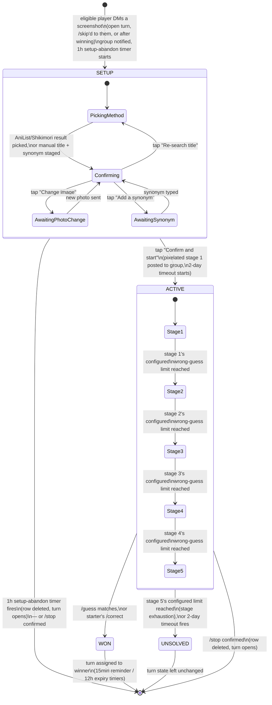

# Mechanics

The single source of truth for this game's rules. See `ARCHITECTURE.md` for
how these rules map onto code/data, and `CLAUDE.md` for repo conventions.
Each section below is tagged **Status: Implemented** or **Status:
Planned** so this doc describes the target design across all of v1, not
just what's currently built.

## Status overview

| Feature | Status |
|---|---|
| Game setup (DM photo + AniList/Shikimori/manual entry) | Implemented |
| Group-membership gate on DM setup | Implemented |
| Pixelation stages (5 stages, scaling wrong-guess allowance, → reveal) | Implemented |
| Guess matching (`/guess`, local fuzzy match) | Implemented |
| Author override (`/correct`) | Implemented |
| Turn handoff (`/skip`) | Implemented |
| 2-day timeout | Implemented |
| Setup-abandon timeout (1h) | Implemented |
| Win-turn reminder (15min) + expiry (12h) | Implemented |
| Manual stop with confirmation (`/stop`) | Implemented |
| Leaderboard (`/leaderboard`) | Implemented |
| Deployed to `moscow` | Implemented |

## Game lifecycle

Every route a `Game` row can take, private (DM setup) and group (posted,
guessed on) alike, including every timer that can end it without anyone
typing a command. Each section below expands on one part of this
diagram in full prose.

`[*]` here means "no `Game` row exists" — every arrow into it either
deletes the row (`/stop`, setup-abandon) or the row reaches a terminal
`status` (`WON`/`UNSOLVED`) and simply stops being the "current" game.
`SETUP`'s four inner states are `Game.setup_step`; `ACTIVE`'s five inner
states are `Game.current_stage` (`PixelStage`).

## Starting a game

**Status: Implemented.**

A game can only start if no other game is currently `SETUP` or `ACTIVE`.
The player allowed to start is whoever `turn_state.next_starter_id` names —
or **anyone**, if it's `null`. They must also currently be a member of the
configured group — the DM entry point is reachable by anyone who finds the
bot, unlike the topic-scoped group commands, which Telegram itself already
restricts to members.

1. The eligible player DMs the bot a screenshot (a photo). The bot posts
   a notice to the group topic — "so-and-so is preparing a new game" —
   so nobody else tries to DM a photo at the same moment, and starts a
   **1-hour setup-abandon timer** (`Game.setup_deadline`). If the player
   never reaches the preview's "Confirm and start" button within that
   hour, the bot deletes the orphaned `SETUP` row, opens the turn to
   anyone, and posts that to the group — the same class of "stuck DM
   flow" bug issue #11 fixed reactively can no longer linger
   indefinitely. The timer is canceled the moment they confirm.
2. The bot asks them to pick an identification method: **AniList**,
   **Shikimori** (the Russian-community anime database, with better
   Russian titles/synonyms), or **manual entry**. If the bot's language
   is currently Russian, Shikimori is listed first with a one-line note
   explaining why. The choice is stored on the game's still-`SETUP` row
   (`Game.source`), not in memory, so it survives a restart before the
   player finishes typing.
3. **AniList/Shikimori**: the bot asks for a search query (the anime's
   name, in whatever form the player remembers it) and searches whichever
   service was picked, showing up to 5 results as an inline keyboard
   (title + year for AniList, the Russian title for Shikimori); a "none
   of these" option lets them retry the search with different text. The
   player taps the correct result, and the bot re-fetches the full record
   from that service (title romaji/English/native for AniList, plus a
   Russian title for Shikimori) and its synonyms list.
   **Manual entry**: for anime neither service knows about. The bot asks
   for the title, then for at least one alternate title/synonym
   (comma- or newline-separated, re-prompted if left blank) — both typed
   by the player, no external lookup.
4. Either way, once a title/synonyms are staged, the bot sends the player
   a **private preview** — the screenshot pixelated at all 5 configured
   stages (blockiest to clearest, see "Pixelation stages" below), sent
   as one Telegram album with the staged title and every other accepted
   answer (every stored title variant — romaji/English/native/Russian,
   not just the manually-typed synonyms — since all of them are already
   valid `/guess` matches) as the caption on the first photo — instead
   of posting straight to the group, so the starter sees exactly how
   the round will progress, and exactly what will count as correct,
   before committing to it. Telegram's `sendMediaGroup` has no
   `reply_markup` support, so the four buttons below arrive on a short
   separate text message right after the album, not on the album
   itself. Those four buttons let them fix anything before it goes
   live:
   - **Change image** — send a new screenshot; keeps the title/synonyms.
   - **Re-search title** — back to the method-selection keyboard; keeps
     the screenshot, replaces the title/synonyms/source once a new one
     is staged.
   - **Add a synonym** — type one more (or several); appended to the
     list, repeatable.
   - **Confirm and start game** — pixelates the (possibly updated)
     screenshot at **stage 1** and posts it into the group's game topic
     with a caption naming the starter and reminding everyone how to
     guess (`/guess <title>` in that topic). The game is now `ACTIVE`.
   Exactly where the starter is in this multi-step flow
   (`Game.setup_step`) is stored on the row, not in memory, so a restart
   mid-edit — say, between tapping "Add a synonym" and typing it —
   resolves correctly from the DB rather than losing track.

If the chosen service is unreachable (search or re-fetch fails), the bot
tells the player and hands back the method-selection choice so they can
try again or switch services — the game stays `SETUP`, never stuck.

If someone who isn't the designated starter (and it isn't open) DMs a
photo, the bot replies that it isn't their turn and doesn't create a game.
Same for someone who isn't currently a group member.

## Guess matching

**Status: Implemented.**

Guessing is an explicit command — **`/guess <text>`** — sent in the game
topic, never free text. This is deliberate: it means the bot never needs
Telegram's group-privacy mode disabled, and every guess attempt is an
unambiguous, loggable event rather than "was that message meant as a
guess?"

Matching is **local and fully deterministic** — no network call happens
per guess. Whichever service was used at setup (see above) is only ever
consulted once, and its result (title variants — including the Russian
title, if Shikimori was used — plus synonyms) is cached on the `Game`
row for the rest of that round:

1. Normalize both the guess and every cached title/synonym: lowercase,
   strip punctuation and extra whitespace.
2. Fuzzy-match the normalized guess against that normalized list with
   `rapidfuzz`, above a fixed similarity threshold defined as a named
   constant in `services/matching.py`.
3. Any match above the threshold counts as correct — it doesn't matter
   which title/synonym it matched, or by how much it cleared the
   threshold.

A **wrong** guess isn't silent: the bot replies in-topic with how many
more wrong guesses remain before the next pixelation stage, and which
stage the game is currently on (e.g. "3 guesses left before the next
clue (4/5)"). The player who started the round can't `/guess` on their
own game at all — they already know the answer.

Because everything the matcher needs is cached at setup time, the same
guess always produces the same verdict for the life of a game — matching
never depends on AniList/Shikimori being reachable, rate limits, or
anything else external, at guess time.

## Pixelation stages

**Status: Implemented.**

The screenshot is downscaled (blocky pixelation) to a **fixed target
width** and immediately upscaled back to its original size, via Pillow,
across 5 stages, from blockiest to clearest. A fixed target width — not
a divisor of the source resolution — keeps stage difficulty independent
of the screenshot's resolution: a narrow target width reads as pure
color blobs whether the original screenshot was 1280px or 3840px wide,
whereas e.g. ÷10 of a 2560px-wide screenshot is still 256px wide and
barely pixelated at all.

**Each stage's target width and wrong-guess limit are admin-configurable
at runtime, not hardcoded constants** — stored one row per `PixelStage`
in the `stage_config` table (see `services/settings/stage_config.py`), seeded
with defaults by migration and changeable live via three DM-only,
admin-gated commands (`commands/stageconfig.py`):

- **`/stageconfig`** — view the current 5-stage table.
- **`/setstageconfig <width:guesses> ×5`** — bulk-set all 5 stages at
  once, positionally (stage 1 through stage 5).
- **`/setstage <stage 1-5> <width> <guesses>`** — tweak just one stage.

Both setters apply immediately (no confirmation step — this is a
fast-iteration admin tool) but **refuse to run while a game is `SETUP`
or `ACTIVE`**, offering a "stop the game" button right there instead
(reusing `/stop`'s own confirmation), and on success immediately post a
visual preview — both fixed example images pixelated at the new
width(s) — so the effect can be checked without a separate step.

Current defaults, as seeded by the migration (run `/stageconfig` for
what's actually live — these get retuned):

| Stage | Target width | Wrong guesses allowed |
|---|---|---|
| `STAGE_1` | 64px (shown first — hardest) | 1 |
| `STAGE_2` | 80px | 1 |
| `STAGE_3` | 128px | 2 |
| `STAGE_4` | 192px | 3 |
| `STAGE_5` | 512px (clearest pixelated stage) | 3 |

No image bytes are stored on disk or in the database. The starter's
original screenshot is kept only as a Telegram `file_id` on the `Game`
row; every stage image is regenerated on demand — download the original
via that `file_id`, run it through the Pillow pipeline, send it, discard
the bytes — so a bot restart mid-game loses nothing (the `file_id` and
`current_stage` are all that's needed to pick back up).

**Each stage allows a different number of wrong `/guess` attempts
before the game advances to the next one**, per its configured
wrong-guess limit, and `wrong_guess_count` resets to 0 on every advance.
If the last allowed wrong guess at the final stage (`STAGE_5`) lands,
the game ends unsolved (see below) instead of advancing further.
Advancing posts the newly-revealed image with a caption naming the new
stage, which guess number (overall) triggered the advance, and how many
more wrong guesses remain before the next one (`guess.
stage_advanced_caption`).

A separate **`/setgamesenabled on|off`** command (also DM-only,
admin-gated) lets an admin pause *starting* new games entirely —
independent of the above, useful for locking things down while
mid-retune. It has no effect on a game already in progress.

## Winning

**Status: Implemented.**

A game ends in a win one of two ways:

- **Automatic**: a `/guess` matches per the rules above.
- **Author override (`/correct @username`)**: the game's starter can force
  a win for a specific player at any time while the game is `ACTIVE`, for
  the case where the fuzzy matcher fails to recognize a guess that was
  actually correct (an alternate title/spelling AniList doesn't list as a
  synonym, for example). Only the starter may run this command; it's a
  fixed `@username` argument, not a reply-based selection.

On a win, the bot:
1. Reveals the original (un-pixelated) screenshot together with the
   anime's title, naming the winner by name in the caption.
2. Sets `status → WON`, records `winner_id`, and increments that player's
   `players.wins`.
3. Cancels the game's pending 2-day timeout job.
4. Sets `turn_state.next_starter_id` to the winner — it's their turn to
   start the next game, called out explicitly in the reveal caption —
   and schedules that winner's 15-minute reminder / 12-hour expiry (see
   "Turn handoff" below).
5. **Cleanup**: once that reveal message is confirmed sent, clears
   `Game.original_file_id` — nothing after this point ever needs to
   re-fetch or re-pixelate the screenshot, so the stored Telegram file
   reference is dropped rather than kept around indefinitely.

## Ending unsolved

**Status: Implemented.**

A game ends unsolved one of two ways, handled identically:

- **Stage exhaustion**: the final stage's (`STAGE_5`) configured
  wrong-guess limit is reached.
- **Timeout**: see below.

Either way, the bot reveals the original screenshot with the anime's
title, sets `status → UNSOLVED`, and performs the same `original_file_id`
cleanup described in "Winning" above. `turn_state.next_starter_id` is left
untouched — an unsolved game doesn't hand anyone a forced turn. If it was
already `null` (open to anyone), it stays that way; if someone was
designated (unusual for this path, since normally only a win sets it),
they remain designated.

## Timeout

**Status: Implemented.**

Every `ACTIVE` game gets a **2-day timeout, absolute from game start** —
not reset by guessing activity. It's scheduled as a `JobQueue` job at
`created_at + 2 days` (`scheduled_end_at`) when the game goes `ACTIVE`. If
no one has won by then, the job fires the same "ending unsolved" flow
above, regardless of how many wrong guesses happened in between.

Because `JobQueue` jobs don't survive a process restart, `app.py` re-arms
a timeout job on startup for any `Game` still `ACTIVE`, using its stored
`scheduled_end_at` — a redeploy never silently loses or resets the clock.

## Stopping a game (`/stop`)

**Status: Implemented.**

Manually aborts whatever game is currently `SETUP` or `ACTIVE`, usable
by that game's own starter, or by any group admin/owner (for any game,
not just their own) — checked via the same `is_group_admin` helper
`/language` uses. **DM only** — sent privately to the bot like `/start`/
`/help`/`/language`, not in the game topic — though the outcome is still
announced there (step 4 below).

`/stop` never acts immediately — it always shows a **Yes/No confirmation**
first (naming the game's title, if one's been staged yet), and only the
starter or an admin can actually tap "Yes" (re-checked at that point too,
independently of who saw the prompt). Tapping "No" just leaves the game
running untouched.

On confirmation, the bot:
1. Cancels whatever timer was pending for that game — its 2-day timeout
   if `ACTIVE`, or its 1-hour setup-abandon timer if still `SETUP`.
2. **Deletes the `Game` row outright** — same precedent as the
   setup-abandon timer and turn expiry: a manually-stopped round isn't a
   meaningful outcome worth a terminal status of its own (unlike
   `WON`/`UNSOLVED`), so no `CANCELED` status exists.
3. Opens the turn (`next_starter_id → null`), same effect as a bare
   `/skip` — canceling any pending win-turn reminder/expiry too.
4. Posts a notice to the group that anyone can start a new game.

## Turn handoff (`/skip`)

**Status: Implemented.**

Usable only by whoever `turn_state.next_starter_id` currently names, and
only while no game is `SETUP`/`ACTIVE` (it governs who may *start* the
next game, not anything mid-game):

- `/skip` (no argument) sets `next_starter_id` to `null` — the turn opens
  up, and anyone can DM the bot a screenshot to start the next game.
  Cancels the reminder/expiry timers below.
- `/skip @username` hands the designation directly to that person instead
  — (re)schedules the timers below for the new designee.

Whenever `next_starter_id` becomes a real user (a win, or `/skip @user`),
two absolute-deadline `TurnState` timers are (re)scheduled:

- **Reminder (15 minutes)**: DMs the designated player that it's their
  turn. If the DM fails (they've never started the bot), falls back to
  an `@mention` in the group topic instead — same "can't reach them
  privately" fallback pattern as `/help`'s.
- **Expiry (12 hours)**: if they still haven't started by then, opens the
  turn to anyone (same as a bare `/skip`) and posts that to the group.

Both are canceled — without touching `next_starter_id` itself — the
moment the designated player actually DMs a photo to start their game;
they're clearly not going to miss a turn they've already begun.

## Leaderboard

**Status: Implemented.**

`/leaderboard`, usable at any time in the game topic regardless of whether
a game is running, lists players ordered by `players.wins` descending.
