# Mechanics

The single source of truth for this game's rules. See `ARCHITECTURE.md` for
how these rules map onto code/data, and `CLAUDE.md` for repo conventions.
Each section below is tagged **Status: Implemented** or **Status:
Planned** so this doc describes the target design across all of v1, not
just what's currently built.

## Status overview

| Feature | Status |
|---|---|
| Game setup (DM photo, or `/newgame` + screenshot picker) + AniList/Shikimori/Jikan/TMDB/manual entry | Implemented |
| Group-membership gate on DM setup | Implemented |
| Pixelation stages (5 stages, scaling wrong-guess allowance, → reveal) | Implemented |
| Guess matching (`/guess`, local fuzzy match) | Implemented |
| Author override (`/correct`) | Implemented |
| Turn handoff (`/skip`) | Implemented |
| 2-day timeout | Implemented |
| Inactivity nudge (3h) + auto-advance (6h) | Implemented |
| Pinned current image (one at a time, follows the game) | Implemented |
| Setup-abandon timeout (1h) | Implemented |
| Win-turn reminder (15min) + expiry (12h) | Implemented |
| Manual stop with confirmation (`/stop`) | Implemented |
| Leaderboard (`/leaderboard`) | Implemented |

## Game lifecycle

Every route a `Game` row can take, private (DM setup) and group (posted,
guessed on) alike, including every timer that can end it without anyone
typing a command. Each section below expands on one part of this
diagram in full prose.

```mermaid
stateDiagram-v2
    [*] --> SETUP: eligible player DMs a screenshot,\nor sends /newgame\n(open turn, /skip'd to them, or after winning)\ngroup notified, 1h setup-abandon timer starts

    state SETUP {
        [*] --> PickingMethod
        PickingMethod --> Confirming: AniList/Shikimori/Jikan/TMDB result picked,\nor manual title + synonym staged\n— screenshot already in hand (DM-photo entry)
        PickingMethod --> PickingScreenshot: same, but no screenshot yet\n(/newgame entry)
        PickingScreenshot --> Confirming: screenshot picked\n(same- or cross-provider, see\n"Picking a screenshot")\nor own photo sent
        PickingScreenshot --> PickingScreenshot: provider down / nothing found\n— back to the source menu\n(see "When a provider fails")
        PickingScreenshot --> AwaitingPhotoChange: tap "Upload my own instead"
        Confirming --> PickingMethod: tap "Re-search title"\n(API-sourced screenshot cleared;\na genuine upload is kept)
        Confirming --> AwaitingPhotoChange: tap "Change image"\n(genuine upload,\nor "Upload a new photo" chosen)
        Confirming --> PickingScreenshot: tap "Change image" ->\n"Pick a different screenshot"\n(API-sourced screenshot only)
        AwaitingPhotoChange --> Confirming: new photo sent
        Confirming --> AwaitingSynonym: tap "Add a synonym"
        AwaitingSynonym --> Confirming: synonym typed
    }

    SETUP --> [*]: 1h setup-abandon timer fires\n(row deleted, turn opens)\n— or /stop confirmed
    SETUP --> ACTIVE: tap "Confirm and start"\n(pixelated stage 1 posted to group,\n2-day timeout starts)

    state ACTIVE {
        [*] --> Stage1
        Stage1 --> Stage2: stage 1's configured\nwrong-guess limit reached,\nor 6h of inactivity
        Stage2 --> Stage3: stage 2's configured\nwrong-guess limit reached,\nor 6h of inactivity
        Stage3 --> Stage4: stage 3's configured\nwrong-guess limit reached,\nor 6h of inactivity
        Stage4 --> Stage5: stage 4's configured\nwrong-guess limit reached,\nor 6h of inactivity
    }
    note right of ACTIVE
        Every /guess resets a 3h-nudge/6h-auto-advance
        inactivity clock (see "Inactivity" section) —
        orthogonal to the 2-day absolute timeout below
    end note

    ACTIVE --> WON: /guess matches,\nor starter's /correct
    ACTIVE --> UNSOLVED: stage 5's configured limit reached\n(stage exhaustion),\nor 6h of inactivity on stage 5,\nor 2-day timeout fires
    ACTIVE --> [*]: /stop confirmed\n(row deleted, turn opens)

    WON --> [*]: turn assigned to winner\n(15min reminder / 12h expiry timers)
    UNSOLVED --> [*]: turn state left unchanged
```

`[*]` here means "no `Game` row exists" — every arrow into it either
deletes the row (`/stop`, setup-abandon) or the row reaches a terminal
`status` (`WON`/`UNSOLVED`) and simply stops being the "current" game.
`SETUP`'s five inner states are `Game.setup_step`; `ACTIVE`'s five inner
states are `Game.current_stage` (`PixelStage`).

## Starting a game

**Status: Implemented.**

A game can only start if no other game is currently `SETUP` or `ACTIVE`.
The player allowed to start is whoever `turn_state.next_starter_id` names —
or **anyone**, if it's `null`. They must also currently be a member of the
configured group — the DM entry point is reachable by anyone who finds the
bot, unlike the topic-scoped group commands, which Telegram itself already
restricts to members.

There are two entry points, both subject to the same eligibility check
above and both creating the same `SETUP` row:

- **DM a screenshot** (a photo) — the traditional, photo-first entry.
  The screenshot's bytes are in hand immediately (`Game.original_image`).
- **`/newgame`** — for a starter who'd rather not hunt down their own
  screenshot (lazy, or on mobile): identifies the anime by title first,
  then picks a real screenshot for it (see "Picking a screenshot"
  below). `Game.original_image` starts empty and is filled in once a
  screenshot is chosen — everything past that point (the confirmation
  preview, posting to the group) is identical either way.

Either way, the bot posts a notice to the group topic — "so-and-so is
preparing a new game" — so nobody else tries to start one at the same
moment, and starts a **1-hour setup-abandon timer** (`Game.setup_deadline`).
If the player never reaches the preview's "Confirm and start" button
within that hour, the bot deletes the orphaned `SETUP` row, opens the turn
to anyone, and posts that to the group — the same class of "stuck DM
flow" bug issue #11 fixed reactively can no longer linger indefinitely.
The timer is canceled the moment they confirm.

### Identifying the anime

The bot asks the starter to pick an identification method: **AniList**,
**Shikimori** (the Russian-community anime database, with better Russian
titles/synonyms), **Jikan** (a third-party MyAnimeList API), **TMDB**
(The Movie Database — English-only, no romaji/native/Russian titles), or
**manual entry**. If the bot's language is currently Russian, Shikimori is
listed first with a one-line note explaining why. The choice is stored on
the game's still-`SETUP` row (`Game.source`), not in memory, so it
survives a restart before the player finishes typing.

**AniList/Shikimori/Jikan/TMDB**: the bot asks for a search query (the
anime's name, in whatever form the player remembers it) and searches
whichever service was picked, showing up to 5 results as an inline
keyboard (title + year for AniList, each service's own best title
otherwise); a "none of these" option lets them retry the search with
different text. The player taps the correct result, and the bot
re-fetches the full record from that service (whichever title fields it
has, plus its synonyms list where available) and records that service's
own id (one column per provider — `Game.anilist_id`/`shikimori_id`/
`jikan_id`/`tmdb_id` — so a later screenshot cross-search can reuse an id
already on file instead of re-searching, see below).
**Manual entry**: for anime none of the above knows about. The bot asks
for the title, then for at least one alternate title/synonym (comma- or
newline-separated, re-prompted if left blank) — both typed by the
player, no external lookup.

External search/detail lookups are cached in memory for a short time
(per process, not persisted across a restart) so repeated taps and a
follow-up screenshot cross-search don't needlessly re-hit the same API
and risk a 429.

### Picking a screenshot (the `/newgame` path only)

Once identification is staged, if `Game.original_image` is still empty
(the `/newgame` path), the bot walks the starter through picking a real
screenshot instead of asking for an upload outright:

1. **Source selection** — every screenshot-capable provider (Shikimori,
   Jikan, TMDB — AniList has no such capability) is offered, with
   whichever one did the identification listed first (no extra search
   needed for that one). An **"Upload my own instead"** button is always
   present too, falling back to the traditional upload step.
2. **Same-provider pick**: tapping the provider that already has an id
   on file (from identification, or a previous cross-search) fetches
   its screenshots directly.
   **Cross-provider resolution**: tapping any other provider silently
   searches it by the already-confirmed title and takes the **top
   result** — no extra confirmation tap — recording that provider's own
   id on the game (`Game.screenshot_picker_provider` starts tracking
   which provider the picker is *resolving*, so a typed correction knows
   which service to search; `Game.screenshot_source` is untouched, since
   no image has been chosen yet) without touching the identification
   fields a real re-search would. If that search finds nothing, the bot
   asks the starter to type a query for it themselves instead (see "When
   a provider fails" below).
3. **The gallery** — up to 5 numbered screenshots at a time (sent as one
   album; Telegram fetches them directly from the provider's URL, no
   download until one's actually picked), followed by a buttons message:
   numbered picks, a paging row of **"◀️ Back"** and/or **"More ▶️"**
   (either is absent at the respective end of the list, and the whole
   row is dropped for a gallery that fits on one page — both encode an
   absolute offset rather than a direction, and the provider's url list
   is cached, so paging either way costs no extra API call),
   **"Wrong anime? Search again"** (re-opens the search-and-pick step
   for a correction, and its prompt carries the source menu so a
   different provider or an upload stays one tap away), and
   **"Upload my own instead"**.
   The correction button is on every gallery except one: the **first
   page of a same-provider gallery** reached straight from the source
   menu, which is the one case where nothing is being resolved — the id
   came from identification. Page 2 of that same gallery has it, as does
   every cross-provider gallery and every gallery re-opened from the
   preview's "Pick a different screenshot": paging is exactly what a
   starter does when the auto-resolved title looks wrong, so dropping
   the escape hatch there took it away at the moment it was wanted.
4. Picking a numbered screenshot downloads its bytes, stores them on
   `Game.original_image` (`Game.screenshot_source` records which
   provider the bytes came from — the one place image provenance is
   written — and the picker column is cleared, since there is nothing
   left to resolve), and lands on the same confirmation preview
   described below — same as if the starter had uploaded it themselves.
   A numbered button whose index no longer exists (the list shrank
   between pages) changes nothing and says so in a notification,
   leaving the gallery and its keyboard exactly as they were.

**A DM photo is accepted at any point in this sub-flow**, not only after
tapping "Upload my own instead" — someone staring at the source menu who
just sends a screenshot means the obvious thing, and it lands on the same
confirmation preview.

#### When a provider fails

Third-party APIs go down (Jikan served nothing but HTTP 504 for a stretch
on 2026-09-14), return nothing for a title, or lose an id between the
search and the pick. **Every one of those outcomes says what happened and
re-shows the source-selection menu**, with the offending provider flagged
`⚠️` but still tappable — outages are usually transient, and it may be the
only source with screenshots for that title. That covers a failed
auto-resolution, a failed or empty typed query, a screenshot fetch that
errors or comes back empty, and a chosen image that won't download.

The starter therefore always has three ways forward — a different
provider, another typed query, or their own upload — and none of these
paths can leave a `SETUP` game with no buttons on screen. Before this,
failure replies went out bare: a down provider produced a literal loop
(type a query, get an error, repeat) whose only exits were `/stop` or the
1-hour setup-abandon timer.

#### Buttons that outlived their round

Every screen above leaves messages in the DM that stay tappable forever,
while the `SETUP` row behind them can end at any moment — confirmed,
`/stop`ped, or deleted by the 1-hour setup-abandon timer. A button
tapped after that **says so in an alert** ("that round isn't being set
up anymore", plus how to start another) rather than doing nothing at
all, which is what it used to do.

`/newgame` sent while the starter's *own* setup is still open is the
same mistake arriving from the other direction, and gets the same
answer: rather than "it's not your turn" — which is false, they're
mid-turn — the bot re-shows the step they're on. On the two steps that
have no keyboard of their own (waiting for a new photo, waiting for an
extra synonym) it says the setup is still open and that `/stop`
abandons it, since the prompt alone would read as a fresh question.

### The confirmation preview

Once a title/synonyms are staged **and** an image exists (uploaded, or
picked per above), the bot sends the player a **private preview** — the
screenshot pixelated at all 5 configured stages (blockiest to clearest,
see "Pixelation stages" below), sent as one Telegram album with the
staged title and every other accepted answer (every stored title
variant — romaji/English/native/Russian, not just the manually-typed
synonyms — since all of them are already valid `/guess` matches) as the
caption on the first photo — instead of posting straight to the group,
so the starter sees exactly how the round will progress, and exactly
what will count as correct, before committing to it. Telegram's
`sendMediaGroup` has no `reply_markup` support, so the four buttons
below arrive on a short separate text message right after the album,
not on the album itself. Those four buttons let them fix anything
before it goes live:

- **Change image** — a genuine upload goes straight to asking for a new
  screenshot, keeping the title/synonyms. An API-picked screenshot
  instead offers a choice: **upload a new photo** (same as above), or
  **pick a different screenshot** (re-opens that same provider's own
  gallery from its already-resolved id — "Wrong anime? Search again" is
  always offered from there too, as an escape hatch to a different
  provider entirely).
- **Re-search title** — back to the method-selection keyboard. A
  genuine upload keeps its screenshot regardless. An API-picked
  screenshot is cleared instead, along with the provider id that
  resolved it, since a re-search might land on a completely different
  anime — the starter goes through "Picking a screenshot" again once
  the new title is staged.
- **Add a synonym** — type one more (or several); appended to the
  list, repeatable.
- **Confirm and start game** — pixelates the (possibly updated)
  screenshot at **stage 1** and posts it into the group's game topic
  with a caption naming the starter and reminding everyone how to
  guess (`/guess <title>` in that topic). The game is now `ACTIVE`.

Exactly where the starter is in this multi-step flow (`Game.setup_step`)
is stored on the row, not in memory, so a restart mid-edit — say,
between tapping "Add a synonym" and typing it — resolves correctly from
the DB rather than losing track.

If the chosen service is unreachable (a search, a re-fetch, or a
screenshot fetch fails), the bot tells the player and hands back to a
safe point — the method-selection keyboard for an identification
failure, a manual-query prompt for a failed screenshot cross-search —
so they can try again or switch services. The game stays `SETUP`, never
stuck.

If someone who isn't the designated starter (and it isn't open) tries
either entry point, the bot replies that it isn't their turn and doesn't
create a game. Same for someone who isn't currently a group member.

## Guess matching

**Status: Implemented.**

Guessing is an explicit command — **`/guess <text>`** — sent in the game
topic, never free text. This is deliberate: it means the bot never needs
Telegram's group-privacy mode disabled, and every guess attempt is an
unambiguous, loggable event rather than "was that message meant as a
guess?"

Matching is **local and fully deterministic** — no network call happens
per guess. Whichever service was used at setup (see above) is only ever
consulted once, and its result (title variants — including the Russian
title, if Shikimori was used — plus synonyms) is cached on the `Game`
row for the rest of that round:

1. Normalize both the guess and every cached title/synonym: lowercase,
   strip punctuation and extra whitespace.
2. Fuzzy-match the normalized guess against that normalized list with
   `rapidfuzz`, above a fixed similarity threshold defined as a named
   constant in `services/matching.py`.
3. Any match above the threshold counts as correct — it doesn't matter
   which title/synonym it matched, or by how much it cleared the
   threshold.

A **wrong** guess isn't silent: the bot replies in-topic with how many
more wrong guesses remain before the next pixelation stage, and which
stage the game is currently on (e.g. "3 guesses left before the next
clue (4/5)"). The player who started the round can't `/guess` on their
own game at all — they already know the answer.

Because everything the matcher needs is cached at setup time, the same
guess always produces the same verdict for the life of a game — matching
never depends on AniList/Shikimori/Jikan/TMDB being reachable, rate
limits, or anything else external, at guess time.

## Pixelation stages

**Status: Implemented.**

The screenshot is downscaled (blocky pixelation) to a **fixed target
width** and immediately upscaled back to its original size, via Pillow,
across 5 stages, from blockiest to clearest. A fixed target width — not
a divisor of the source resolution — keeps stage difficulty independent
of the screenshot's resolution: a narrow target width reads as pure
color blobs whether the original screenshot was 1280px or 3840px wide,
whereas e.g. ÷10 of a 2560px-wide screenshot is still 256px wide and
barely pixelated at all.

**Each stage's target width and wrong-guess limit are admin-configurable
at runtime, not hardcoded constants** — stored one row per `PixelStage`
in the `stage_config` table (see `services/settings/stage_config.py`), seeded
with defaults by migration and changeable live via three DM-only,
admin-gated commands (`commands/stageconfig.py`):

- **`/stageconfig`** — view the current 5-stage table.
- **`/setstageconfig <width:guesses> ×5`** — bulk-set all 5 stages at
  once, positionally (stage 1 through stage 5).
- **`/setstage <stage 1-5> <width> <guesses>`** — tweak just one stage.

Both setters apply immediately (no confirmation step — this is a
fast-iteration admin tool) but **refuse to run while a game is `SETUP`
or `ACTIVE`**, offering a "stop the game" button right there instead
(reusing `/stop`'s own confirmation), and on success immediately post a
visual preview — both fixed example images pixelated at the new
width(s) — so the effect can be checked without a separate step.

Current defaults, as seeded by the migration (run `/stageconfig` for
what's actually live — these get retuned):

| Stage | Target width | Wrong guesses allowed |
|---|---|---|
| `STAGE_1` | 64px (shown first — hardest) | 1 |
| `STAGE_2` | 80px | 1 |
| `STAGE_3` | 128px | 2 |
| `STAGE_4` | 192px | 3 |
| `STAGE_5` | 512px (clearest pixelated stage) | 3 |

No image bytes are stored on disk. The starter's original screenshot
lives on the `Game` row itself, as raw bytes in a deferred column
(`Game.original_image`) rather than as a Telegram `file_id` — nothing
then depends on Telegram continuing to serve a given file for the life
of a round, and an upload and an API-picked screenshot are handled
identically ("obtain bytes once, store them"). Every stage image is
regenerated on demand — load the original, run it through the Pillow
pipeline, send it, discard the result — so a bot restart mid-game loses
nothing (the stored bytes and `current_stage` are all that's needed to
pick back up), and the bytes themselves are dropped once the reveal
message is confirmed sent (see "Cleanup" below).

**Each stage allows a different number of wrong `/guess` attempts
before the game advances to the next one**, per its configured
wrong-guess limit, and `wrong_guess_count` resets to 0 on every advance.
If the last allowed wrong guess at the final stage (`STAGE_5`) lands,
the game ends unsolved (see below) instead of advancing further.
Advancing posts the newly-revealed image with a caption naming the new
stage and its wrong-guess budget as `remaining/limit` (`guess.
stage_advanced_caption`) — on a freshly entered stage those are equal,
which is the point: it says how generous this stage is, not just how
much is left. The same `remaining/limit` pair appears in the `/guess`
wrong-answer reply (`guess.wrong_feedback`, where the numerator does
tick down) and in the round's opening post (`dm_start.
game_started_caption`, which names stage 1 and its budget), so all three
counters read the same way. The overall guess number is still tracked on
the row (`total_guess_count`) but is no longer shown — a bare counter
with nothing to measure it against told players nothing.

**Whatever image was most recently posted for the current game — a
pixelation stage or the final reveal — stays pinned in the group topic,
with exactly one message pinned at a time**: posting a new one unpins
whatever was pinned before and pins the new one instead
(`bot_settings.pinned_message_id`). Pinning is best-effort — if the bot
lacks the group's "Pin messages" admin permission, the pin/unpin call is
skipped and logged as a warning rather than blocking the post itself
(see `ARCHITECTURE.md`). The pin is left in place once a game ends; the
next game's first post naturally supersedes it.

A separate **`/setgamesenabled on|off`** command (also DM-only,
admin-gated) lets an admin pause *starting* new games entirely —
independent of the above, useful for locking things down while
mid-retune. It has no effect on a game already in progress.

## Winning

**Status: Implemented.**

A game ends in a win one of two ways:

- **Automatic**: a `/guess` matches per the rules above.
- **Author override (`/correct @username`)**: the game's starter can force
  a win for a specific player at any time while the game is `ACTIVE`, for
  the case where the fuzzy matcher fails to recognize a guess that was
  actually correct (an alternate title/spelling AniList doesn't list as a
  synonym, for example). Only the starter may run this command; it's a
  fixed `@username` argument, not a reply-based selection.

  The `@username` is resolved against the `players` table, which the bot
  fills in from **any** update it sees — a DM, a command, or plain chat
  in the game topic (see ARCHITECTURE.md's "Handler groups"). So this
  only fails for someone who has never interacted with the bot at all,
  and the failure reply tells them to DM it, naming the bot's handle.
  Before that pre-handler existed the table was populated only by a
  successful `/guess` or by starting a game, which meant `/correct` —
  whose entire purpose is awarding someone the matcher didn't catch —
  routinely couldn't find its target.

On a win, the bot:
1. Reveals the original (un-pixelated) screenshot together with the
   anime's title, naming the winner by name in the caption.
2. Sets `status → WON`, records `winner_id`, and increments that player's
   `players.wins`.
3. Cancels the game's pending 2-day timeout job, and its inactivity
   nudge/auto-advance timers.
4. Sets `turn_state.next_starter_id` to the winner — it's their turn to
   start the next game, called out explicitly in the reveal caption —
   and schedules that winner's 15-minute reminder / 12-hour expiry (see
   "Turn handoff" below).
5. **Cleanup**: once that reveal message is confirmed sent, clears
   `Game.original_image` — nothing after this point ever needs to
   re-pixelate the screenshot, so the stored bytes are dropped rather
   than kept around indefinitely.

## Ending unsolved

**Status: Implemented.**

A game ends unsolved one of two ways, handled identically:

- **Stage exhaustion**: the final stage's (`STAGE_5`) configured
  wrong-guess limit is reached — via a `/guess`, or via the inactivity
  auto-advance timer firing while already on `STAGE_5` (see
  "Inactivity" below; both go through the same `advance_stage()`).
- **Timeout**: see below.

Either way, the bot reveals the original screenshot with the anime's
title, sets `status → UNSOLVED`, and performs the same `original_image`
cleanup described in "Winning" above. `turn_state.next_starter_id` is left
untouched — an unsolved game doesn't hand anyone a forced turn. If it was
already `null` (open to anyone), it stays that way; if someone was
designated (unusual for this path, since normally only a win sets it),
they remain designated.

## Timeout

**Status: Implemented.**

Every `ACTIVE` game gets a **2-day timeout, absolute from game start** —
not reset by guessing activity. It's scheduled as a `JobQueue` job at
`created_at + 2 days` (`scheduled_end_at`) when the game goes `ACTIVE`. If
no one has won by then, the job fires the same "ending unsolved" flow
above, regardless of how many wrong guesses happened in between.

Because `JobQueue` jobs don't survive a process restart, `app.py` re-arms
a timeout job on startup for any `Game` still `ACTIVE`, using its stored
`scheduled_end_at` — a redeploy never silently loses or resets the clock.

## Inactivity

**Status: Implemented.**

The 2-day timeout above is a coarse absolute backstop; this is a much
finer-grained clock that keeps an individual round moving if nobody
guesses on it for a while, without waiting anywhere near 2 days. Unlike
the timeout, it **resets on every `/guess`** (right or wrong) — not just
once at game/stage start:

- **Nudge (3 hours of silence)**: posts a reminder to the group topic,
  replying to whatever image is currently pinned (see "Pixelation
  stages" above), that the game is still running and nobody's guessed
  yet.
- **Auto-advance (6 hours of silence)**: advances to the next stage
  exactly as a guess-driven stage exhaustion would — the same
  `advance_stage()` function record_guess() itself calls, so the two
  paths can never drift apart — posting the newly-revealed (and newly
  pinned) image. If the game was already on the final stage, it ends
  unsolved instead, same as normal stage exhaustion.

Both are (re)scheduled from an absolute deadline stored on the row
(`Game.inactivity_nudge_at`/`inactivity_advance_at`), the same pattern
as the timeout's `scheduled_end_at` — and, like the timeout, re-armed
from that stored deadline on startup, so a redeploy never silently loses
the clock either.

**Worst case — a game that never receives a single guess** — resolves
to unsolved via 5 stages × 6 hours = 30 hours, comfortably inside the
2-day absolute timeout. That timeout isn't made redundant by this,
though: it still catches a different case this clock can't — sparse but
nonzero guessing (say, one wrong guess every ~10 hours) that never
leaves the game idle long enough to trigger a nudge or auto-advance, yet
also never racks up enough wrong guesses within 48 hours to advance via
the normal guess-count path.

## Stopping a game (`/stop`)

**Status: Implemented.**

Manually aborts whatever game is currently `SETUP` or `ACTIVE`, usable
by that game's own starter, or by any group admin/owner (for any game,
not just their own) — checked via the same `is_group_admin` helper
`/language` uses. **DM only** — sent privately to the bot like `/start`/
`/help`/`/language`, not in the game topic — though the outcome is still
announced there (step 4 below).

`/stop` never acts immediately — it always shows a **confirmation**
first (naming the game's title, if one's been staged yet), and only the
starter or an admin can actually tap a stop button (re-checked at that
point too, independently of who saw the prompt). Tapping "No" just leaves
the game running untouched.

There are **two** ways to say yes:

- **"Yes, stop it"** — stops quietly.
- **"Stop and reveal"** — stops *and* tells the group what the anime
  was. Offered only for an `ACTIVE` round — which is the whole of what
  `game_service.has_answer_to_reveal` tests: a `SETUP` game has never
  posted anything to the topic, and may not even have a title staged
  yet, so there's nothing anyone is waiting to find out. The
  confirmation for a `SETUP` game is therefore still a plain Yes/No.
  An `ACTIVE` round always still has its image — the bytes are dropped
  only once a round reaches a terminal outcome — so the button does not
  re-check them, and reading them here would have pulled the whole blob
  to decide whether to draw a button. The two paths that actually post a
  reveal re-check the bytes where they use them, and fall back to the
  plain notice if they are somehow gone.

On either confirmation, the bot:
1. Cancels whatever timer(s) were pending for that game — its 2-day
   timeout and inactivity nudge/auto-advance pair if `ACTIVE`, or its
   1-hour setup-abandon timer if still `SETUP`.
2. Announces the outcome in the group topic — a plain "anyone can start a
   new game" notice, or, on the reveal path, the **original un-pixelated
   screenshot captioned with the title**, posted through the same
   `post_current_image` the win/unsolved/timeout reveals use, so it also
   becomes the topic's pinned image. That caption already says the turn
   is open, so the reveal path posts one message, not two.
3. **Deletes the `Game` row outright** — same precedent as the
   setup-abandon timer and turn expiry: a manually-stopped round isn't a
   meaningful outcome worth a terminal status of its own (unlike
   `WON`/`UNSOLVED`), so no `CANCELED` status exists.
4. Opens the turn (`next_starter_id → null`), same effect as a bare
   `/skip` — canceling any pending win-turn reminder/expiry too.

The announcement deliberately happens *before* the row is deleted: the
reveal needs the row's image bytes and title, and `post_current_image`
needs a live session to move the group's pin.

## Turn handoff (`/skip`)

**Status: Implemented.**

Usable only by whoever `turn_state.next_starter_id` currently names, and
only while no game is `SETUP`/`ACTIVE` (it governs who may *start* the
next game, not anything mid-game):

- `/skip` (no argument) sets `next_starter_id` to `null` — the turn opens
  up, and anyone can DM the bot a screenshot to start the next game.
  Cancels the reminder/expiry timers below.
- `/skip @username` hands the designation directly to that person instead
  — (re)schedules the timers below for the new designee. Same `players`
  lookup and same "I don't know them yet" reply as `/correct` above.

Whenever `next_starter_id` becomes a real user (a win, or `/skip @user`),
two absolute-deadline `TurnState` timers are (re)scheduled:

- **Reminder (15 minutes)**: DMs the designated player that it's their
  turn. If the DM fails (they've never started the bot), falls back to
  an `@mention` in the group topic instead — same "can't reach them
  privately" fallback pattern as `/help`'s.
- **Expiry (12 hours)**: if they still haven't started by then, opens the
  turn to anyone (same as a bare `/skip`) and posts that to the group.

Both are canceled — without touching `next_starter_id` itself — the
moment the designated player actually starts their game (a DM photo, or
`/newgame`); they're clearly not going to miss a turn they've already
begun.

## Leaderboard

**Status: Implemented.**

`/leaderboard`, usable at any time in the game topic regardless of whether
a game is running, lists players ordered by `players.wins` descending.
