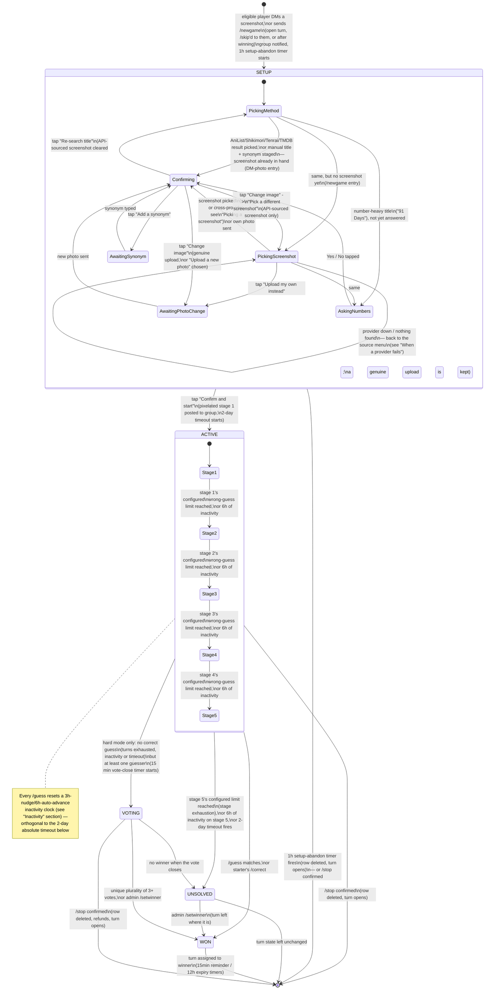

# Mechanics

The single source of truth for this game's rules. See `ARCHITECTURE.md` for
how these rules map onto code/data, and `CLAUDE.md` for repo conventions.
Each section below is tagged **Status: Implemented** or **Status:
Planned** so this doc describes the target design across all of v1, not
just what's currently built.

## Status overview

| Feature | Status |
|---|---|
| Game setup (DM photo, or `/newgame` + screenshot picker) + AniList/Shikimori/Tenrai/TMDB/manual entry | Implemented |
| Personal MyAnimeList account linking (`/linkmal`/`/unlinkmal`) + "My MAL List" identification method | Implemented |
| Group-membership gate on DM setup | Implemented |
| Pixelation stages (5 stages, scaling wrong-guess allowance, → reveal) | Implemented |
| Guess matching (`/guess`, local fuzzy match) | Implemented |
| Author override (`/correct`) | Implemented |
| Turn handoff (`/skip`) | Implemented |
| 2-day timeout | Implemented |
| Inactivity nudge (3h) + auto-advance (6h) | Implemented |
| Animated reveal video at every ending that reveals the image | Implemented |
| Pinned current image (one at a time, follows the game) | Implemented |
| Manual resync (`/status`) — re-post the current image with a live caption | Implemented |
| Setup-abandon timeout (1h) | Implemented |
| Win-turn reminder (15min) + expiry (12h) | Implemented |
| Manual stop with confirmation (`/stop`) | Implemented |
| Leaderboard (`/leaderboard`) | Implemented |
| Game history (`/history`) | Implemented |
| Achievements, titles, champions (`/achievements`, `/title`) | Implemented |
| Pixels 💠 — earning, `/balance`, `/pixelconfig` | Implemented |
| Clue shop (`/shop`) — spend 💠 on private clues | Implemented |
| Public spends — bounty (`/bounty`), `/tip`, `/sharpen` | Implemented |
| HARD MODE vote when nobody guessed right (15 min, unique plurality of 3+ votes) | Implemented |
| Quiet hours (`/quiethours`, `/timezone`) — automatic posts held, clocks frozen | Implemented |

## Game lifecycle

Every route a `Game` row can take, private (DM setup) and group (posted,
guessed on) alike, including every timer that can end it without anyone
typing a command. Each section below expands on one part of this
diagram in full prose.


```mermaid
stateDiagram-v2
    [*] --> SETUP: eligible player DMs a screenshot,\nor sends /newgame\n(open turn, /skip'd to them, or after winning)\ngroup notified, 1h setup-abandon timer starts

    state SETUP {
        [*] --> PickingMethod
        PickingMethod --> Confirming: AniList/Shikimori/Tenrai/TMDB result picked,\nor manual title + synonym staged\n— screenshot already in hand (DM-photo entry)
        PickingMethod --> PickingScreenshot: same, but no screenshot yet\n(/newgame entry)
        PickingScreenshot --> Confirming: screenshot picked\n(same- or cross-provider, see\n"Picking a screenshot")\nor own photo sent
        PickingScreenshot --> PickingScreenshot: provider down / nothing found\n— back to the source menu\n(see "When a provider fails")
        PickingScreenshot --> AwaitingPhotoChange: tap "Upload my own instead"
        Confirming --> PickingMethod: tap "Re-search title"\n(API-sourced screenshot cleared;\na genuine upload is kept)
        Confirming --> AwaitingPhotoChange: tap "Change image"\n(genuine upload,\nor "Upload a new photo" chosen)
        Confirming --> PickingScreenshot: tap "Change image" ->\n"Pick a different screenshot"\n(API-sourced screenshot only)
        AwaitingPhotoChange --> Confirming: new photo sent
        Confirming --> AwaitingSynonym: tap "Add a synonym"
        AwaitingSynonym --> Confirming: synonym typed
        PickingMethod --> AskingNumbers: number-heavy title\n("91 Days"), not yet answered
        PickingScreenshot --> AskingNumbers: same
        AskingNumbers --> Confirming: Yes / No tapped
    }

    SETUP --> [*]: 1h setup-abandon timer fires\n(row deleted, turn opens)\n— or /stop confirmed
    SETUP --> ACTIVE: tap "Confirm and start"\n(pixelated stage 1 posted to group,\n2-day timeout starts)

    state ACTIVE {
        [*] --> Stage1
        Stage1 --> Stage2: stage 1's configured\nwrong-guess limit reached,\nor 6h of inactivity
        Stage2 --> Stage3: stage 2's configured\nwrong-guess limit reached,\nor 6h of inactivity
        Stage3 --> Stage4: stage 3's configured\nwrong-guess limit reached,\nor 6h of inactivity
        Stage4 --> Stage5: stage 4's configured\nwrong-guess limit reached,\nor 6h of inactivity
    }
    note right of ACTIVE
        Every /guess resets a 3h-nudge/6h-auto-advance
        inactivity clock (see "Inactivity" section) —
        orthogonal to the 2-day absolute timeout below
    end note

    ACTIVE --> WON: /guess matches,\nor starter's /correct
    ACTIVE --> UNSOLVED: stage 5's configured limit reached\n(stage exhaustion),\nor 6h of inactivity on stage 5,\nor 2-day timeout fires
    ACTIVE --> VOTING: hard mode only: no correct guess\n(turns exhausted, inactivity or timeout)\nbut at least one guesser\n(15 min vote-close timer starts)
    VOTING --> WON: unique plurality of 3+ votes,\nor admin /setwinner
    VOTING --> UNSOLVED: no winner when the vote closes
    UNSOLVED --> WON: admin /setwinner\n(turn left where it is)
    ACTIVE --> [*]: /stop confirmed\n(row deleted, turn opens)
    VOTING --> [*]: /stop confirmed\n(row deleted, refunds, turn opens)

    WON --> [*]: turn assigned to winner\n(15min reminder / 12h expiry timers)
    UNSOLVED --> [*]: turn state left unchanged
```

`[*]` here means "no `Game` row exists" — every arrow into it either
deletes the row (`/stop`, setup-abandon) or the row reaches a terminal
`status` (`WON`/`UNSOLVED`) and simply stops being the "current" game.
The one way out of `UNSOLVED` is an admin's `/setwinner`, which re-finishes
it as `WON` (see "Bot-initiated games").
`SETUP`'s five inner states are `Game.setup_step`; `VOTING` is hard mode only (see "HARD MODE vote"). `ACTIVE`'s five inner
states are `Game.current_stage` (`PixelStage`).

## Starting a game

**Status: Implemented.**

A game can only start if no other game is currently `SETUP`, `ACTIVE` or `VOTING`.
The player allowed to start is whoever `turn_state.next_starter_id` names —
or **anyone**, if it's `null`. They must also currently be a member of the
configured group — the DM entry point is reachable by anyone who finds the
bot, unlike the topic-scoped group commands, which Telegram itself already
restricts to members.

There are two entry points, both subject to the same eligibility check
above and both creating the same `SETUP` row:

- **DM a screenshot** (a photo) — the traditional, photo-first entry.
  The screenshot's bytes are in hand immediately (`Game.original_image`).
- **`/newgame`** — for a starter who'd rather not hunt down their own
  screenshot (lazy, or on mobile): identifies the anime by title first,
  then picks a real screenshot for it (see "Picking a screenshot"
  below). `Game.original_image` starts empty and is filled in once a
  screenshot is chosen — everything past that point (the confirmation
  preview, posting to the group) is identical either way.

Either way, the bot posts a notice to the group topic — "so-and-so is
preparing a new game" — so nobody else tries to start one at the same
moment, and starts a **1-hour setup-abandon timer** (`Game.setup_deadline`).
If the player never reaches the preview's "Confirm and start" button
within that hour, the bot deletes the orphaned `SETUP` row, opens the turn
to anyone, and posts that to the group — the same class of "stuck DM
flow" bug issue #11 fixed reactively can no longer linger indefinitely.
The timer is canceled the moment they confirm.

Every post that announces a game — the setup notice, the first image post, and
every reveal — ends with `🎲 Game #<id>`, the id admin commands take (issue #248).

When the setup started from an uploaded screenshot, the bot first replies
with that screenshot pixelated at **stage 1** (the blockiest, with the
game's current pixelation algorithm) so the starter can judge whether it
works as a puzzle before identifying anything. It's a convenience only:
if the image can't be pixelated or the send fails, it's logged and
skipped and the method selection follows regardless. `/newgame` has no
image at this point, so it skips this.

### Identifying the anime

The bot asks the starter to pick an identification method: **AniList**,
**Shikimori** (the Russian-community anime database, with better Russian
titles/synonyms), **Tenrai** (a third-party MyAnimeList API), **TMDB**
(The Movie Database — English-only, no romaji/native/Russian titles),
**manual entry**, or — only once MyAnimeList account linking is
configured bot-wide (see `ARCHITECTURE.md`'s connectivity section) —
**My MAL List** (see "Linking a personal MyAnimeList account" below). If
the bot's language is currently Russian, Shikimori is
listed first with a one-line note explaining why. The choice is stored on
the game's still-`SETUP` row (`Game.source`), not in memory, so it
survives a restart before the player finishes typing.

**AniList/Shikimori/Tenrai/TMDB**: the bot asks for a search query (the
anime's name, in whatever form the player remembers it) and searches
whichever service was picked, showing up to 5 results as an inline
keyboard (title + year for AniList, each service's own best title
otherwise); a "none of these" option lets them retry the search with
different text. Shikimori's own ranking is poor on punctuated titles
(`K-On` ranks every K-On entry below 16 unrelated ones), so its search
fetches a 50-result page, re-ranks it locally by fuzzy title similarity
(`matching.rank_by_similarity`, ties keep Shikimori's order) and shows
the top 5. It also passes `censored: true`, so explicit titles never
reach the picker. The player taps the correct result, and the bot
re-fetches the full record from that service (whichever title fields it
has, plus its synonyms list where available) and records that service's
own id (one column per provider — `Game.anilist_id`/`shikimori_id`/
`tenrai_id`/`tmdb_id` — so a later screenshot cross-search can reuse an id
already on file instead of re-searching, see below). The query prompt,
the results, and a "nothing found" reply also carry a **↩ Different
search method** button back to the method-selection keyboard, for when
the anime isn't on that provider at all — before it, the only way out
was picking a wrong result to reach the preview's "Re-search title".
**Manual entry**: for anime none of the above knows about. The bot asks
for the title, then for at least one alternate title/synonym (comma- or
newline-separated, re-prompted if left blank) — both typed by the
player, no external lookup.

External search/detail lookups are cached in memory for a short time
(per process, not persisted across a restart) so repeated taps and a
follow-up screenshot cross-search don't needlessly re-hit the same API
and risk a 429.

### Linking a personal MyAnimeList account

**Status: Implemented.**

Unlike every method above, **My MAL List** doesn't search a public
catalog — the player browses their *own* MyAnimeList anime list and
picks directly from it. Linking is **per-player**, not a shared,
bot-wide account: each player links (or doesn't) their own MyAnimeList
account, independently of everyone else, via **`/linkmal`** (DM-only,
self-service — no admin gate, unlike `/language`) or **`/unlinkmal`** to
forget it again. The sixth method-picker button is a convenience
wrapper around the same flow, not a separate thing: it's **always
visible to every player** once the bot itself has MAL linking
configured, regardless of whether *that particular player* has linked
yet — it is never hidden from an unlinked player. Tapping it while
unlinked (or after MyAnimeList has revoked the stored refresh token)
walks the player through linking first: open the authorization link,
log into MyAnimeList, approve access, then paste the code it shows back
into the DM — and lands them straight in their list browser the moment
linking succeeds, since reaching the list was the point of tapping the
button in the first place. Running the standalone `/linkmal` command
outside of an active setup just confirms the link instead.

Once linked, the browser pages through the player's list **10 entries
at a time** (a "◀️ Back"/"More ▶️" pair, the same paging shape as the
screenshot gallery), showing **every list status** — Completed,
Watching, Plan to Watch, On Hold, Dropped — each entry tagged with its
own status, not filtered down to completed-only.

Picking an entry does **not** introduce a new identification method
under the hood: MyAnimeList and Tenrai (a third-party MyAnimeList API)
share the exact same catalog id space, so a pick resolves through the
existing Tenrai lookup and lands exactly where a Tenrai search-and-pick
would — `Game.source` is set to Tenrai's own provider value and
`Game.tenrai_id` to the picked id, continuing into the same
screenshot-picker-or-confirmation-preview flow every other method
already ends in (see "Picking a screenshot" and "The confirmation
preview" below). There is no separate provider value for "MAL list"
and no MAL-specific columns on `Game`.

A player's OAuth tokens are refreshed **on demand** — checked against
their stored expiry right before a list fetch, never on a proactive
schedule — and encrypted at rest (see `ARCHITECTURE.md`'s data model).
If the refresh fails (MyAnimeList has revoked the refresh token), or
the stored tokens no longer decrypt (e.g. after the bot's encryption
key was rotated), the player is treated exactly like someone who never
linked at all — walked through `/linkmal` again — rather than shown an
error.

### Picking a screenshot (the `/newgame` path only)

Once identification is staged, if `Game.original_image` is still empty
(the `/newgame` path), the bot walks the starter through picking a real
screenshot instead of asking for an upload outright:

1. **Source selection** — every screenshot-capable provider (Shikimori,
   Tenrai, TMDB — AniList has no such capability) is offered, with
   whichever one did the identification listed first (no extra search
   needed for that one). An **"Upload my own instead"** button is always
   present too, falling back to the traditional upload step.
2. **Same-provider pick**: tapping the provider that already has an id
   on file (from identification, or a previous cross-search) fetches
   its screenshots directly.
   **Cross-provider resolution**: tapping any other provider silently
   searches it by the already-confirmed title and takes the **top
   result** — no extra confirmation tap — recording that provider's own
   id on the game (`Game.screenshot_picker_provider` starts tracking
   which provider the picker is *resolving*, so a typed correction knows
   which service to search; `Game.screenshot_source` is untouched, since
   no image has been chosen yet) without touching the identification
   fields a real re-search would. If that search finds nothing, the bot
   asks the starter to type a query for it themselves instead (see "When
   a provider fails" below).
3. **The gallery** — up to 5 numbered screenshots at a time (sent as one
   album; Telegram fetches them directly from the provider's URL, no
   download until one's actually picked), followed by a buttons message:
   numbered picks, a paging row of **"◀️ Back"** and/or **"More ▶️"**
   (either is absent at the respective end of the list, and the whole
   row is dropped for a gallery that fits on one page — both encode an
   absolute offset rather than a direction, and the provider's url list
   is cached, so paging either way costs no extra API call),
   **"Wrong anime? Search again"** (re-opens the search-and-pick step
   for a correction, and its prompt carries the source menu so a
   different provider or an upload stays one tap away), and
   **"Upload my own instead"**.
   The correction button is on every gallery except one: the **first
   page of a same-provider gallery** reached straight from the source
   menu, which is the one case where nothing is being resolved — the id
   came from identification. Page 2 of that same gallery has it, as does
   every cross-provider gallery and every gallery re-opened from the
   preview's "Pick a different screenshot": paging is exactly what a
   starter does when the auto-resolved title looks wrong, so dropping
   the escape hatch there took it away at the moment it was wanted.
4. Picking a numbered screenshot downloads its bytes, stores them on
   `Game.original_image` (`Game.screenshot_source` records which
   provider the bytes came from — the one place image provenance is
   written — and the picker column is cleared, since there is nothing
   left to resolve), and lands on the same confirmation preview
   described below — same as if the starter had uploaded it themselves.
   A numbered button whose index no longer exists (the list shrank
   between pages) changes nothing and says so in a notification,
   leaving the gallery and its keyboard exactly as they were.

**A DM photo is accepted at any point in this sub-flow**, not only after
tapping "Upload my own instead" — someone staring at the source menu who
just sends a screenshot means the obvious thing, and it lands on the same
confirmation preview.

#### When a provider fails

Third-party APIs go down (Jikan served nothing but HTTP 504 for a stretch
on 2026-09-14), return nothing for a title, or lose an id between the
search and the pick. **Every one of those outcomes says what happened and
re-shows the source-selection menu**, with the offending provider flagged
`⚠️` but still tappable — outages are usually transient, and it may be the
only source with screenshots for that title. That covers a failed
auto-resolution, a failed or empty typed query, a screenshot fetch that
errors or comes back empty, and a chosen image that won't download.

A gallery page Telegram can't deliver doesn't count as the provider being
down, as long as the starter can still see it (issue #283). The gallery
hands the provider's image URLs to Telegram, whose servers download them
before answering. There are two ways that can go wrong:
- **Telegram takes too long to answer.** The album most likely arrived, so
  its buttons are sent anyway.
- **Telegram says it couldn't fetch a URL** (`webpage_curl_failed`: hotlink
  blocking, a slow CDN). The bot downloads that page's screenshots itself
  and uploads them, keeping their numbers.

Only if those downloads fail too does it fall back to the source menu with
the provider flagged.

The starter therefore always has three ways forward — a different
provider, another typed query, or their own upload — and none of these
paths can leave a `SETUP` game with no buttons on screen. Before this,
failure replies went out bare: a down provider produced a literal loop
(type a query, get an error, repeat) whose only exits were `/stop` or the
1-hour setup-abandon timer.

#### Buttons that outlived their round

Every screen above leaves messages in the DM that stay tappable forever,
while the `SETUP` row behind them can end at any moment — confirmed,
`/stop`ped, or deleted by the 1-hour setup-abandon timer. A button
tapped after that **says so in an alert** ("that round isn't being set
up anymore", plus how to start another) rather than doing nothing at
all, which is what it used to do.

`/newgame` sent while the starter's *own* setup is still open is the
same mistake arriving from the other direction, and gets the same
answer: rather than "it's not your turn" — which is false, they're
mid-turn — the bot re-shows the step they're on. On the two steps that
have no keyboard of their own (waiting for a new photo, waiting for an
extra synonym) it says the setup is still open and that `/stop`
abandons it, since the prompt alone would read as a fresh question.

### The confirmation preview

Once a title/synonyms are staged **and** an image exists (uploaded, or
picked per above), the bot sends the player a **private preview** — the
screenshot pixelated at all 5 configured stages (blockiest to clearest,
see "Pixelation stages" below), sent as one Telegram album with the
staged title and every other accepted answer (every stored title
variant — romaji/English/native/Russian, not just the manually-typed
synonyms — since all of them are already valid `/guess` matches) as the
caption on the first photo — instead of posting straight to the group,
so the starter sees exactly how the round will progress, and exactly
what will count as correct, before committing to it. Telegram's
`sendMediaGroup` has no `reply_markup` support, so the four buttons
below arrive on a short separate text message right after the album,
not on the album itself. Those four buttons let them fix anything
before it goes live:

- **Change image** — a genuine upload goes straight to asking for a new
  screenshot, keeping the title/synonyms. An API-picked screenshot
  instead offers a choice: **upload a new photo** (same as above), or
  **pick a different screenshot** (re-opens that same provider's own
  gallery from its already-resolved id — "Wrong anime? Search again" is
  always offered from there too, as an escape hatch to a different
  provider entirely).
- **Re-search title** — back to the method-selection keyboard. A
  genuine upload keeps its screenshot regardless. An API-picked
  screenshot is cleared instead, along with the provider id that
  resolved it, since a re-search might land on a completely different
  anime — the starter goes through "Picking a screenshot" again once
  the new title is staged. Picking a method (and staging any result or
  manual entry) also clears the previous identification entirely —
  every title variant, the synonyms, and every provider id — so nothing
  of the old anime survives into the new one's accepted answers.
- **Add a synonym** — type one more (or several); appended to the
  list, repeatable.
- **🔢 Numbers count** ✅/⬜ — only when one of the titles has a digit.
  Off by default: guessing ignores numbers (see "Guess matching"), so
  `GITS` wins *GITS 2026*. On, the numbers are part of the answer for
  this game — digits, ordinals and roman numerals all have to be in the
  guess (fuzzily, like the rest), and the text clues hide digits as
  letters (`_`) instead of showing them as `X`.

**Do the numbers matter?** Right before the preview, a title that has a
number and fewer than 5 letters once its numbers are gone (*91 Days*,
*11eyes*, *18if*, *GITS 2026*) makes the bot ask the creator outright:
**No, ignore them** (`days` wins *91 Days*) or **Yes, they count**
(`91 days` is needed). The answer sets the switch above, which can still
be flipped on the preview. It's asked once per identification —
re-searching the title clears the answer, and the question comes back if
the new title qualifies. A title made only of numbers (*22/7*) never
asks: its numbers always count. Only the title fields are checked, not
synonyms.
- **Confirm and start game** — pixelates the (possibly updated)
  screenshot at **stage 1** and posts it into the group's game topic
  with a caption naming the starter and reminding everyone how to
  guess (`/guess <title>` in that topic). The game is now `ACTIVE`.

Exactly where the starter is in this multi-step flow (`Game.setup_step`)
is stored on the row, not in memory, so a restart mid-edit — say,
between tapping "Add a synonym" and typing it — resolves correctly from
the DB rather than losing track.

If the chosen service is unreachable (a search, a re-fetch, or a
screenshot fetch fails), the bot tells the player and hands back to a
safe point — the method-selection keyboard for an identification
failure, a manual-query prompt for a failed screenshot cross-search —
so they can try again or switch services. The game stays `SETUP`, never
stuck.

If someone who isn't the designated starter (and it isn't open) tries
either entry point, the bot replies that it isn't their turn and doesn't
create a game. Same for someone who isn't currently a group member.

## Guess matching

**Status: Implemented.**

Guessing is an explicit command — **`/guess <text>`** — sent in the game
topic, never free text. This is deliberate: it means the bot never needs
Telegram's group-privacy mode disabled, and every guess attempt is an
unambiguous, loggable event rather than "was that message meant as a
guess?"

Matching is **local and fully deterministic** — no network call happens
per guess. Whichever service was used at setup (see above) is only ever
consulted once, and its result (title variants — including the Russian
title, if Shikimori was used — plus synonyms) is cached on the `Game`
row for the rest of that round:

1. Normalize both the guess and every cached title/synonym the same way:
   - lowercase, with full-width characters folded to plain ones;
   - every punctuation or symbol character (`: ; - × « » ・ ☆ °`…)
     becomes a space, except apostrophes, which are dropped
     (`Journey’s` → `journeys`);
   - **numbers are ignored**: digits, ordinals as a whole (`2nd`,
     `2-й`), standalone roman numerals I–XX, and the word *season*
     (`season`/`сезон` in any form) are removed — so `GITS` is a correct
     guess for *GITS 2026* and `GITS 2026` for *GITS*, and
     `shingeki no kyojin` for *Shingeki no Kyojin Season 2*;
   - extra whitespace collapsed.

   If either side has nothing left once its numbers are gone — a title
   made only of numbers like *22/7*, or a guess of just `2026` — both
   are compared with their numbers kept instead (the season word still
   goes). So `22/7`, `22 7` and `227` win *22/7*, while `2026` alone
   never wins *GITS 2026*.

   A game's creator can make the numbers count instead (the preview's
   **🔢 Numbers count** switch, see "Starting a game"): then digits,
   ordinals and roman numerals stay on both sides, so `days` no longer
   wins *91 Days* but `91 days` does.
2. Fuzzy-match the normalized guess against that normalized list with
   `rapidfuzz`, above a fixed similarity threshold defined as a named
   constant in `services/matching.py`.
3. Any match above the threshold counts as correct — it doesn't matter
   which title/synonym it matched, or by how much it cleared the
   threshold.

Every guess is recorded (`game_guesses`) with the stage it was made at.

A **wrong** guess isn't silent: the bot replies in-topic with how many
more wrong guesses remain before the next pixelation stage, and which
stage the game is currently on (e.g. "3 guesses left before the next
clue (4/5)"). The player who started the round can't `/guess` on their
own game at all — they already know the answer.

Because everything the matcher needs is cached at setup time, the same
guess always produces the same verdict for the life of a game — matching
never depends on AniList/Shikimori/Tenrai/TMDB being reachable, rate
limits, or anything else external, at guess time.

### Partial matches

A wrong guess can still be partly right. When it shares **whole words**
with one of the round's titles/synonyms, the bot shows that title with
only the matched words spelled out and every other word masked, e.g.
`🔎 Partly right: _ _ _ _ _ _   _ _   Frieren`:

- Numbers, ordinals, roman numerals and the word *season* are never
  words to reveal or keep hidden — matching ignores them — and are masked
  in the reveal like the title shape does (`X` for a digit).
- Only guess words of at least 3 letters count (`of`, `no`, `to` never
  reveal anything), and the matched words must add up to at least the
  `/partialmatch` threshold in letters (default 4; `0` turns it off).
  The title with the most matched letters wins.
- At least one word of the title always stays hidden: a guess containing
  every word would reveal the answer, so it reveals nothing. Short words
  count here: `titan on attack` names all of "Attack on Titan", so it
  reveals nothing even though `on` itself is never spelled out.
- It is still a wrong guess — it counts toward the stage's limit like any
  other. The reveal appears in the wrong-guess reply, or in the caption of
  the stage post when that guess advanced the stage. It is stored with the
  guess in `game_guesses`.
- Once any partial reveal fires in a round, the title-shape clue stops
  being sold for that round (the shape is public); clues already bought
  stay.

## Pixelation stages

**Status: Implemented.**

The screenshot is downscaled (blocky pixelation) to a **fixed target
width** and immediately upscaled back to its original size, via Pillow,
across 5 stages, from blockiest to clearest. A fixed target width — not
a divisor of the source resolution — keeps stage difficulty independent
of the screenshot's resolution: a narrow target width reads as pure
color blobs whether the original screenshot was 1280px or 3840px wide,
whereas e.g. ÷10 of a 2560px-wide screenshot is still 256px wide and
barely pixelated at all.

**Each stage's target width and wrong-guess limit are admin-configurable
at runtime, not hardcoded constants** — stored one row per `PixelStage`
in the `stage_config` table (see `services/settings/stage_config.py`), seeded
with defaults by migration and changeable live via three DM-only,
admin-gated commands (`commands/stageconfig.py`):

- **`/stageconfig`** — view the current 5-stage table.
- **`/setstageconfig <width:guesses> ×5`** — bulk-set all 5 stages at
  once, positionally (stage 1 through stage 5).
- **`/setstage <stage 1-5> <width> <guesses>`** — tweak just one stage.

Both setters apply immediately (no confirmation step — this is a
fast-iteration admin tool) but **refuse to run while a game is `SETUP`
or `ACTIVE`**, offering a "stop the game" button right there instead
(reusing `/stop`'s own confirmation), and on success immediately post a
visual preview — both fixed example images pixelated at the new
width(s) — so the effect can be checked without a separate step.

### Which algorithm colours the blocks

The stage width decides *how wide* the mosaic is; a separate, orthogonal
choice decides *how each block is coloured*. Five are offered
(`services/pixelate/`):

| Algorithm | Each block becomes |
|---|---|
| `median` | the block's median colour — **the default** |
| `box` | the block's average colour (the canonical mosaic) |
| `nearest` | one arbitrary pixel sampled from the block |
| `lanczos` | a windowed resample — the sharpest block colours |
| `mode` | the block's most frequent colour |

`median` is the default because `nearest` — the original and only
implementation until now — samples a single arbitrary pixel per block,
so one bright speck can define a whole block and fine texture aliases
into misleading patterns. `mode` is offered but **flagged as the worst
choice in the picker**: `ModeFilter` falls back to the centre pixel
whenever no colour repeats in its window, which on a real screenshot is
most windows, so it speckles harder than the `nearest` it was meant to
improve on.

**The starter picks per game, from the confirmation preview** — a
button showing the current choice opens a submenu listing all five with
one-line descriptions. Picking one re-renders the whole preview album
immediately, so the effect is visible before committing. The choice is
stored on the game row (`games.pixel_algorithm`), not in a shared
setting: stages 2-5 are rendered much later and from elsewhere (a
`/guess` advance, the inactivity job), and a mid-round change to a
shared setting would make a round's later stages look unlike the ones
already posted.

Current defaults, as seeded by the migration (run `/stageconfig` for
what's actually live — these get retuned):

| Stage | Target width | Wrong guesses allowed |
|---|---|---|
| `STAGE_1` | 64px (shown first — hardest) | 1 |
| `STAGE_2` | 80px | 1 |
| `STAGE_3` | 128px | 2 |
| `STAGE_4` | 192px | 3 |
| `STAGE_5` | 512px (clearest pixelated stage) | 3 |

No image bytes are stored on disk. The starter's original screenshot
lives on the `Game` row itself, as raw bytes in a deferred column
(`Game.original_image`) rather than as a Telegram `file_id` — nothing
then depends on Telegram continuing to serve a given file for the life
of a round, and an upload and an API-picked screenshot are handled
identically ("obtain bytes once, store them"). Every stage image is
regenerated on demand — load the original, run it through the Pillow
pipeline, send it, discard the result — so a bot restart mid-game loses
nothing (the stored bytes and `current_stage` are all that's needed to
pick back up), and the bytes themselves are dropped once the reveal
message is confirmed sent (see "Cleanup" below).

**Each stage allows a different number of wrong `/guess` attempts
before the game advances to the next one**, per its configured
wrong-guess limit, and `wrong_guess_count` resets to 0 on every advance.
If the last allowed wrong guess at the final stage (`STAGE_5`) lands,
the game ends unsolved (see below) instead of advancing further.
Advancing posts the newly-revealed image with a caption naming the new
stage and its wrong-guess budget as `remaining/limit` (`guess.
stage_advanced_caption`) — on a freshly entered stage those are equal,
which is the point: it says how generous this stage is, not just how
much is left. The same `remaining/limit` pair appears in the `/guess`
wrong-answer reply (`guess.wrong_feedback`, where the numerator does
tick down) and in the round's opening post (`dm_start.
game_started_caption`, which names stage 1 and its budget), so all three
counters read the same way. The overall guess number is still tracked on
the row (`total_guess_count`) but is no longer shown — a bare counter
with nothing to measure it against told players nothing.

**Whatever image was most recently posted for the current game — a
pixelation stage or the final reveal — stays pinned in the group topic,
with exactly one message pinned at a time**: posting a new one unpins
whatever was pinned before and pins the new one instead
(`bot_settings.pinned_message_id`). Pinning is best-effort — if the bot
lacks the group's "Pin messages" admin permission, the pin/unpin call is
skipped and logged as a warning rather than blocking the post itself
(see `ARCHITECTURE.md`). The pin is left in place once a game ends; the
next game's first post naturally supersedes it.

**`/status`** (game topic, any time) is a manual resync for when the chat
looks out of step with the bot: a post that never arrived, or a missing
or stale pin (its caption's guess count is frozen at post time).

- **During a game**, it re-posts the current stage image (the HARD MODE
  pair as an album) with a live caption:
  - stage (or turn) and guesses left at it
  - the bounty, if any
  - how long until the game ends on its own
  - the 🎲 game number
- **Otherwise** it says what is happening instead: who is setting up the
  next game, that a vote is open, or whose turn it is to start one.

It never changes anything and never re-pins.

A separate **`/setgamesenabled on|off`** command (also DM-only,
admin-gated) lets an admin pause *starting* new games entirely —
independent of the above, useful for locking things down while
mid-retune. It has no effect on a game already in progress.

## Winning

**Status: Implemented.**

A game ends in a win one of two ways:

- **Automatic**: a `/guess` matches per the rules above.
- **Author override (`/correct @username`)**: the game's starter can force
  a win for a specific player at any time while the game is `ACTIVE`, for
  the case where the fuzzy matcher fails to recognize a guess that was
  actually correct (an alternate title/spelling AniList doesn't list as a
  synonym, for example). Only the starter may run this command; it's a
  fixed `@username` argument, not a reply-based selection.

  The `@username` is resolved against the `players` table, which the bot
  fills in from **any** update it sees — a DM, a command, or plain chat
  in the game topic (see ARCHITECTURE.md's "Handler groups"). So this
  only fails for someone who has never interacted with the bot at all,
  and the failure reply tells them to DM it, naming the bot's handle.
  Before that pre-handler existed the table was populated only by a
  successful `/guess` or by starting a game, which meant `/correct` —
  whose entire purpose is awarding someone the matcher didn't catch —
  routinely couldn't find its target.

On a win, the bot:
1. Reveals the original (un-pixelated) screenshot, as the animated
   reveal video (see "The reveal video" below), together with the
   anime's title, naming the winner by name in the caption.
2. Sets `status → WON`, records `winner_id` and `ended_at`, and increments
   that player's `players.wins`.
3. Cancels the game's pending 2-day timeout job, and its inactivity
   nudge/auto-advance timers.
4. Sets `turn_state.next_starter_id` to the winner — it's their turn to
   start the next game, called out explicitly in the reveal caption —
   and schedules that winner's 15-minute reminder / 12-hour expiry (see
   "Turn handoff" below).
5. **Cleanup**: once that reveal message is confirmed sent, clears
   `Game.original_image` — nothing after this point ever needs to
   re-pixelate the screenshot, so the stored bytes are dropped rather
   than kept around indefinitely.

### The reveal video

**Status: Implemented.**

Every ending that reveals the clear screenshot posts an animated video
instead of a still photo: the pixelated image turns into the clear one
through a transition effect. Captions, pinning and everything after the
reveal are exactly as for a photo. Telegram loops the video; there is no
way to play it once.

| Ending | What the video shows |
|---|---|
| Win by `/guess` or `/correct` | the effect, then the clear image with a celebration: a gold badge with the winner's avatar and `@handle` (their name when they have no username), a crown, a pop-in, one shine sweep and confetti |
| Unsolved: stage 5 exhausted, 2-day timeout, inactivity on stage 5, `/stop` with reveal | the same effect, then the clear image held, no badge |
| HARD MODE (any of the above) and the vote opening | the album as before, but the screenshot picked at game start is the reveal video (a badge on a win, none on the vote opening or an unsolved ending) and the other one stays a photo |

The effect is picked uniformly at random **at game start** from `iris`,
`tile_flip`, `ripple`, `glitch` and `shatter`. For HARD MODE the animated
screenshot (`a` or `b`) is picked then too. The effect part is rendered in
the background right after the game goes live, so the reveal itself only
renders the ending and never delays a game's start.

**Still-photo fallback.** The reveal is never lost: if the pre-render
failed, isn't done within 5 seconds of the ending, the render fails, or
Telegram rejects the video, the bot posts the plain photo exactly as
before. The one exception is a send that timed out: the video may have
arrived, so nothing is posted twice.

## Ending unsolved

**Status: Implemented.**

A game ends unsolved one of two ways, handled identically:

- **Stage exhaustion**: the final stage's (`STAGE_5`) configured
  wrong-guess limit is reached — via a `/guess`, or via the inactivity
  auto-advance timer firing while already on `STAGE_5` (see
  "Inactivity" below; both go through the same `advance_stage()`).
- **Timeout**: see below.

Either way, the bot reveals the original screenshot with the anime's
title, sets `status → UNSOLVED` (stamping `ended_at`), and performs the same `original_image`
cleanup described in "Winning" above. `turn_state.next_starter_id` is left
untouched — an unsolved game doesn't hand anyone a forced turn. If it was
already `null` (open to anyone), it stays that way; if someone was
designated (unusual for this path, since normally only a win sets it),
they remain designated.

## Timeout

**Status: Implemented.**

Every `ACTIVE` game gets a **2-day timeout, absolute from game start** —
not reset by guessing activity. It's scheduled as a `JobQueue` job at
`created_at + 2 days` (`scheduled_end_at`) when the game goes `ACTIVE`. If
no one has won by then, the job fires the same "ending unsolved" flow
above, regardless of how many wrong guesses happened in between.

Because `JobQueue` jobs don't survive a process restart, `app.py` re-arms
a timeout job on startup for any `Game` still `ACTIVE`, using its stored
`scheduled_end_at` — a redeploy never silently loses or resets the clock.

During quiet hours this clock is frozen and its post is held back — see "Quiet hours" below.

## Inactivity

**Status: Implemented.**

The 2-day timeout above is a coarse absolute backstop; this is a much
finer-grained clock that keeps an individual round moving if nobody
guesses on it for a while, without waiting anywhere near 2 days. Unlike
the timeout, it **resets on every `/guess`** (right or wrong) — not just
once at game/stage start:

- **Nudge (3 hours of silence)**: posts a reminder to the group topic,
  replying to whatever image is currently pinned (see "Pixelation
  stages" above), that the game is still running and nobody's guessed
  yet.
- **Auto-advance (6 hours of silence)**: advances to the next stage
  exactly as a guess-driven stage exhaustion would — the same
  `advance_stage()` function record_guess() itself calls, so the two
  paths can never drift apart — posting the newly-revealed (and newly
  pinned) image. If the game was already on the final stage, it ends
  unsolved instead, same as normal stage exhaustion.

Both are (re)scheduled from an absolute deadline stored on the row
(`Game.inactivity_nudge_at`/`inactivity_advance_at`), the same pattern
as the timeout's `scheduled_end_at` — and, like the timeout, re-armed
from that stored deadline on startup, so a redeploy never silently loses
the clock either.

**Worst case — a game that never receives a single guess** — resolves
to unsolved via 5 stages × 6 hours = 30 hours, comfortably inside the
2-day absolute timeout. That timeout isn't made redundant by this,
though: it still catches a different case this clock can't — sparse but
nonzero guessing (say, one wrong guess every ~10 hours) that never
leaves the game idle long enough to trigger a nudge or auto-advance, yet
also never racks up enough wrong guesses within 48 hours to advance via
the normal guess-count path.

During quiet hours both clocks are frozen and their posts are held back — see "Quiet hours" below.

## Stopping a game (`/stop`)

**Status: Implemented.**

Manually aborts whatever game is currently `SETUP`, `ACTIVE` or `VOTING`, usable
by that game's own starter, or by any group admin/owner (for any game,
not just their own) — checked via the same `is_group_admin` helper
`/language` uses. **DM only** — sent privately to the bot like `/start`/
`/help`/`/language`, not in the game topic — though the outcome is still
announced there (step 4 below).

`/stop` never acts immediately — it always shows a **confirmation**
first (naming the game's title, if one's been staged yet), and only the
starter or an admin can actually tap a stop button (re-checked at that
point too, independently of who saw the prompt). Tapping "No" just leaves
the game running untouched.

There are **two** ways to say yes:

- **"Yes, stop it"** — stops quietly.
- **"Stop and reveal"** — stops *and* tells the group what the anime
  was. Offered only for an `ACTIVE` round — which is the whole of what
  `game_service.has_answer_to_reveal` tests: a `SETUP` game has never
  posted anything to the topic, and may not even have a title staged
  yet, so there's nothing anyone is waiting to find out. The
  confirmation for a `SETUP` game is therefore still a plain Yes/No.
  An `ACTIVE` round always still has its image — the bytes are dropped
  only once a round reaches a terminal outcome — so the button does not
  re-check them, and reading them here would have pulled the whole blob
  to decide whether to draw a button. The two paths that actually post a
  reveal re-check the bytes where they use them, and fall back to the
  plain notice if they are somehow gone.

On either confirmation, the bot:
1. Cancels whatever timer(s) were pending for that game — its 2-day
   timeout and inactivity nudge/auto-advance pair if `ACTIVE`, its
   15-minute vote-close timer if `VOTING`, or its 1-hour setup-abandon
   timer if still `SETUP`. A `VOTING` game is refunded (clue purchases
   and the bounty pot) exactly like an `ACTIVE` one, and its votes are
   dropped with the row.
2. Announces the outcome in the group topic — a plain "anyone can start a
   new game" notice, or, on the reveal path, the **original un-pixelated
   screenshot captioned with the title**, posted through the same
   `post_current_image` the win/unsolved/timeout reveals use, so it also
   becomes the topic's pinned image. That caption already says the turn
   is open, so the reveal path posts one message, not two.
3. **Deletes the `Game` row outright** — same precedent as the
   setup-abandon timer and turn expiry: a manually-stopped round isn't a
   meaningful outcome worth a terminal status of its own (unlike
   `WON`/`UNSOLVED`), so no `CANCELED` status exists.
4. Opens the turn (`next_starter_id → null`), same effect as a bare
   `/skip` — canceling any pending win-turn reminder/expiry too.

The announcement deliberately happens *before* the row is deleted: the
reveal needs the row's image bytes and title, and `post_current_image`
needs a live session to move the group's pin.

## Turn handoff (`/skip`)

**Status: Implemented.**

Usable only by whoever `turn_state.next_starter_id` currently names, and
only while no game is `SETUP`/`ACTIVE`/`VOTING` (it governs who may *start* the
next game, not anything mid-game). While the turn is open to anyone
(`next_starter_id` is `null` — after an unsolved/timeout ending, a bare
`/skip`, a turn expiry, or `/stop`), it names nobody, so `/skip` is refused
for everyone: there's no turn to hand off.

- `/skip` (no argument) sets `next_starter_id` to `null` — the turn opens
  up, and anyone can DM the bot a screenshot to start the next game.
  Cancels the reminder/expiry timers below.
- `/skip @username` hands the designation directly to that person instead
  — (re)schedules the timers below for the new designee. Same `players`
  lookup and same "I don't know them yet" reply as `/correct` above.

Whenever `next_starter_id` becomes a real user (a win, or `/skip @user`),
two absolute-deadline `TurnState` timers are (re)scheduled:

- **Reminder (15 minutes)**: DMs the designated player that it's their
  turn. If the DM fails (they've never started the bot), falls back to
  an `@mention` in the group topic instead — same "can't reach them
  privately" fallback pattern as `/help`'s.
- **Expiry (12 hours)**: if they still haven't started by then, opens the
  turn to anyone (same as a bare `/skip`) and posts that to the group.

Both are canceled — without touching `next_starter_id` itself — the
moment the designated player actually starts their game (a DM photo, or
`/newgame`); they're clearly not going to miss a turn they've already
begun.

During quiet hours both timers are frozen and the reminder DM / expiry post are held back — see "Quiet hours" below.

## Bot-initiated games

**Status: Implemented.**

Two ways the bot can start a game itself instead of waiting for a human —
both gated behind `autostart_enabled` (`/setautostart on|off`, DM-only,
admin-gated, default **off**), checked *in addition to* `games_enabled`,
and both no-ops while a game is already `SETUP`/`ACTIVE`/`VOTING`.

- **Idle auto-start (24h backstop)**: whenever the turn becomes open to
  anyone with no game running — a bare `/skip`, or the "leave
  `next_starter_id` alone" branch of an unsolved/timeout ending (see
  "Ending unsolved" above) — a 24-hour absolute deadline is armed
  (`turn_state.turn_opened_at`/`autostart_deadline_at`). If nobody has
  started a game by the time it fires, and autostart is enabled, the bot
  picks a random anime and screenshot pair for itself (see below) and
  starts a **HARD MODE** game (see "HARD MODE" below) exactly as if it
  had DMed itself the screenshots. A failed pick
  (every provider down, or no screenshot found for the anime it randomly
  landed on) doesn't go silent — it retries again in 1 hour rather than
  waiting for the next natural turn-open event. Any human starting a game
  in the meantime — or the turn being reassigned via `/skip @user` —
  cancels the backstop the normal way (`clear_autostart`/re-designation
  already do this).
- **Overthrow (~12% chance right when a game concludes)**: every
  game-ending path — a win (whether by `/guess` or `/correct`), an
  unsolved ending, or a timeout — rolls a weighted coin (`~12%`, tuned in
  `services/game/autostart.py`'s `OVERTHROW_PROBABILITY`) for the bot to
  claim the *next* game itself, right after committing that ending's own
  normal outcome. On a win, this **dethrones the winner's next-turn
  privilege** — the bot starts the next game instead of them — but
  **the winner keeps full credit**: their `players.wins` increment, the
  win reveal, and the "congratulations" caption are entirely unaffected,
  exactly as if no overthrow had happened. On an unsolved/timeout ending
  (turn already open to anyone), the bot simply claims that already-open
  turn instead of leaving it for a human.

**Picking a random anime + screenshot pair** (`services/game/autostart.py`,
framework-agnostic, no DB writes until a full pick is in hand): a random
Shikimori anime (`order: random`, `censored: true` — excludes hentai/
yaoi/yuri — and restricted to TV series and movies (`kind: tv,movie`) —
specials, OVAs, ONAs and recaps often reuse their parent's footage, so
their screenshots read as the parent show, issue #247), falling back to Tenrai's `/random/anime` on any failure or
empty result — Tenrai's request already asks for `sfw=true`, and
`services/game/autostart.py` also rejects an explicit-rated (`Rx`) pick
as a backstop, the same rejection Jikan's fallback already had. What's
new to Tenrai's fallback since the migration off Jikan is its own
popularity floor (`tenrai.py`'s `RANDOM_PICK_MIN_MEMBERS`, mirroring
`shikimori.py`'s own `RANDOM_PICK_MIN_WATCHED` floor on the pick above)
— closing issue #165: Jikan's old fallback had no such floor, so it
could surface an anime almost nobody had actually watched. The Tenrai
fallback applies the same TV/movie rule to its `type` field. Then a
screenshot **pair** for it — two distinct screenshots
from the same provider, since HARD MODE (see below) always needs a
genuine pair and never the same screenshot twice — via the same
same-provider-first, cross-search-fallback provider order human-started
games use (see "Picking a screenshot" above). Up to 3 different-anime
attempts per firing (`AUTOSTART_ATTEMPT_LIMIT`) before giving up silently
for that firing — caps how many API calls one attempt can cost if a
provider is down or an anime keeps coming up with no screenshots
anywhere.

**A bot-started game plays out under a different ruleset than a
human-started one — HARD MODE (see below) — for the pixelation/turn
structure itself**, but everything else — guess matching, the 2-day
timeout, the inactivity clock, turn handoff on a win — applies exactly as
it does to a normal game. The one deliberate permission gap is the same
either way: **`/correct` has no direct use on a bot-started game.**
`/correct` is still starter-only and `ACTIVE`-only
(`user.id == game.starter_id`), and for a bot-started game the starter
*is* the bot — no human can ever satisfy that check. A game that ended
wrongly has two remedies instead: the HARD MODE vote (see below), and an
admin's `/setwinner <game id> @user` (DM only). `/setwinner` re-finishes
an `UNSOLVED` game as a normal win — the usual win reward and a text
announcement in the game topic, but no change to whose turn it is and no
bounty (the pot was already refunded when the game ended). On a game
still in the `VOTING` state it closes the vote right there, with that
winner. An admin's `/stop` (with reveal) still just ends a round and
reveals the title, awarding nobody the win.

The bot's own `/stop`-ability needs no special-casing either: once the
bot has started its first game, it has a real `players` row like any
other starter, and `/stop`'s existing starter-or-admin check
(`commands/game_flow/stop.py::_may_stop`) already covers a bot-started
game correctly — no human is ever "the starter" of one, so only a group
admin/owner can stop it (the bot itself never calls `/stop`).

## Quiet hours

**Status: Implemented.**

An optional daily window during which the bot keeps quiet on its own
initiative — **off by default**. A group admin/owner sets it in a DM:

- `/timezone` — saves the admin's own IANA timezone (e.g.
  `Europe/Moscow`), picked from a keyboard of common zones or typed as
  `/timezone Asia/Novosibirsk`. Stored as a zone name, not a fixed
  offset, so DST is followed automatically.
- `/quiethours 23:00 08:00` — sets the window, interpreted in that
  admin's saved timezone (the bot asks for one first if it hasn't got
  it). The window is `[start, end)` in local wall-clock time and may
  cross midnight; `start == end` is rejected. Every reply echoes the
  window back with its UTC equivalent, e.g. `23:00–08:00 Europe/Moscow
  (20:00–05:00 UTC)`. `/quiethours` alone shows the current setting,
  `/quiethours off` turns it off.

While the window is active:

- **Every automatic, timer-driven message is held back** until the
  window ends: the 3h inactivity nudge, the 6h inactivity auto-advance
  (or unsolved ending), the 2-day timeout, the 1h setup-abandon notice,
  the 15-minute win-turn reminder DM (and its group fallback), the 12h
  turn expiry, and the 24h idle auto-start (and its 1h retry).
- **Every one of those clocks freezes** — quiet time doesn't count
  toward any of their durations. A `/guess` at 03:00 with quiet hours
  23:00–08:00 puts the next 6h auto-advance at 14:00, not 09:00; a
  2-day timeout spanning two nights runs two nights longer.
- **No overthrow roll** after a win (see "Bot-initiated games" above) —
  the winner simply gets the turn, and the idle auto-start backstop
  (itself frozen and held back) remains.
- **Everything a player does keeps working normally** — `/guess`
  (including guess-driven stage advances and wins, which post their
  images immediately), `/newgame` and DM setup, `/correct`, `/skip`,
  `/stop`, and so on. Quiet hours only silence what the bot does on its
  own.

Under the hood: every deadline is computed through one helper
(`services/game/clock.py`'s `deadline_after`) that skips quiet time, and
every timer callback is wrapped in a guard (`jobs/timers/quiet.py`) that,
if it fires inside a window anyway, re-schedules itself for the window's
end instead of posting. That guard covers two cases the freeze can't:
deadlines computed before quiet hours were set or changed, and deadlines
that went overdue while the bot was down (re-armed on startup to fire
immediately — and then deferred).

**Known simplification:** turning quiet hours on or changing them does
not recompute deadlines already set — those are only *deferred* to the
window's end if they land inside it, not frozen. Every clock reset after
that (the next guess, the next turn, the next game) freezes correctly.

## HARD MODE

**Status: Implemented.**

Every bot-autostarted game — both "Bot-initiated games" paths above,
idle auto-start and overthrow, with no exceptions — unconditionally uses
**HARD MODE**, a different, harder ruleset than the normal 5-stage
pixelation reveal described in "Pixelation stages" above. A
player-started game (`/newgame`, or a DM'd screenshot) never uses HARD
MODE — it's exclusively how the bot's own games play.

HARD MODE replaces stages with **turns**:

- **2 turns total** (`HARD_MODE_TURN_COUNT`), not 5 pixelation stages.
- Each turn shows **2 different screenshots of the same anime, from the
  same provider**, posted together as a single Telegram photo album
  (`post_current_images`) rather than one image at a time — see "Picking
  a random anime + screenshot pair" above for how that pair is sourced.
  Both screenshots in the pair are pixelated to that turn's width and
  live for the whole game on `Game.hard_mode_image_a`/`hard_mode_image_b`
  (`original_image` is left unpopulated for these games).
- Each turn is pixelated at its own **fixed target width**
  (`HARD_MODE_TURN_WIDTHS` in `services/game/hard_mode.py`): turn 1 is
  64px — the same width as a normal game's `STAGE_1`, not harder — and
  turn 2 is 160px, comfortably clearer. HARD MODE's difficulty doesn't
  come from a harsher pixelation width than a normal game starts at; it
  comes from the guess budget and turn cap below.
- **1 wrong guess allowed per turn** (`HARD_MODE_WRONG_GUESS_LIMIT`)
  before it advances (turn 1 → turn 2) or, on turn 2, ends the game
  unsolved — the same shape as stage exhaustion in "Ending unsolved"
  above, just against `Game.hard_mode_turn` instead of `current_stage`.
  This is a **fixed constant, not admin-configurable** — `/stageconfig`,
  `/setstageconfig`, and `/setstage` only ever read/write the
  `stage_config` table, which a HARD MODE game never consults.
- A correct guess awards **+2 wins** (`HARD_MODE_WIN_AWARD`) instead of
  the normal +1.
- **Clue sale:** clues in the shop are discounted. The discount starts at
  20% and grows by 20 points after each consecutive HARD MODE round that
  ended unsolved, capped at 80%; a solved round (by guess, vote or
  `/setwinner`) resets it to 20%. It is fixed when the round starts
  (`Game.hard_mode_clue_discount`) and announced in the round's first post
  and in the shop. Prices round down, with a minimum of 1 💠.

Everything else about a HARD MODE game is unchanged from a normal one:
guess matching, the 2-day timeout, the inactivity nudge/auto-advance
clock, `/stop`, and turn handoff on a win all apply exactly as described
above. The one exception is **`/correct`, which is not usable on a HARD
MODE game** (its starter-only check can never be satisfied by a human,
since the starter of a bot-autostarted game is the bot itself); the vote
and an admin's `/setwinner` are the remedies — see "Bot-initiated games"
above.

## HARD MODE vote

**Status: Implemented.**

A HARD MODE round that ends with no correct guess doesn't always just
end unsolved: when someone did guess, the group gets to vote on whether
one of the guessers was actually right (fuzzy matching and the 1-guess
budget are strict, and a miss can still be the right anime under another
name).

- **Trigger:** any hard-mode ending with no correct guess — turn 2
  exhausted, the 6h inactivity advance on turn 2, or the 2-day timeout —
  and **at least one guesser**. With no guessers there is nobody to vote
  for, and the round ends unsolved, exactly as before.
- **Held while voting:** `status → VOTING`. No new game can start
  (`/newgame`, a DM'd screenshot and the autostart timers all treat it
  as a running game), there is no overthrow roll and no turn handoff
  yet, the bounty pot stays held, and both screenshots are kept. The
  bot posts the answer with the two screenshots, then the ballot.
- **Ballot:** one button per guesser, listing each guesser's guesses.
  Any group member votes once, can change their vote by tapping another
  button, and cannot vote for themselves. Only guessers are candidates.
- **Close:** 15 minutes after the vote opened (`VOTE_DURATION`),
  computed through `deadline_after`, so quiet hours push it back like
  every other automatic deadline. The deadline is stored
  (`games.vote_deadline_at`) and re-armed on a restart; an already-overdue
  one closes right away. If the restart came after the vote opened but
  before its ballot was posted (no `games.vote_message_id`) and the vote
  is still open, the answer and ballot are posted again on startup.
- **Rule:** a candidate wins with a **unique plurality of at least 3
  votes** (`VOTE_MIN_VOTES`). A tie for the top spot, or fewer than 3
  votes, is no winner.
- **Outcomes:** a winner gets a normal hard-mode win — +2 wins, the
  regular 💠 payout including the bounty pot — and the next-game turn,
  after which the overthrow roll runs as after any win. With no winner
  the round gets the unsolved settlement (pot refunded) and the turn is
  opened if nobody was designated, then the overthrow roll runs.
  The ballot's buttons are removed on close. A close that fires on a
  game that is no longer `VOTING` does nothing.
- **While a vote is open:** `/guess` is answered with a "vote in
  progress" reply and changes nothing. `/stop` works as usual (see
  "Stopping a game"): it cancels the vote-close timer, refunds, and
  deletes the round.

## Leaderboard

**Status: Implemented.**

`/leaderboard` is the all-time board: a table of every player with at least
one win, 10 per page (◀ n/N ▶ edits the message in place). Columns: rank,
player (their chosen title, see "Achievements", in «» after the name),
👑 lifetime wins, 💠 balance and 🏆 achievement points. Order: 👑 wins,
then 🏆 points, then player id, so ranks are always unique.

It works at any time in the game topic, whether or not a game is running,
and in DM for group members. Only the DM copy adds a "You: #N …" line when
you aren't on the page shown: the topic message is shared, so whoever pages
it isn't necessarily who that line would describe.

## Game history

**Status: Implemented.**

`/history` (DM only, group members only) lists the group's finished games,
won or unsolved, newest first, 10 per page. A game still being set up,
running or being voted on never appears, so the history can't spoil a
round. Each row shows the 🎲 game number, the date it ended, the anime, the
winner (❌ when unsolved) and the host, and has a `#N` button that opens the
game's record. A row of four tabs above the list narrows it, the current
one marked ●:
- **📜 All**: every finished game
- **👤 I played**: games you hosted, won or made a guess in
- **🎲 I hosted**: games you hosted
- **👑 I won**: games you won

A game's record has two tabs, the current one marked ●: **📋 Record**
(where it opens) and **💬 Guesses (N)**.

📋 Record shows:
- its titles
- the host
- how the anime was found (provider, or typed in by hand) and where the
  screenshot came from
- HARD MODE, if it was
- when it started and ended, and how long it lasted
- the outcome:
  - won: who won, at which stage or turn, how (/guess, the host's
    /correct, the group's vote or an admin's /setwinner), how long it took
    to solve, the bounty paid out and the 🌟 the winner got
  - unsolved: why (time ran out, every stage used up, HARD MODE with nobody
    guessing, or a vote with no winner)
- 🛒 the clues bought: time, player, clue, the 💠 paid and when the buyer
  shared it (— if never). A refunded clue is deleted with its refund, so
  it doesn't appear.
- 💰 the bounty: what each player put in, added up. Contributions that
  were refunded (every one, when the game ended unsolved) don't count.
- 🎞 the stages: when each stage advance happened and why (the wrong-guess
  limit was reached, someone paid to /sharpen, or 6 hours went by with no
  guess). Normal games only: a HARD MODE turn change logs no stage
  advance, so a HARD MODE record has no stages section.
- 👥 how many players guessed
- 🗳 HARD MODE: each vote, voter → candidate

Each part is left out when the game has none of it.

💬 Guesses is the full guess log: time, player, guess, stage, ✅/❌, 25 per
page.

◀ Back, on either tab, returns to the same list page.

Where the parts come from:
- how a game was won, the bounty paid out, the solve time, how many
  players guessed, an unsolved game's cause and the stage advances: the
  event log
- the clues: the clue purchases, priced from the 💠 charge each one names
- the bounty contributions: the currency ledger
- the votes: the HARD MODE ballots
- the guess log: the guesses table

Games older than the records some parts come from just leave those parts
out:
- the event log started with achievements
- the guess log started with issue #251

## Achievements

**Status: Implemented.**

Playing earns **achievements**: each pays 💠 and points, and the top ones
unlock a title. Weekly, monthly and yearly **champions** are crowned from a
points race over finished games. The code is `services/achievements/`; the
design is in `ARCHITECTURE.md`'s "Achievements".

Icons in texts: 💠 currency, 🏆 achievement points, 🌟 champion period
score, 👑 wins. The two 👑 counts differ: on `/leaderboard` it is the
lifetime `players.wins`, where a HARD MODE win adds 2; in `/standings` and
on the period podium it is the number of games won in that period, 1 each
(HARD MODE included).

In DM, `/achievements` (with its deep link and buttons), `/standings` and
`/title` are for group members only — anyone can DM the bot, and these
show members' names and activity. A non-member gets the same "not a
member" reply the shop gives.

**Every win message shows the 🌟 it earned**, after the 💠 lines. It names
the winner, then gives one bullet per running period:

```
🌟 @winner: +4 points
   • this week — 5 🌟, 3rd place (⬆1)
   • this month — 12 🌟, 1st place
   • this year — 40 🌟, 2nd place (new on the board)
```

Each bullet is the winner's new total for that period and their place in
it. `(⬆N)` is the places gained, and `(new on the board)` marks a first
score there; an unchanged place gets no marker. A place held with someone
else (equal on every tie-breaker) reads `shared 1st place`. Russian reads
`🌟 @winner: +4 очка` / `• за неделю — 5 🌟, 3-е место (⬆1)` (shared:
`делит 1-е место`), with очко/очка/очков following the number.

A period the game's `ended_at` falls outside (an admin `/setwinner`
re-finish long after it closed) is left out; with none left there is no
line. A normal (non-HARD MODE) win adds `🌟 Host @name: +1 point` for the
host. The same lines close a vote win, an admin-named win, `/correct` and a
re-finish.

### Since launch

Only events logged after this release count. `event_log` starts empty and
nothing reads `games`, `game_guesses` or `currency_transfers` history, so a
player's first win after the deploy is their first win as far as
achievements go (Sharpshooter I, and Pioneer for the group's first).

### Rewards

| Rarity | 💠 (default) | Points |
|---|---|---|
| Bronze | 25 | 1 |
| Silver | 75 | 3 |
| Gold | 200 | 8 |
| Platinum | 500 | 20 |

The 💠 amounts are the `achievement_bronze`/`_silver`/`_gold`/`_platinum`
keys in `/pixelconfig`; the points are fixed. A reward is an ordinary
incoming 💠 transfer (reason `achievement`), so it counts toward Pixel
Magnate. Points rank the achievements top; ties go to whoever reached the
score first.

Ladders climb one rarity per tier. The last defined tier and every endless
tier are Platinum. A ladder's tiers map to rarities by count: 2 tiers G·P,
3 B·G·P, 4 B·S·G·P, 5 B·S·S·G·P, 6 B·B·S·S·G·P. The exceptions are spelled
out per ladder below (Purist S·G, Bounty Hunter B·S·G, Milestone Keeper
G·G·P·P).

### The catalogue

33 achievements, counting Champion of the week/month/year as one family.
Hidden ones are marked: this file is for maintainers, so their conditions
are written down, but players see "❔ Hidden" until they earn one.

**Ladders**

| Name | Counts | Tiers |
|---|---|---|
| Sharpshooter | Every win as 1: `/guess`, `/correct`, vote and `/setwinner` alike. A HARD MODE win is also 1 | 1·5·10·25·50·100, then +100 endless |
| Storyteller | Games you hosted that ended WON by someone | 1·5·10·25·50, then +50 endless |
| Persistent | Distinct games with at least one guess of yours (not raw guesses, which would be spammable) | 5·25·50·100·250 |
| Pixel Magnate | Lifetime incoming 💠, reversals excluded. Tips received and achievement rewards count | 500·1k·2.5k·5k·10k |
| Big Spender | Clues and `/sharpen` at purchase; a bounty only when the pot pays a winner | 500·2k·5k·10k |
| Clue Collector | Clue purchases of any kind; refunded ones still count | 5·25·100 |
| Patron | Total 💠 tipped | 100·500·2000 |
| Regular | Distinct active days. Active means you guessed, confirmed a hosted game, voted, or bought a clue. Days are in the group timezone | 7·30·100·365 |
| Unbroken | Consecutive active-day streak (see "Unbroken" below) | 7·14·30 |
| Hard Mode Hero | Any HARD MODE win, including vote and `/setwinner` | 1·5·10·25 |
| Civic Duty | Distinct ballots you voted in, counted at close | 1·5·20 |
| Eagle Eye | Win at stage 1, or at turn 1 in HARD MODE | 1·5·10 |
| Stumper | A game you hosted ends UNSOLVED with at least 3 distinct guessers. `/stop` never counts | 1·3·10 |
| Hat Trick | Consecutive finished games (WON or UNSOLVED, group order) that you won. Any finished game you didn't win resets it, except games you started, which are skipped. A refinished game counts once | 3·5 |
| Bounty Hunter | Size of a single pot you collected | ≥100 (B) · ≥250 (S) · ≥500 (G) |
| Purist | HARD MODE win without buying a clue yourself. Clues others shared are fine | 1 (S) · 5 (G) |
| Wordsmith | Your wrong guesses that revealed at least one new title word | 1·10·25 |
| On Cue | Prompt-turn bonuses earned, under the existing 1h rule | 1·10·25 |

**One-shots**

| Name | Condition | Rarity |
|---|---|---|
| Kingmaker | Your final vote went to the ballot's winner | B |
| Clutch | Win at stage 5 with exactly one wrong-guess slot left, so the next miss would have been UNSOLVED. Normal games only | G |
| First Try | The game's very first `/guess` is correct. `/guess` only, normal games only | S |
| Speed Demon | Win within 60s of the game going live (`games.activated_at`). Normal games only | G |
| Comeback | Win after at least 3 of your own wrong guesses in that game. Normal games only | B |
| Crowd Pleaser | A game you hosted (WON or UNSOLVED) drew guesses from at least 5 distinct players | S |
| People's Champion | Win by ballot plurality. `/setwinner` doesn't count | S |
| Shopaholic | Buy all 5 clue kinds within one game | S |
| Explorer | Host confirmed games from all 5 recorded sources: anilist, shikimori, tenrai, tmdb, manual. Shows k/5 progress | S |

My MAL List resolves to `tenrai`, so it isn't counted as a separate source.

**Group-unique** (one holder ever; others see 🔒 "taken by @x")

| Name | Condition | Rarity |
|---|---|---|
| Pioneer | The first win after launch | P |
| Milestone Keeper | The winner of the group's Nth WON game since launch. Tiers 100·250·500·1000, then +500 endless, one holder per tier | G·G·P·P… |

Milestone Keeper counts **solved** games since launch, not the 🎲 Game #id
shown on every game (that id also counts unsolved and cancelled games, and
games from before launch). The achievements browser shows the group's
count against the next unclaimed threshold, e.g. "solved so far: 137/250".

**Periods**

| Name | Rarity |
|---|---|
| Champion of the Week (key `2026-W41`) | S |
| Champion of the Month (key `2026-10`) | G |
| Champion of the Year (key `2026`) | P |

Grants are keyed by period, so the next period's achievement exists
automatically.

**Hidden**

| Name | Condition | Rarity |
|---|---|---|
| Dethroned | You lost your turn to the bot's overthrow roll | B |
| So Close | A wrong guess whose fuzzy score landed just under the match threshold (within 5 points) | S |
| Penny Pincher | `/tip` exactly 1 💠 | B |

A refinished game (`/setwinner` on an unsolved one) emits a second terminal
event for the same game; Milestone Keeper, Pioneer and Hat Trick count each
game once. A reward that unlocks another achievement (Pixel Magnate) is
granted in order, and the engine re-reads what a player already holds
before each grant, so a cascade never grants a tier twice.

### Money rules

- **Reversals never count and never take anything away.** Refunds
  (`/refund`, a failed-delivery refund, a bounty pot returned), HARD MODE
  cashback and any ledger row with `reverses_id` are invisible to
  achievements: they add no progress, remove none, and never trigger an
  evaluation, so they can't fire an achievement twice.
- **The original spend still counts.** Spend 100 and get 100 back: Big
  Spender counts 100, Pixel Magnate does not count the 100 back, and a
  refunded clue still counts for Clue Collector and Shopaholic. Clues and
  `/sharpen` count when paid, because an admin `/refund` can arrive long
  after the game ended, which makes "count once final" impossible.
- **Bounty contributions** count toward Big Spender only when the pot goes
  to a winner (the `bounty_settled` event). A returned pot never counted.
- **Compensation** for a disputed win counts as normal earnings, and
  achievement rewards are normal incoming 💠.

### Titles

A title is shown next to your name on `/leaderboard`, in the achievements
top and in announcements. The ones that confer a title: the group-unique
achievements, the champions, and the top *defined* tier of every ladder.
Choose with `/title` (DM only; an earned title or "none").

### Champions

- **Periods** are ISO weeks (Mon–Sun), calendar months and calendar years
  in the group timezone (the quiet-hours timezone, UTC if none). The first
  partial periods after launch count normally.
- **Score.** A win at stage 1–5 is worth 5/4/3/2/1; a HARD MODE win at
  turn 1/2 is worth 6/4; hosting a game someone solved is +1. A **clean
  solve** (a normal-mode win with no wrong guess of the winner's own in
  that game) is worth +1 more. A win the matcher didn't catch
  (`/correct`, a HARD MODE vote, `/setwinner`) doesn't count the winning
  guess as wrong, here or in the ❌ tie-breaker. HARD MODE gets no clean
  bonus, and a win with an unknown stage earns nothing, bonus included.
  The recent-changes feed marks a clean win with ✨.
- **Live view.** `/standings` (topic or DM) shows the running week, month
  and year in one message: each top 5 as a table of the (shared) place,
  🌟 score, 👑 wins and the two tie-breakers, ❌ wrong guesses and ⏱
  total solve time (to the second, `m:ss` or `h:mm:ss`, since a second
  can decide a tie), plus your own line (place, score, wins, ❌, ⏱) when
  you are outside the top 5 rows, or
  a note that you haven't scored yet. It reads the same scoring the closing
  uses, so it can never disagree with the final podium.
- **Explainer and recent changes.** Under `/standings` are two buttons
  that open the bot's DM (deep links, so they work even for someone who
  never started the bot; group members only):
  - **📖 How points work**: this section's scoring in plain words. Every
    number is rendered from the scoring constants, so the text can't
    disagree with the code.
  - **🕑 Recent changes**: this week's 🌟 gains, newest first, 10 per page.
    Each row has the time, the player, the points, why (won game #N at
    stage s/5, won in HARD MODE at turn t/2, or host of game #N) and the
    rank move in the week (`#3 → #1`, `— → #2` for a first score). It's
    the week's standings replayed one game at a time, so it always adds up
    to the table.
- **Ties** go to more 👑 wins in the period, then to fewer ❌ wrong
  guesses of your own in the games you won that period, then to less
  total ⏱ solve time over those wins (activation to the win; a win
  without a start time counts 0). Both tie-breakers cover only the wins
  counted in that period: a September win doesn't weigh on October.
  Hosting adds to neither. Players still equal on all four keys **share
  the place** (competition ranking: 1, 1, 3), so #1 can be shared.
- **A game counts in the period it ended in.** The end time is the
  `ended_at` recorded in the win event, so a `/setwinner` re-finish keeps
  the period of the original ending.
- **Closing.** A period closes at local midnight; the ranking is frozen at
  the boundary. The posts wait out quiet hours. A one-shot boundary job
  closes what ended and re-arms for the next boundary. After downtime,
  start-up closes every missed period, oldest first, exactly once. The very
  first start only arms the periods running at that moment (nothing before
  launch is scored). Coinciding boundaries go week, month, year.
- **Posting.** Every player placed #1–#3 goes on the podium, so a tie
  can put more than three there (1, 2, 2, 2). The summary text lists all
  of them. The podium card places players by rank:
  a plain 1/2/3 podium keeps its classic layout (#1 large in the middle),
  while shared ranks spread the players shown evenly in one row, every co-champion
  large with a gold ring and the rest smaller, shrunk only as needed to
  keep four badges apart. The image shows at most four players (every
  co-champion first, then the best places); the text lists everyone
  placed.
  Everyone at #1 becomes **co-champion** and gets the Champion
  achievement (and title), up to 3; a tie of four or more at #1 crowns
  nobody, and the podium is still posted. The summary is immediately
  followed by the unlocks. A period nobody scored in is not posted.
- **When the rules changed.** The clean-solve bonus, the ❌/⏱
  tie-breakers and shared places apply to every period still running when
  they shipped (the standings are recomputed from the win events on every
  read, and every win event already carries the wrong count, solve time and
  how it was won). Periods closed before that keep the podium and Champion
  grants they were frozen with; nothing is re-scored.

### Unbroken

A day on which nobody in the group played doesn't break a streak. "Played"
means someone logged a guess, a confirmed hosted game, a vote or a clue
purchase that day, so the streak is measured from the event log.

### Announcements

Every unlock is posted to the game topic as an image card (with the
player's avatar, or initials if there is none) with the text as the
caption. Three or more unlocks from one event go out as an album (chunks of
10). Posts are queued in the same transaction as the grant and sent by a
job every 20 seconds, so a crash can't lose one; delivery is at-least-once,
so a crash between the send and the bookkeeping can post one twice. Quiet
hours make posts wait. A post that keeps failing is given up after 3
attempts with an ERROR, and a drain stops at the first failed send so order
holds; one that can't be drawn goes out as plain text.

### Views

- `/achievements` in the game topic: a rich summary (count, points, rank,
  title, latest unlocks) with a **Browse in DM** button; `/achievements top`
  for the top 10 by points.
- The DM browser (`/achievements [@username]` or the button): one message
  edited in place, tabs All / Earned / Not yet, 8 rows per page, a ladder
  as one row with progress to its next tier.
- **Compare** with another player (All / Only they have / Only you have)
  and **Top** are reached from the browser. On someone else's browser the
  button compares them with you directly; on your own, **Compare** opens a
  picker of the other players by 🏆 points (10 per page, a button each,
  best first). Players with no achievement are not listed: there is
  nothing to compare.
- `/title`.

## Pixels 💠

**Status: Implemented (earning, the clue shop and public spends, below).**

Every player has a 💠 balance (`players.currency`), shown by `/balance` (in
the game topic or a DM) and next to the win count on `/leaderboard`. A
new player starts with 50 💠, which pays for a bounty contribution but not for
any clue, so clues need some earnings first. Every change is also recorded as a row in
the `currency_transfers` ledger, so a balance can always be explained.
Players who already existed before this release start at 0 until a
one-time backfill is run.

### Earning

| Event | Default | Paid to |
|---|---|---|
| Starting balance (first time the bot sees a player) | 50 | the new player |
| Wrong guess | 2 each, up to 10 per game | the guesser |
| First guess of a game (right or wrong) | 5 | whoever guessed first |
| Win at stage 1 / 2 / 3 / 4 / 5 | 40 / 30 / 25 / 20 / 15 | the winner |
| Setter bonus (win at stage 2-4 only) | 15 | the game's starter |
| Prompt turn | 10 | the starter |
| Bounty (the pot, if any) | whatever players put in | the winner, all of it, including their own contribution; see "Public spends" |
| Cashback (`cashback`; HARD MODE only) | 50% of their net clue spend (`clue_cashback_percent`) | each clue buyer, when the round finally ends unsolved |
| Compensation (`compensation`) | 30 (`disputed_win_bonus`) | a winner chosen by the group vote or an admin's `/setwinner`, on top of the normal win |

### Rules

- The first-guess bonus is paid once per game, to whoever guesses first,
  whether that guess is right or wrong.
- The wrong-guess cap is per player per game. A player who has already
  earned the cap (or more, if an admin lowered it) earns nothing further
  from wrong guesses in that game.
- The win reward depends on the stage the game was won at.
- A HARD MODE win on turn N pays the stage-N reward x 2, with no setter
  and no prompt bonus (the starter is the bot itself).
- The setter is paid only for a win at stages 2-4 (stage 1 is too easy,
  stage 5 barely solvable), and never for an unsolved game. A starter who
  wins their own game is not paid the setter bonus.
- A prompt turn means the game was created at most 1 hour after the turn
  was handed to the starter specifically (by winning, or by `/skip @you`).
  A turn that is open to anyone earns no prompt bonus, and re-designating
  the same player does not restart the hour.
- A starter can't `/correct` themselves: awarding the win to the game's own
  starter is rejected, so `/correct` can't be used to farm 💠.
- **Cashback:** only for HARD MODE rounds. When the round finally ends
  unsolved (after the vote, or with no vote at all), every clue buyer gets
  `clue_cashback_percent` (default 50%) of their net clue spend back
  (charges minus refunded ones; a discounted charge counts at what was
  actually paid). It is paid once per game and kept even if an admin later
  names that player the winner.
- **Compensation:** a winner decided by the group vote or an admin's
  `/setwinner` also gets `disputed_win_bonus` (default 30 💠) on top of the
  normal win reward.
- The bot's guess and win replies and the game-start message show what was
  just earned.

### Tuning

Admins view and change every amount with `/pixelconfig` (DM-only,
admin-gated): `/pixelconfig` lists them, `/pixelconfig <key> <amount>`
sets one. Unlike `/stageconfig`, it also works mid-game; a change only
affects payouts from then on. An amount of 0 disables that reward.

### Clue shop

**Status: Implemented.**

Players spend 💠 on private clues to the round that is currently being
played. Clues are delivered by DM, not shown to the group.

| Clue | Default price | `/pixelconfig` key |
|---|---|---|
| Last letter | 60 | `clue_last_letter` |
| First letter | 100 | `clue_first_letter` |
| Title shape | 120 | `clue_title_shape` |
| Extra screenshot | 150 for the first, then +75 for each one already bought in that game (150 / 225 / 300) | `clue_screenshot`, `clue_screenshot_step` |
| Reveal a tile | 100 | `clue_tile` |

Admins change these with `/pixelconfig` like any other amount; a change
applies to purchases from then on.

**Opening the shop.** Every stage post in the game topic carries a
🛒 entry that opens the shop in a DM with the bot (a button under the
image; in a HARD MODE album, which cannot carry buttons, a link in the
caption). The shop is also open with `/shop` in a DM, or `/start shop`
(which is what the 🛒 link sends). It lists only what can currently be
bought, with a 🔒 on anything the player cannot afford, and shows the
player's balance.

**Who can buy.**
- Only members of the group.
- Only while a round is `ACTIVE`; a button from an earlier round answers
  that the round is over, and spends nothing.
- Never the setter of that round: they know the answer.

**The clues.**
- *First letter*, *last letter* and *title shape* cover a list of titles,
  not just one: first the round's display title (the group-language one,
  with the usual language fallback), then the romaji title, then the
  English title, each listed once. A title whose text matches one
  already listed (ignoring case) is skipped, and the original (native)
  title appears only when it is the fallback display title. Each line
  or block names its source (for example the English, romaji or Russian
  title), so a clue taken from a romanised title is not mistaken for the
  Russian one. Only a **letter** counts (so Cyrillic and kana work);
  since guessing ignores numbers, digits, an ordinal's suffix (`2nd`)
  and the word *season* never count — the first letter of
  *86: Eighty-Six* is **E**, the last of *Re:Zero 2nd Season* is **o**.
  A title made only of numbers (*22/7*) is the exception: its digits
  are what's guessed, so they count like letters (**2** and **7**) —
  and so do every title's digits when the game's creator switched
  **🔢 Numbers count** on.
  Spaces and punctuation are not hidden. A title with nothing that
  counts gets no line in the letter clues.
- *Title shape* shows each title with every letter hidden as `_`, every
  ignored digit as `X`, the word *season* and an ordinal's suffix
  spelled out, punctuation as-is, words separated, plus the number of
  hidden letters in each word: *GITS 2026* is `_ _ _ _   X X X X`,
  *Re:Zero 2nd Season* is `_ _ : _ _ _ _   X n d   S e a s o n`, and
  *22/7* is `_ _ / _` (its digits counting as letters). It also shows the first and
  last letter if the player has already bought them. Buying a letter
  *after* the shape re-sends the updated shape, so the player never has
  to piece the two together.
- *Extra screenshot*: another pixelated screenshot of the same anime, at
  the stage the round is on now (in HARD MODE, at the current turn's
  stage). At most 3 per player per game, with the escalating price above.
  It is never a screenshot that is already in play in this round (the
  one used by the round, or either one of a HARD MODE pair) and never
  one the player already bought. Available in HARD MODE too. It comes
  only from sources with real in-episode frames — Shikimori and TMDB,
  starting with whichever one the round's own screenshot came from —
  never from Tenrai, whose pictures are promotional art (posters) that
  can show the title. A game with no Shikimori or TMDB id doesn't offer
  this clue.
- *Reveal a tile*: one tile per round, the same for every buyer. The
  first player to buy it picks one square of an 8x8 grid laid over the
  round's screenshot, and gets the image back with that square shown
  unpixelated. Every later buyer in that round gets the same square,
  with no grid: the button charges and delivers straight away (the
  picture is the stage the round is on now). Each player can buy it
  once per round. Not available in HARD MODE, whose two images are not
  a single screenshot to tile.

**The group is told.** When someone buys a clue, the game topic gets a
short notice naming the buyer and the type of clue (not its contents).

**Sharing.** Every delivered clue message has a *Share with the group*
button, and so does the title shape re-sent after a later letter
purchase (it is its own message with its own button). Sharing is free,
works once per clue, and only while that round is still active; it
posts the clue (the text, or the picture) to the game topic under the
player's name. The one exception: a title shape that has since revealed
a new letter (bought after it was last shared) may be shared again. Every
share is recorded in the event log (`clue_shared`) with what was shared.

**Failure and refunds.**
- If Telegram refuses to deliver a clue, the player is refunded in full
  (a `refund` ledger row that reverses the charge) and told so.
- For an extra screenshot the bot first finds, downloads and pixelates
  the picture, and only then charges. When no unused screenshot is
  available, the player is never charged and is told there is none left;
  when the lookup or download itself fails, they are told the screenshot
  could not be loaded, also without a charge.
- A screenshot button remembers how many screenshots the player owned
  when the shop menu was drawn. A tap with a different count (a double
  tap, an older menu) is refused as stale, so nobody pays the escalated
  price by accident.
- If a round is stopped (`/stop`) its clue purchases are refunded in
  full, since they die with the round.
- An admin can refund any single clue purchase with `/refund @user` (DM): a
  paginated list of the player's purchases, newest first; the refund is the
  same reversal as a failed delivery, and the player gets a DM saying so
  (issue #249). If the round already paid that player HARD MODE cashback,
  the refund keeps back this purchase's share of it (the cashback not yet
  kept back by earlier refunds, pro rata over their remaining clue spend
  in that round), so cashback plus refund comes to exactly what the clue
  cost. The list and the confirm prompt show that net amount and name the
  deduction.

### Public spends

**Status: Implemented.** Three ways to spend 💠 in the open: put it into a
round's bounty, tip a player, or pay to sharpen the image.

**Bounty.** The bounty is a pot of 💠 on one round, paid to whoever solves it.
- `/bounty <amount>` works only in the game topic, during an `ACTIVE` game,
  with a minimum of 30. Anyone with the balance can add, any number of times,
  the setter included.
- The setter can also, before posting, pick a preset of 30, 60 or 100 from the
  setup preview's bounty submenu (only the presets they can afford are
  offered). That 💠 goes into the pot as soon as they tap the preset, while the
  game is still in setup, and is refunded if the setup is abandoned.
- The pot is shown in the caption of each stage post (also in HARD MODE).
- The winner takes all of the pot, including their own contribution. The win
  reply shows it as its own line, separate from the other earnings.
- The pot is refunded to its contributors when the game ends unsolved by any
  route (wrong guesses running out, the 2-day timeout, the inactivity
  auto-advance running out of stages; HARD MODE included), on `/stop`, and when
  a setup is abandoned. The unsolved reveal message lists the refunded amount.
- The pot is derived from the `currency_transfers` ledger (contributions into
  the pot minus what has left it); there is no `games.bounty` column.

**`/tip @username <amount>`.** Sends 💠 from you to another player.
- Works in the game topic or in a DM, with a minimum of 1.
- You cannot tip yourself or the bot, the recipient must be a player the bot
  knows by username, and you need the balance.
- A plain transfer tied to no game; nothing is refunded later.

**`/sharpen`.** Pays to advance the current round one pixelation stage.
- Costs 250 by default (`/pixelconfig` key `sharpen`, at least 1).
- Normal games only, not HARD MODE; not at the last stage; and never for the
  round's setter.
- It asks for confirmation first; only the player who requested it can press
  the confirm button. A confirm made for an earlier stage (the stage moved on
  in the meantime) is refused and charges nothing.
- On confirm the player is charged and the round gets the same effects as any
  stage advance: the next stage image is posted, the wrong-guess counter resets
  and the new stage is announced in the group topic.
