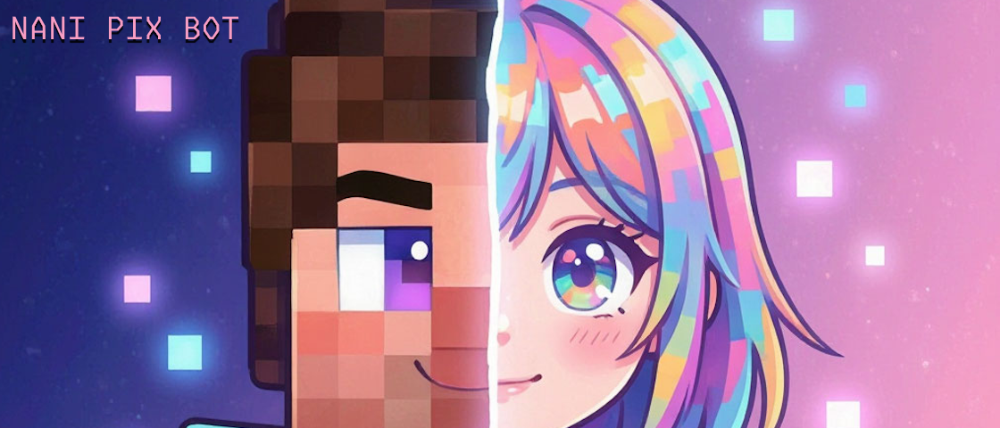

# nani-pix-bot




Telegram bot for an anime-screenshot guessing game, played in one topic of a
group chat. Someone DMs the bot a screenshot — or sends `/newgame` and picks
a real screenshot from Shikimori/Tenrai/TMDB instead — and identifies the
anime (see `MECHANICS.md` for exactly how); the bot posts it heavily
pixelated into the group's game topic, and it gets progressively clearer
as wrong `/guess` attempts accumulate — each of the five stages has its
own admin-configurable wrong-guess limit (1/1/2/3/3 by default) — until
someone's right or it's revealed unsolved.

Players also earn a small 💠 currency for guessing and winning: `/balance`
shows yours, and admins tune the amounts in a DM with `/pixelconfig` (see
`MECHANICS.md`'s "Pixels" section). Spend it with `/shop` (or the 🛒 under
each round image) on private clues: a letter, the title's shape, an extra
screenshot or an unpixelated tile (see "Clue shop" there). Players can also
put 💠 into a round's bounty with `/bounty`, give some to another player with
`/tip`, or pay to advance the image a stage with `/sharpen` (see "Public
spends" there).

📖 **[User's guide](https://sm-steel.github.io/nani-pix-bot/)**: how to play,
admin commands and self-hosting, in English and Russian.

See `MECHANICS.md` for the full rules and `ARCHITECTURE.md` for the system
design.

## Stack

- Python 3.11+, managed with [uv](https://docs.astral.sh/uv/)
- [python-telegram-bot](https://docs.python-telegram-bot.org/) (async, long-polling)
- SQLAlchemy + Alembic against MariaDB
- Pillow (pixelation), rapidfuzz (guess matching), httpx (AniList/Shikimori
  GraphQL, Tenrai/TMDB/MyAnimeList REST), cryptography (Fernet — encrypts
  linked players' MyAnimeList tokens at rest)
- Linting/formatting: `ruff`. Type checking: `ty`. Complexity/duplication/secrets: `qlty`.

## Dev setup

```sh
uv sync                  # install deps + create .venv
cp .env.example .env     # fill in BOT_TOKEN, DATABASE_URL, etc.
uv run pytest            # run tests
uv run ruff check .      # lint
uv run ruff format .     # format
uv run ty check          # type check
```

The animated end-of-game reveal video is rendered with `ffmpeg`, so running
from source needs `ffmpeg` and `ffprobe` on your `PATH`. `mise.toml` pins
[BtbN's static ffmpeg 7.1.1 build](https://github.com/BtbN/FFmpeg-Builds)
(GPL, with libx264) and `mise.lock` records each platform's download URL and
sha256. Install it with [mise](https://mise.jdx.dev/): run `mise install`
once (locked mode, set in `mise.toml`, fails on anything that doesn't match
the lockfile), then run commands through it (`mise exec -- uv run pytest`)
or let mise's shell activation put it on `PATH`. CI and the Docker image
install the same locked build, so all three run the identical binary
(`ffmpeg -version` reports `n7.1.1-57-g1b48158a23`). Without ffmpeg the bot still works:
every reveal falls back to the plain photo, and the tests marked `ffmpeg`
skip.

## Self-hosting

Running your own copy (Telegram setup, `.env`, Docker Compose, updates and
optional MyAnimeList linking) is covered in the
[user's guide](https://sm-steel.github.io/nani-pix-bot/self-hosting/).

## Continuous Integration

Two GitHub Actions workflows run on every push/PR — **Checks**
(`.github/workflows/checks.yml`: `ruff`, `ty`, and `qlty smells`, via the
same `.pre-commit-config.yaml` the local pre-commit hook uses) and **Tests**
(`.github/workflows/tests.yml`: `pytest`). A third workflow, **Release**
(`.github/workflows/release.yml`), runs only on a push to `master` — this
repo's default and release branch (see `CLAUDE.md`'s "Branching &
workflow" section): it cuts a semantic-release
version and, when a release actually happens, builds and pushes a
versioned image to `ghcr.io/sm-steel/nani-pix-bot`. **Docs**
(`.github/workflows/docs.yml`) builds the user's guide (`docs/site/`) on every
PR that touches it, and on a push to `master` publishes it to GitHub Pages
together with the MyAnimeList callback page. There is no workflow that deploys
the bot itself —
see the guide's [Updating](https://sm-steel.github.io/nani-pix-bot/self-hosting/updating/)
page for how to roll a release out to your own instance. See `CLAUDE.md` for details.
